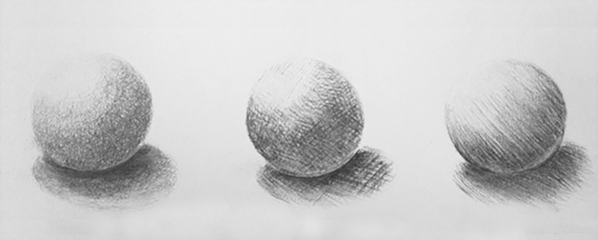

name: inverse
layout: true
class: center, middle, inverse
---

#### Prof. Dr. Lena Gieseke | l.gieseke@filmuniversitaet.de  
#### Film University Babelsberg KONRAD WOLF

# Materials and Shading Workshop

### Shading

<!--

Start server in /doc/

h or ?: Toggle the help window
j: Jump to next slide
k: Jump to previous slide
b: Toggle blackout mode
m: Toggle mirrored mode.
c: Create a clone presentation on a new window
p: Toggle PresenterMode
f: Toggle Fullscreen
t: Reset presentation timer
<number> + <Return>: Jump to slide <number>
-->

---
template:inverse

# Introduction

---
layout:false
.header[Introduction]
## Materials & Shading

.center[]

---
.header[Introduction]
## Materials & Shading

.center[]

???

Here an example, which demonstrates that materials and light are essential for the perception of 3D space.

---
.header[Introduction]
## Materials & Shading

.center[[[Gereon Zwosta]](http://www.gereon-zwosta.de)]

---
.header[Introduction]
## Materials & Shading

.center[[[Gereon Zwosta]](http://www.gereon-zwosta.de)]

---
.header[Introduction]
## Look Development

For creating a certain look for a model, e.g. to make it seamlessly fit into an environment, we need to consider

--

* Texturing
* Shading
* Lighting
* Rendering

---
.header[Introduction]
## Shading

Shading describes the reflectance behavior of a surface.

--

.center[]  .footnote[[[Modeling Anisotropic Surface Reflectance with Example-Based Microfacet Synthesis](https://www.slideserve.com/jacob/modeling-anisotropic-surface-reflectance-with-example-based-microfacet-synthesis). SIGGRAPH 2008]]

???
* satin, metal, wood

---
.header[Introduction]
## Materials & Shading

Materials are often considered as the combination of textures and shading properties.

--

### Materials = Textures + Shading

--

The look development of materials and lighting are often closely intertwined.

---
.header[Introduction | Materials]
## Texturing

???

.task[TASK:] Means what?

--

 [[pluralsight]](https://www.pluralsight.com/courses/3ds-max-uv-mapping-fundamentals)

???

*Texturing* is usually understood as attaching an image to a shape or a geometry and the *textures* are the images we “stick” on geometry. 

*UV Maps* define a relationship between the space of the geometry and the texture space. You can also imagine this as taking the geometry and flatting it onto a 2D representation, as for example sewing pattern do.

---
.header[Introduction | Materials]

## Procedural Texturing

A procedural texture is a texture created using a mathematical description (i.e. an algorithm) rather than directly stored data. 

???

.task[TASK:]What are the advantages to this?

--

* Low storage cost
* Unlimited texture resolution 
* Easy texture mapping

???

* The advantage of this approach is low storage cost, unlimited texture resolution and easy texture mapping.

---
.header[Introduction | Materials]

## Procedural Texturing

These kinds of textures are often used for 

* High frequency detail, e.g. of natural elements
    * Wood, marble, granite, metal, stone, and others
* Regular patterns

---
.header[Introduction | Materials]

## Procedural Texturing

.center[]

---
.header[Introduction | Materials]

## Textures For Shading

Textures are also used for shading and lighting related effects. 

???

* They enable the simulation of near-photorealism in real time by vastly reducing the number of polygons and lighting calculations needed to construct a realistic and functional 3D scene.

--
Such as 

* height mapping, 
* bump and displacement mapping, 
* reflection, specular and occlusion mapping.

.footnote[[[Wikipedia - Texture Mapping]](https://en.wikipedia.org/wiki/Texture_mapping)]

???

Specular maps determine how much light will reflect off of a surface. 

Specular maps are pivotal in controlling how light plays across the surface of 3D models, defining flat light images, and which parts of different texture maps in the model are glossy or matte. This nuanced control over how light interacts with different parts of the texture application of a model is crucial in simulating a variety of materials and finishes accurately.

In the range of black and white values, the whiter area will reflect more light, and the blacker areas less light. Gloss, on the other hand, determines how clear that reflection will be.
http://wedesignvirtual.com/what-does-a-specular-map-do/

Reflection Maps: Mirroring Reality in Virtual Worlds

In the pursuit of photorealism, reflection maps serve as a key element, dictating how environments and objects are reflected on the surfaces of 3D models. This is because the reflection map is particularly crucial in simulating materials like glass, metal, and water, where reflections play a pivotal role in conveying material properties and enhancing realism. Reflection maps ensure that 3D models not only interact with direct light but also incorporate the surrounding environment into their visual presentation, thereby grounding them more firmly within their virtual worlds.

https://textura.ai/texture-maps-3d-models/

These maps are usually put together and controlled by a *materials system* of the rendering engine, such as Unreal.

What are displacement and bump maps?

Displacement

* Adds actual new geometry at render time
* The renderer subdivides the existing geometry and moves it according to the noise values

Normal and Bump Map

* Usually part of the shader
* Create the appearance of additional surface detail by changing normals at render time, without actually creating additional geometry
* This makes them faster and use less memory

* Bump_01: https://www.pinterest.com/pin/513832638715552263/
* Bump_02: http://yullenpyon.blogspot.com/2014/04/mapping.html

---
.header[Introduction | Materials | Textures For Shading]

## Specular Map

.center[    .imgref[[[learnopengl]](https://learnopengl.com/Lighting/Lighting-maps)]]

???
* Specular Maps: Manipulating the Play of Light

---
.header[Introduction | Materials | Textures For Shading]

## Specular Map

.center[    .imgref[[[learnopengl]](https://learnopengl.com/Lighting/Lighting-maps)]]

---
.header[3D Engine Environment | Texturing]

## Textures For Shading

> We will not work on texturing and texture maps in this workshop. 

???

.task[TASK:]What else do we need for this to work, when we have an image as texture and a geometry?

There are several tutorials and tools online. One common approach is [texture baking](https://blenderartists.org/t/what-is-texture-baking/408872), for example.

---
template:inverse

# Shading

---
.header[Introduction]
## Shading

.center[]

???

Here an example, which demonstrates that materials and light are essential for the perception of 3D space.

---
.header[Introduction]
## Shading

???

.task[TASK:] What would shading be in traditional drawing?

--

.center[ .imgref[[[Nitram]](https://nitramcharcoal.com/basic-shading-techniques/)]]

---
.header[Introduction]
## Shading

 .imgref[[[Nitram]](https://nitramcharcoal.com/basic-shading-techniques/)]

Shading used in drawing means 

--
* to apply varying level of darkness,  

--
* to support the perception of depth, and

--
* to visualize material properties.

---
.header[Introduction]
## Shading

In computer graphics, shading does pretty much the same thing:   

--

> A color (e.g. from a texture) is altered by varying levels of darkness. 

--

.center[]

???

White multiplied with various shades of gray.

---
.header[Introduction]
## Shading

In computer graphics, shading does pretty much the same thing:   

> A color (e.g. from a texture) is altered by varying levels of darkness. 

This is done based on characteristics such as

--
* the surface's angle and distance to lights

--
* light properties, and

--
* material properties.

???

On each of which we are going to have a look on now.

---
template:inverse

# Environments

---
layout: false

.header[Introduction | Environments]

## 3D Engines

--
* A given environment such as a Three.js, Unreal, Unity, p5, Houdini etc. scene

--
* Assets such geometry, lights and materials already exists

--
    * Use the provided material editing system

--
* In this class, we access the given assets in the fragment shader and create shading behavior from scratch

--
* The engine does the rendering

???

This means we plug our shading development into a given environment such as p5, Unity, Houdini etc. and work with given assets such lights or material properties.

For example, a p5 scene is straight-forward to use with almost no overhead and it even gives reasonable errors for a shader.

--

> 3D engines are a good option for complex scenes and realistic appearance.

---
.header[Introduction | Environments]

## In Contrast: The Fragment Shader Only

--

> Why?

---
.header[Introduction | Environments]

## The Fragment Shader

* Good intro into GLSL and GPU programming
* Powerful in itself for many real-time artistic effects

???
.task[COMMENT:]  

* In the industry 

--

One graphics processing unit is very limited regarding processing power and memory! Their beauty comes through **massive parallelization**.

???
.task[COMMENT:]  

> So what?

--

* We need graphics algorithms that are suitable in this context

---
.header[Introduction | Environments]

## The Fragment Shader

### Shader Programming Workshop

* Rendering a 3D Scene in the Fragment Shader  
* We built the whole scene within the fragments shader itself, including the rendering 

---
.header[Rendering a 3D Scene in the Fragment Shader]

## We Start With...

--

...nothing!

--

 

Scene Setup

--
* *Implicit geometry* 

--
* *Sphere tracing* as rendering algorithm

---
.header[Introduction | Environments]

## The Fragment Shader

Possible visual content is still limited in comparison to working within a 3D software.

???

* https://www.shadertoy.com/view/WsSBzh
* https://www.youtube.com/watch?v=8--5LwHRhjk
* Comment on youtube: "I googled how to feel stupid and this video showed up."

--

> Fragment shaders are a good option for abstracted and simplified scenes based on procedural generation principles and whenever interactivity is crucial (e.g. in a performance scenario).

<!----------------------------------------------------------------------------->
---
template:inverse
# Summary

---

## Summary

--

* For Look Development you need to consider 
    * Texturing
    * Shading
    * Lighting
    * Rendering

--
* Shading usually describes the reflectance behavior of a surface

--
* Materials are usually considered as texture + shading

---

## Summary

* For material creation you can work with

--
    * The material editing system within a 3D environment

--
    * The material editing system within a 3D environment and add to that with GLSL

--
    * Build your own rendering engine, including the materials, within the fragment shader

---

## Summary

* For material creation you can work with
    * The material editing system within a 3D environment
    * **The material editing system within a 3D environment and add to that with GLSL**
    * Build your own rendering engine, including the materials, within the fragment shader

---
template:inverse