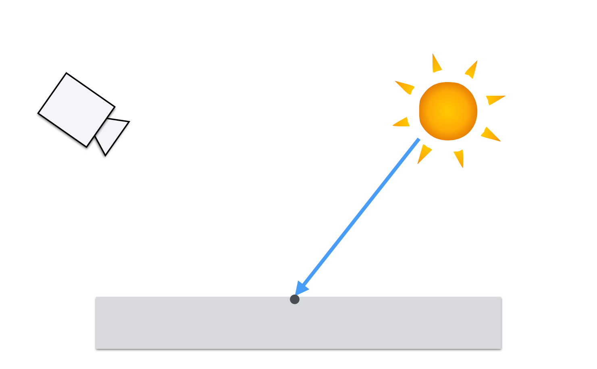
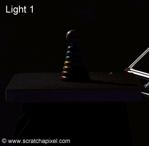
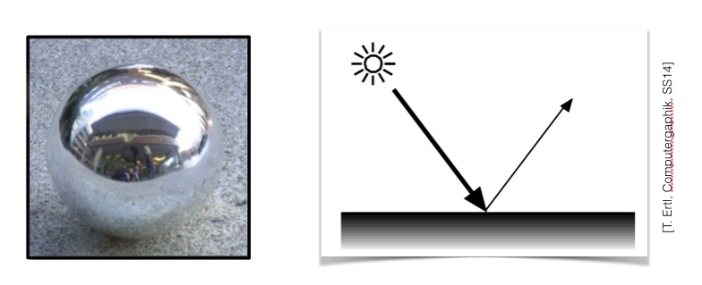
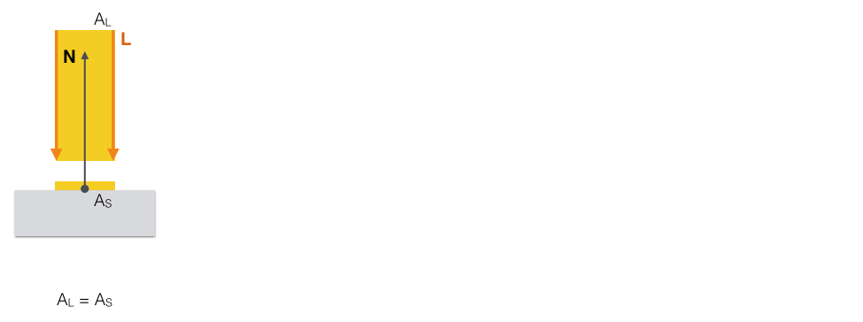
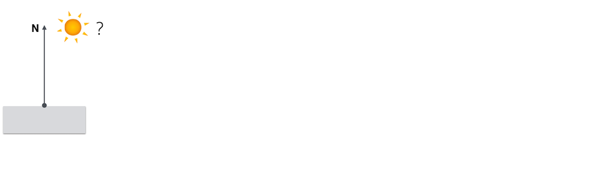
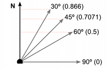
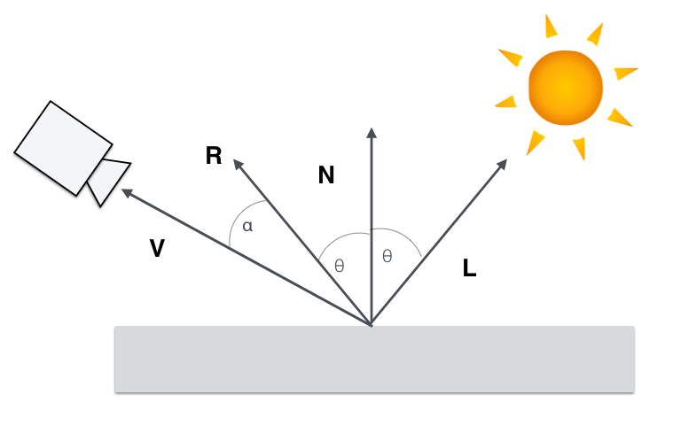
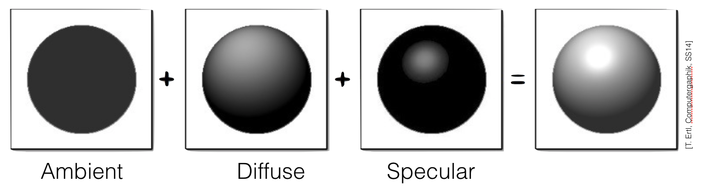

name: inverse
layout: true
class: center, middle, inverse
---

#### Prof. Dr. Lena Gieseke | l.gieseke@filmuniversitaet.de  
#### Film University Babelsberg KONRAD WOLF

# Materials and Shading Workshop

### Local Illumination

<!--

Start server in /doc/


h or ?: Toggle the help window
j: Jump to next slide
k: Jump to previous slide
b: Toggle blackout mode
m: Toggle mirrored mode.
c: Create a clone presentation on a new window
p: Toggle PresenterMode
f: Toggle Fullscreen
t: Reset presentation timer
<number> + <Return>: Jump to slide <number>
-->


---
template:inverse

### Goal:

## Let's Re-Implement Some of Three.js' Materials!
# 😁

???

.task[TASK:] 

* ...and modify them!
* Show scene visuals, no code yet


---
layout: false

## Goal

.center[ ]


---

.center[]


---

## Lighting and Shading

.center[]

---
## Lighting and Shading

.center[]

---
.header[Lighting and Shading]

## Camera

.center[]

---
.header[Lighting and Shading]

## Camera

.center[]

---
.header[Lighting and Shading]

## Camera

.center[]


---
## Lighting and Shading

.left-even[

]


---
## Lighting and Shading

.left-even[

]

.right-even[
1. How much light reaches the surface?
]

---
## Lighting and Shading

.left-even[

]

.right-even[
1. How much light reaches the surface?
2. How much light reaches the camera?
]


---
## Lighting and Shading

.left-even[

]

.right-even[
1. How much light reaches the surface?
2. How much light reaches the camera?

> How does the material at the surface point reflect light?
]


---

## Lighting & Shading

.left-even[

]

.right-even[
* Physically accurate models are still too complex
]


???
* To model this interaction using the whole of today’s knowledge of physics would be far too computationally time-consuming.  

---

## Lighting & Shading

.left-even[

]

.right-even[
* Physically accurate models are still too complex
* We use models that ***approximate*** the appearance of a surface or physics

]


---

## Lighting & Shading

.left-even[

]

.right-even[
* Physically accurate models are still too complex
* We use models that ***approximate*** the appearance of a surface or physics

> Essentially, all models are wrong, but some are useful. – George E. P. Box
]


---
template: inverse

# Local Illumination

---

## Local Illumination


One approach to make light-surface interaction more handlebar, is to only consider
  
--
***local* interaction** between 

--
* the camera view,

--
* defined lights, and 

--
* a surface point.

--

<br/>
This powerful approximation is called ***local illumination*** and one of the oldest but still used techniques for shading.

???

Let's have a look at what local illumination exactly is.

---

## Local Illumination


.center[]

???

We have a nicely defined 3d scene with a camera, light and sufficient information about the surface, such as its normal at the point to shade

---

## Local Illumination

.center[]

???

... and ask our selfs how to compute the color value of a point on a surface (what p5 currently does for us)?

---

## Local Illumination

.center[]

*Lighting* or *illumination* is used to describe the process by which the color and intensity of light *reaching a surface* is determined. 


---

## Local Illumination


.center[]

*Local Illumination* simplifies illumination to light only directly emitted from a light source, travelling in a straight path to the illuminated point.


???

With properties such as color and intensity

---

## Local Illumination

.center[]

*Shading* describes the reflectance behavior and with that color and intensity of light *reaching the camera* for each point on a surface. 


---

## Local Illumination

Hence, the final color of a fragment... 

.center[]


---

## Local Illumination

Hence, the final color of a fragment, which is the light reaching the camera...

.center[]


---

## Local Illumination

Hence, the final color of a fragment, which is the light reaching the camera, depends on the **properties of the light sources** as well as the **reflective characteristics** of the surface itself.

.center[]

---

## Local Illumination

.left-even[]

.right-even[
    
<br/>
> This computation can be interpreted as a geometric problem.
]


---
.header[Local Illumination]

## View and Light Vectors

--

We interpret the light transport as the radiance traveling along rays, where

--

* **L** points to the direction the light is coming from,

--
* **V** points to the camera (the view vector).

.center[]


---
.header[Local Illumination]

## View and Light Vectors

.center[

**Make sure that ||**L**|| = ||**V**|| = 1 as these are directions!**
]


---
.header[Local Illumination]

## Insights

1. We describe the scene with vectors


---
template:inverse

### Local Illumination

# Lights


???
* What could be one light? A intensity (ambient) and a direction (directional)

---
.header[Local Illumination]

## Multiple Lights?

--

.center[]  .footnote[[[Scratchapixel]](https://www.scratchapixel.com/lessons/3d-basic-rendering/introduction-to-shading/shading-multiple-lights)]


???

.task[TASK:] What do we see here?


* All lights contribute to the illumination of the surface
* We need to iterate over all lights and collect their values

In most render engines, we can get the intensity and/or color of each light separately. 


---
.header[Local Illumination]

## Multiple Lights


.left-even[]

.right-even[The contribution of each light adds up **linearly**.  
  
]

.footnote[[[Scratchapixel]](https://www.scratchapixel.com/lessons/3d-basic-rendering/introduction-to-shading/shading-multiple-lights)]


---
.header[Local Illumination]

## Multiple Lights


.left-even[]

.right-even[The contribution of each light adds up **linearly**.  

<br />
The contribution of each light just needs to be **summed up**.]

.footnote[[[Scratchapixel]](https://www.scratchapixel.com/lessons/3d-basic-rendering/introduction-to-shading/shading-multiple-lights)]


---
.header[Local Illumination]

## Insights

1. We describe the scene with vectors
2. We iterate over all lights and sum up their contributions


---
.header[Local Illumination]

## What Are we Summing Up?


???
.task[COMMENT:]  

* The computation of the different light intensities, e.g. for a spot light this is given by a formul

---
.header[Local Illumination]

## Lighting

The standard types of light sources supported by most 3D graphics systems: 

* Ambient 
* Directional / Distant
* Point 
* Spot

???

.task[TASK:] Describe each one.

+ Area lights
+ Environment lights

---
.header[Local Illumination]

## Lighting

.center[

.footnote[[[Houdini Reference]](http://www.sidefx.com/docs/houdini/render/lights.html#lights)]]


???
In p5:

.center[  [[p5 Reference]](https://p5js.org/reference/#group-Lights,%20Camera)]  


---
.header[Local Illumination]

## Lighting

[Overview of the pre-defined lights in Three.js ↗︎](https://threejs.org/manual/#en/lights)

---
.header[Local Illumination]

## Lighting


For the sake of simplicity we work with

**Light Color = Intensity + Color**

--
* A constant color for the ambient light
    * E.g., color = vec3(0.2,0.2,0.2)

--
* A direction vector and a constant color for each directional light
    * E.g., color = vec3(0.9,0.9,0.2), direction = vec3(0,0,1)

--

> In a 3D context you usually just use the lights and customize the shading.

---
.header[Local Illumination]

## On a Side Note: GLSL Color

* RGB color system 
* Value range 0..1


???
* Also, for the p5 example, we are working with the RGB color system and the intensity of reflected light at a point on a surface is calculated for red, green, and blue wavelengths simultaneously.

--

Hence, whenever we talk about intensity and color, we mean a `vec3` vector.

???

.task[TASK:] Workshop stop is possible here.


---
.header[Local Illumination]

## Insights

1. We describe the scene with vectors
2. We iterate over all lights and sum up their contributions
3. We use numeric properties for the incoming light


???

* .task[TASK: Introduce Setup] 
* .task[TASK: Go over lighting in code] 

---
template:inverse

# Let's Code!

---
.header[Local Illumination]

## Coding

--
* Have npm
    * Test in terminal: `npm -v`
    * If not, take care of that later

---
.header[Local Illumination]

## Coding

* Download Phong Material -> 1. Lighting: [steps], **[code]**

--
* Run the code

--
    * Unzip the folder
    * With a terminal navigate into the folder 
    * Install the dependencies with **`npm install`**
    * Start a local server with **`npm run dev`**
    * Open localhost in browser


---
## Lighting and Shading

.left-even[

]

.right-even[
1. How much light reaches the surface? ✓
2. How much light reaches the camera?

> How does the material at the surface point reflect light?
]


???

.center[ .imgref[[[Nitram]](https://nitramcharcoal.com/basic-shading-techniques/)]]


.header[Local Illumination]
## Light Reflected?


.center[ .imgref[[[Nitram]](https://nitramcharcoal.com/basic-shading-techniques/)]]

---
.header[Local Illumination]
## Adjust The Brightness!

.center[ .imgref[[[Nitram]](https://nitramcharcoal.com/basic-shading-techniques/)]]


???
*  of the Surface Point


.header[Local Illumination]
## Light Reaching the Camera?


.center[]


---
.header[Local Illumination]
## Adjust The Brightness


.center[]


---
template:inverse

### Local Illumination

# Materials

---
.header[Local Illumination | Materials]

.center[  
.imgref[[[Wikipedia]](https://upload.wikimedia.org/wikipedia/commons/thumb/3/39/Fluorescence_in_calcite.jpg/300px-Fluorescence_in_calcite.jpg)]]


???
.task[COMMENT:]  

A photon is a piece of energy that 
* has no mass
* moves at the speed of light
* acts like a particle
* has momentum
The energy of a photon is quantized.

* A photon is the smallest discrete amount or quantum of electromagnetic radiation. It is the basic unit of all light
* Photons are always in motion and, in a vacuum, travel at a constant speed...
    * ...to all observers of 2.998 x 108 m/s. This is commonly referred to as the speed of light, denoted by the letter c. 

The basic properties of photons are:

* They have zero mass and rest energy. They only exist as moving particles.
* They are elementary particles despite lacking rest mass.
* They have no electric charge.
* They are stable.
* They are spin-1 particles which makes them bosons.
* They carry energy and momentum which are dependent on the frequency.
* They can have interactions with other particles such as electrons, such as the Compton effect.
* They can be destroyed or created by many natural processes, for instance when radiation is absorbed or emitted.
* When in empty space, they travel at the speed of light.

https://www.zmescience.com/science/what-is-photon-definition-04322/

Photons can be 

* *absorbed*, 
* *reflected*, or 
* *transmitted*  
 
when they strike the surface of a material.  


---
.header[Local Illumination | Materials]


.center[ .imgref[[[Wikipedia]](https://en.wikipedia.org/wiki/File:BSDF05_800.png)]]


???
.task[COMMENT:]  

Photons can be 

* *absorbed*, 
* *reflected*, or 
* *transmitted*  
 
when they strike the surface of a material.  


---
.header[Local Illumination]

## Materials

.left-quarter[
Instead of...
]

.right-quarter[
 .imgref[[[Wikipedia]](https://en.wikipedia.org/wiki/File:BSDF05_800.png)]
]


---
.header[Local Illumination]

## Materials

...we simply compute how much incoming light is reflected at a surface point along the view vector:

.center[]

---
.header[Local Illumination]

## Materials

.left-even[

]

.right-even[
1. The reflected light cannot be more than the received light
]

---
.header[Local Illumination]

## Materials

.left-even[

]

.right-even[
1. The reflected light cannot be more than the received light
2. There are different types of reflections
]


???


How these different types of reflections are computed and combined is defined by various shading models.

First we have a look at the relevant refection types, then we implement them.


<!----------------------------------------------------------------------------->
---
template: inverse
### Local Illumination
# Reflections

???

.task[TASK:] Which reflections do you know?

---
.header[Local Illumination]


## Reflections

--

.center[]

???

Be based on the microfacet surface model: this theory describes how at a microscopic level, all surfaces have a certain degree of roughness which will scatter light rays in a more or less chaotic way, depending on this roughness degree. 

--

.center[  ]  

[[avilapa]](https://avilapa.github.io/post/custom-engine-pbr/)


---
.header[Local Illumination]
## Diffuse Reflection

???

.task[TASK:] Is what?

--

A diffuse reflection reflects equally in random directions.

--

.center[]


---
.header[Local Illumination]
## Diffuse Reflection

A diffuse reflection reflects equally in random directions.


.center[]


* Also called a *Lambertian* reflection
* Does not depend on the position of the observer, only on the light direction

---
.header[Local Illumination]

## Specular Reflection

???

.task[TASK:] Is what?

--

A *shiny* or *glossy* reflection reflects with in a preferred angle.

--
.center[]

---
.header[Local Illumination]

## Specular Reflection

A *shiny* or *glossy* reflection reflects with in a preferred angle.

.center[]

* More of the incident light is reflected in a certain angle than in other angles
* Depends on the position of the observer and the light direction

---
.header[Local Illumination]

## Full Specular Reflection

--

A full specular reflection reflects all light in the same angle as the incoming angle.  

--

.center[]

---
.header[Local Illumination]

## Full Specular Reflection

A full specular reflection reflects all light in the same angle as the incoming angle.  

.center[]

* This is a *mirror reflection*
* Depends on the position of the observer and the light direction

???

* https://www.explainthatstuff.com/howmirrorswork.html


---

.center[]


---
.header[Local Illumination]

## Measured Reflections

Matthias B. Hullin, Martin Fuchs, Boris Ajdin, Ivo Ihrke, Hans-Peter Seidel, Hendrik P. A. Lensch, [Direct Visualization of Real-World Light Transport](https://resources.mpi-inf.mpg.de/lighttransport/pdf/VMV2008-final.pdf) , Proceedings of VMV 2008, Konstanz, Germany, 2008. 


???
* https://light.informatik.uni-bonn.de/publications/


---

### Diffuse Surface Reflection

.center[  .imgref[[[Hullin et al. 2008]]()]]

---

### Glossy Surface Reflection

.center[  .imgref[[[Hullin et al. 2008]]()]]

---

### Layered (Diffuse & Glossy) Surface Reflection

.center[  .imgref[[[Hullin et al. 2008]]()]]


<!----------------------------------------------------------------------------->
---
template:inverse

### Local Illumination
# Reflections' Computation

---


## Diffuse Reflection Computation

A diffuse reflection looks the same under all observation directions. 


**It only depends on the light direction.**


---
.header[Diffuse Reflection Computation]

## Light Direction

> How to compute?

---
.header[Diffuse Reflection Computation]

## Light Direction



---
.header[Diffuse Reflection Computation]

## Light Direction


---
.header[Diffuse Reflection Computation]

## Light Direction


---
.header[Diffuse Reflection Computation]

## Light Direction


As the angle between the normal vector and the light direction **increases**, the surface area illuminated by the beam of light (which stays the same) increases...

--


... and the intensity of the light per unit surface area **decreases**.

---
.header[Diffuse Reflection Computation]

## Light Direction


This means that depending on the angle between light and normal, we want to multiply the light intensity with a factor.

--



---
.header[Diffuse Reflection Computation]

## Light Direction


This means that depending on the angle between light and normal, we want to multiply the light intensity with a factor.


---
.header[Diffuse Reflection Computation]

## Light Direction


This means that depending on the angle between light and normal, we want to multiply the light intensity with a factor.


---
.header[Diffuse Reflection Computation]

## Light Direction


This means that depending on the angle between light and normal, we want to multiply the light intensity with a factor.


---
.header[Diffuse Reflection Computation]

## Light Direction


This means that depending on the angle between light and normal, we want to multiply the light intensity with a factor.


---
.header[Diffuse Reflection Computation]

## Light Direction


This means that depending on the angle between light and normal, we want to multiply the light intensity with a factor.


> Cosine to the rescue!


---
.header[Diffuse Reflection Computation]

## Cosine To The Rescue!

${cosθ}$: 

.center[]

---
.header[Diffuse Reflection Computation]

## Cosine To The Rescue!

${cosθ}$: 

.center[]


.footnote[[[Unity Manual]](https://docs.unity3d.com/Manual/UnderstandingVectorArithmetic.html)]


---
.header[Diffuse Reflection Computation | Light Direction]

## Lambert's Cosine Law

We need to decrease in the intensity of the light by a factor of ${cosθ}$
  
--
.center[]


---
.header[Diffuse Reflection Computation | Light Direction]

## Lambert's Cosine Law

The value of ${cosθ}$ is given by the **dot product** between the normal vector $N$ and the unit direction to the light source $L$. 
  
<br/>
${cosθ} = L \cdot N$


???
NOTE: Add formula?

--

> Don't forget to normalize L and N!

---
.header[Diffuse Reflection Computation | Light Direction]

## Lambert's Cosine Law

.left-even[
> What about the light facing in the opposite direction of the surface normal?
]
--

.right-even[]  


???
.task[COMMENT:]  

* What should the factor be? -> 0


---
.header[Diffuse Reflection Computation | Light Direction]

## Lambert's Cosine Law

.left-even[
> What about the light facing in the opposite direction of the surface normal?
  
<br />
The factor should be zero...
]

.right-even[]  


???
.task[COMMENT:]  

* and should not be illuminated at all. 


---
.header[Diffuse Reflection Computation | Light Direction]

## Lambert's Cosine Law

.left-even[
> What about the light facing in the opposite direction of the surface normal?
  
<br />
The factor should be zero and should not be illuminated at all! 
]

.right-even[]  


???
.task[COMMENT:]  

* and should not be illuminated at all. 


---
.header[Diffuse Reflection Computation | Light Direction]

## Lambert's Cosine Law


.right-even[]

.footnote[[[Unity Manual]](https://docs.unity3d.com/Manual/UnderstandingVectorArithmetic.html)]


---
.header[Diffuse Reflection Computation | Light Direction]

## Lambert's Cosine Law

.left-even[
Lucky Us! 
  
<br />
  
The dot product becomes negative when the surface is facing away from the light source.
]

.right-even[]  

.footnote[[[Unity Manual]](https://docs.unity3d.com/Manual/UnderstandingVectorArithmetic.html)]


???

  
* ANy ideas how to do this algorithmically? What to do with cosinus?

---
.header[Diffuse Reflection Computation]

## Lambert's Cosine Law

Hence, we can clamp the dot product to zero for our illumination calculations:
  
$max(L \cdot N, 0)$

--

.center[]

---
.header[Diffuse Reflection Computation]

## Lambert's Cosine Law

$max(L \cdot N, 0)$

<br />
This is the *Lambertian reflection*.

--

Meaning this is the factor with which we need to multiply the incoming light.

--

```glsl
float diffuseReflection(vec3 normal, vec3 light_direction_to_point) {

    return max(0., dot(normal, light_direction_to_point));
}
```


???
* text

# Let's Code!

.header[Local Illumination]

## Coding

* Download Phong Material -> 2. Shading: [steps], **[code]**
* Run the code
    * Unzip the folder
    * With a terminal navigate into the folder 
    * Install the dependencies with **`npm install`**
    * Start a local server with **`npm run dev`**
    * Open localhost in browser


---
.header[Specular Reflection Computation]

## Specular Reflection

--

.center[]

---
.header[Specular Reflection Computation]

## Specular Reflection

Surfaces tend to reflect light strongly along the **reflection of the incident direction** across the surface normal.  

---
.header[Specular Reflection Computation]

## Specular Reflection

.center[ .imgref[[[Hullin et al. 2008]]()]]


---
.header[Specular Reflection Computation]

## Specular Reflection

 .imgref[[[Hullin et al. 2008]]()]


This results in the appearance of a shiny highlight on the surface, called a specularity. 


???
* Hence, unlike the diffuse reflection, the specular reflection depends on the position of the viewer! 


---
.header[Specular Reflection Computation]

## Specular Reflection


.center[ ]

---
.header[Specular Reflection Computation]

## Specular Reflection


.center[ ]


---
.header[Specular Reflection Computation]

## Specular Reflection


.center[ ]

The intensity of the specular reflection is strongly related to reflection vector R.


---
.header[Specular Reflection Computation]

## Reflection Vector

???

Hence, for specular reflection, we need the reflection vector.

--

.center[]


---
.header[Specular Reflection Computation]

## Reflection Vector


.left-even[]

.right-even[

<br />
Most 3D package offer functions such as `reflect(L, N);` in GLSL.
]

???

NOTE: Add formula?

---
.header[Specular Reflection Computation]

## Specular Reflection

.left-even[]

.right-even[
  
<br />
Based on the given geometry, how can we model specular reflection now?
]


---
.header[Specular Reflection Computation]

## Specular Reflection

.center[ ]

--

A model that recreates believable specular highlights uses again the **cos** function for modulation.


???
* But having almost no real physical basis 

---
.header[Specular Reflection Computation]

## Specular Reflection

.center[  ]


\\[{cos^{n}\alpha} = max(0, R \cdot V)\\]

---
.header[Specular Reflection Computation]

## Specular Reflection

.center[ ]

How about the shape of the highlight?

---
.header[Specular Reflection Computation]

## Specular Reflection

.center[]  

.footnote[[[cglearn](https://cglearn.eu/images/seminar/light/cosinePower.gif)]]


---
.header[Specular Reflection Computation]

## Specular Reflection


.center[]

---
.header[Specular Reflection Computation]

## Specular Reflection


.center[   ]


\\[{cos^{n}\alpha} = max(0, R \cdot V)^{n}\\]


???

The expression (N ⋅ L > 0) is a boolean expression that evaluates to 1 if true and 0 otherwise. This prevents specular highlights from showing up at points on a surface that face away from the light source. 

---
.header[Reflections | Computation | Specular Reflection]

## Shininess Exponent

\\[{cos^{n}\alpha} = max(0, R \cdot V)^{\bbox[yellow]{n}}\\]

The specular or shininess exponent $n$ controls the sharpness of the specular highlight. 

--

.center[]

--

* A small value of n produces a dull highlight that fades out over a relatively large distance

--
* A large value of n produces a sharp highlight that fades out quickly as the vectors V and R diverge.  

---
.header[Reflections | Computation | Specular Reflection]

## Specular Reflection

Now, we can compute the specular reflection with:

--

```glsl
//max(0, R ∙ V)^n;

float specularReflection(vec3 normal, vec3 lightDirection, vec3 viewDirection) {

    vec3 reflection = reflect(lightDirection, normal);
    float specular = max(0., dot(reflection, viewDirection));
    specular = pow(specular, shininess);
    return specular;
}
```
---
template:inverse

# Let's Code!

???
* Continue with previous code

---
.header[Local Illumination]

## Coding

* Download Phong Material -> 2. Shading: [steps], **[code]**
* Run the code
    * Unzip the folder
    * With a terminal navigate into the folder 
    * Install the dependencies with **`npm install`**
    * Start a local server with **`npm run dev`**
    * Open localhost in browser

---
template:inverse

## *And now what?*
# 🤨


???
.task[COMMENT:]  

* We need to put together the different formulas to a material models

<!----------------------------------------------------------------------------->
---
template:inverse
# Shading Models
---


## Shading Models

What we just learned are the parts of one of the most famous and excessively used shading model, namely the ***Phong* shading model**.

--

<br />
The Phong model looks as follows:

\\( I_{Phong} = I_A + I_D + I_S \\)

--

.center[]

---
.header[Shading Models]

## Phong Model

$I_{Phong} = I_A + I_D + I_S$

--
  
<br />
With the (reflection) components modelled as
  

--
<br />

\\(I_{Ambient} = k_a \\)

--

\\(I_{Diffuse} =  k_d \cdot max(N \cdot L, 0) \cdot I_D \\)

--

\\(I_{Specular} =k_s \cdot max(R \cdot V, 0)^n \cdot I_S \\)


???
* light_a usually as k_a

---
.header[Shading Models | Phong Model]


.center[]


---
.header[Shading Models]

## Phong Model

> How much of the incoming light intensity is reflected on a surface point for a view vector.

--

For an incoming light $I$

\\(I_{Phong} = k_a + k_d \cdot max(N \cdot L, 0) \cdot I_d  + k_s \cdot max(R \cdot V, 0)^n \cdot I_s \\)

--

<br />

This is also called a **BRDF**, or better in this case the **Phong BRDF**.


<!----------------------------------------------------------------------------->
---
template:inverse
# Summary

---

## Summary

--
* Local illumination only considers local interaction between the camera view, well-defined lights and a surface point.

--

* We describe this as a geometric problem with vectors and numeric values.

--
* Light adds up linearly and we can sum up the contribution of each light.

---

## Summary

* The Phong model re-create the appearance of surface with

--
    * Ambient light

--
    * Diffuse reflection

--
    * Specular reflection around the reflectance of the light-to-surface vector

--
    * Modulation of the highlight with a shininess exponent


---
template:inverse