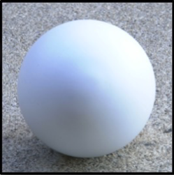
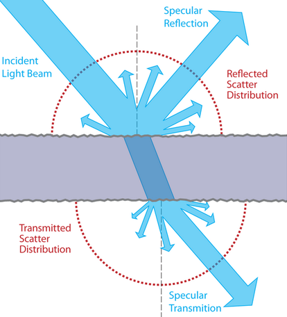
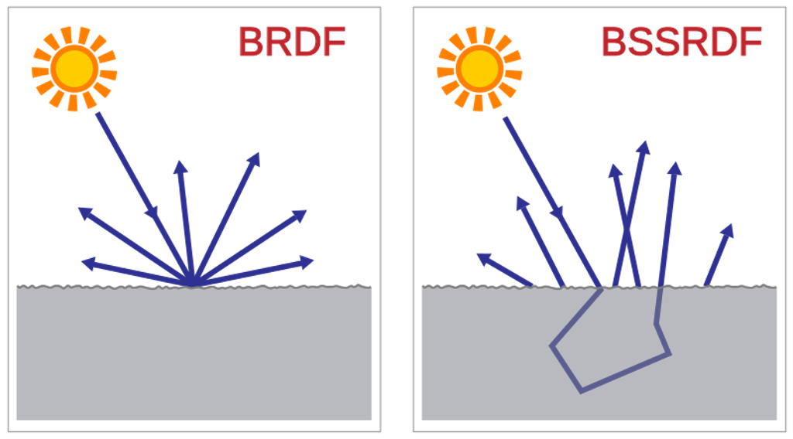

name: inverse
layout: true
class: center, middle, inverse
---

#### Prof. Dr. Lena Gieseke | l.gieseke@filmuniversitaet.de  
#### Film University Babelsberg KONRAD WOLF

# Materials and Shading Workshop

### BRDFs

<!--

Start server in /doc/

h or ?: Toggle the help window
j: Jump to next slide
k: Jump to previous slide
b: Toggle blackout mode
m: Toggle mirrored mode.
c: Create a clone presentation on a new window
p: Toggle PresenterMode
f: Toggle Fullscreen
t: Reset presentation timer
<number> + <Return>: Jump to slide <number>
-->

<!----------------------------------------------------------------------------->
---
template:inverse
# BRDFs

---
layout:false

## Phong BRDF

\\(I_{Phong} = k_a + k_d \cdot max(N \cdot L, 0) \cdot I_d  + k_s \cdot max(R \cdot V, 0)^n \cdot I_s \\)

???
* In summary, for shading a surface with the Phong model, we compute how much of the incoming light intensity is reflected on a surface point for a certain view vector, based on the Phong formula.

--

 
> A BRDF computes the ratio of the incoming to the exiting light.

--

 
BRDF stand for ***Bidirectional Reflectance Distribution Function***.

---

## BRDF

The ***Bidirectional Reflectance Distribution Function*** \\( {f(\omega_{\text{i}}, \omega{\text{r}})} \\) is a function of four variables:
<!-- The BRDF \\({f(\omega\us{\text{i}}, \omega\us{\text{r}})}\\) is a function of four variables: -->

.center[ .imgref[[[Wikipedia]](https://en.wikipedia.org/wiki/Bidirectional_reflectance_distribution_function)]]

???

* Each direction \omega is itself parameterized by azimuth angle \phi and zenith angle \theta, therefore the BRDF as a whole is a function of 4 variables. 
* The BRDF has units sr−1, with steradians (sr) being a unit of solid angle. 

---

## BRDF

The ***Bidirectional Reflectance Distribution Function*** \\( {f(\omega_{\text{i}}, \omega{\text{r}})} \\) is a function of four variables:
<!-- The BRDF \\({f(\omega\us{\text{i}}, \omega\us{\text{r}})}\\) is a function of four variables: -->

.center[ .imgref[[[Wikipedia]](https://en.wikipedia.org/wiki/Bidirectional_reflectance_distribution_function)]]

\\(\omega_{\text{i}}\\) and \\(\omega{\text{r}}\\) are equivalent to **L**  and **V**.
 

--

The BRDF returns the *ratio* of incoming irradiance to reflected radiance. 

???

The correct  computation of BRDFs an be very complex and mathematically challenging.

The units of radiance and irradiance are quite crucial here, but of ot scope of this workshop.  

If the material is homogeneous – every surface point has the same appearance

---

## BRDF

By computing the value of a given BRDF for all surface points, we have a description of the surface's shading behavior.

 

.center[ ]

---

## BRDFs

To describe the reflectance behavior on a surface point there are various different BRDFs.

---

.center[ .imgref[[[Montes 2012]](https://digibug.ugr.es/bitstream/handle/10481/19751/rmontes_LSI-2012-001TR.pdf)]]

???
  

* Legend: (star) if the BRDF has this property; (triangle) if the BRDF, does not; (...) unknown value.
* Physically plausible: a function that obeys non-negativity, reciprocity and the law of energy conservation. A BRDF with this property can be used safely in a rendering system, avoiding situations where energy is created wrong.
* Sampling: appropriate for importance sampling of Monte-Carlo integration
* Fresnel: refelction behaviour, we will cover next time
* Isotropic and anisotropic are terms that describe whether or not the properties of materials depend on direction. When a property is the same in all directions, the material is isotropic. When a property varies according to direction, the material is anisotropic. 

---

.header[BRDFs]

## Diffuse Reflection

.imgref[[[wiki]](http://en.wikipedia.org/wiki/Oren–Nayar_reflectance_model)]

???
  

* Lambert is too dark when we compute it in gazing angles.
* Solution: Oren-Nayar BRDF model
* https://dl.acm.org/doi/pdf/10.1145/192161.192213

---

.header[BRDFs]

## Diffuse Reflection

 .imgref[[[filament]](https://google.github.io/filament/Filament.html#materialsystem)]

Lambertian diffuse BRDF vs. Disney diffuse BRDF

???
  

*  a comparison between a simple Lambertian diffuse BRDF and the higher quality Disney diffuse BRDF, using a fully rough dielectric material. For comparison purposes, the right sphere was mirrored. The surface response is very similar with both BRDFs but the Disney one exhibits some nice retro-reflections at grazing angles (look closely at the left edge of the spheres). 

---
## Material Properties

> To be continued...

...see chapter *Material Properties*!

---
## BRDFs

Where are BRDFs coming from?

* Measured

--
    * From material samples using calibrated cameras and lightsources
    * In tabular form: expensive, requires interpolation for rendering
    * Editing is difficult

---
.header[BRDFs]

.left-quarter[The MERL BRDF Database]
.right-quarter[ .imgref[[[Matusik 2003]](https://www.merl.com/brdf/)]]

???

The MERL BRDF database contains reflectance functions of 100 different materials.  

* A set of 100 isotropic BRDF material samples was captured by Matusik et al. in 2003 [18] covering a wide range of materials including paints, woods, metals, fabric, stone, rubber, plastic, and other synthetic materials. This data set is freely available from Mitsubishi Electric Research Laboratories at www.merl.com/brdf and is commonly used for evaluating new BRDF models. Slices of these BRDFs are shown in Figure 1.
* Each BRDF in the MERL 100 is densely sampled into a 90 by 90 by 180 cube along the θh, θd, and φd axes respectively. These correspond to 1 degree increments except for the θh axis which was warped to concentrate data samples near the specular peak. The measurements have been filtered and extrapolated as needed so that there are no holes in the data. This is good in that the data is easy to use, but it’s not clear how accurate the data is, particularly near the horizon. Because of this, some researchers discard data near the horizon when performing fitting, but this data is still useful to consider as it can have a profound effect on the material appearance.

---

## BRDFs

How do we get BRDFs?

* Measured
* Phenomenologically motivated

--
    * Few, intuitive parameters
    * Only limited realism
    * Phong [1975], Blinn-Phong [1977], Ward [1992], Lafortune et al. [1997], Ashikhmin et al. [2000],... BRDFs are still activly researched

???
https://scholar.google.com/scholar?as_ylo=2024&q=BRDF&hl=en&as_sdt=0,5

There are phenomenological BRDF models. They use mathematical expressions to create a function that reproduces an intended physical effect.

Examples: the Phong model [Phong 1975], the Blinn-Phong model [Blinn 1977], the Ward model [Ward 1992] (some physical motivation, though), the Lafortune model [Lafortune et al. 1997], the Ashikhmin-Shirley model [Ashikhmin and Shirley 2000]

---

## BRDFs

How do we get BRDFs?

* Measured
* Phenomenologically motivated
* Physically motivated

--
    * More exact results
    * Tuning parameters more difficult
    * Cook-Torrance [1981], He et al. [1991]

---
.left-quarter[BRDF Explorer]
.right-quarter[ .imgref[[[Disney]](https://github.com/wdas/brdf)]]

---

## BRDFs

The previously mentioned BRDFs were all models for the "simple" case of

.center[]

---

## BRDFs

.left-quarter[But what about?]

.right-quarter[]

---

## BRDFs

.center[ .imgref[[[wiki]](https://www.wikiwand.com/en/Bidirectional_scattering_distribution_function)]]

---

## BRDFs

BSSRDF (Bidirectional Scattering-Surface Reflectance Distribution Function or Bidirectional Surface Scattering RDF)

.center[ .imgref[[[wiki]](https://www.wikiwand.com/en/Bidirectional_scattering_distribution_function)]]

---

## BSSRDFs

.center[   .imgref[[[wiki]](https://www.wikiwand.com/en/Bidirectional_scattering_distribution_function)]]

--

> More variables are needed!

---
.header[BRDFs]

.center[]

???

* Isotropic reflection: reflection doesn't vary as the surface os rotated
* SVBRDF: Spatially varying
* BSSRDF: Bidirectional scattering distribution function

---

## Latest Developments

* Hybrid models
    * Maximize artist ease-of-use 
    * Physical realism
    * *Disney*-BRDF [Burley 2012a] / [Burley 2012b]

???

* https://people.cs.clemson.edu/~ekp/courses/dpa8090/assets/papers/PBS_at_Disney.pdf

* Research on BRDFs is still going strong
    * https://wangningbei.github.io/2022/NLBRDF.html
    * https://conferences.eg.org/eg2021/program/full-papers/
* https://github.com/romanlarionov/BRDFViewer
* https://github.com/chicio/Spectral-BRDF-Explorer

---

## BRDFs

* Hybrid models
    * Maximize artist ease-of-use 
    * Physical realism
    * *Disney*-BRDF [Burley 2012a] / [Burley 2012b]
  

=> Leading to **physically-based** models and rendering (PBR)

<!----------------------------------------------------------------------------->
---
template:inverse
# Physically-Based Shading

---

## Physically-Based Shading

> PBR is more a *concept* than a strict set of rules, and as such, the exact implementations of PBR systems tend to vary.

--

* Computational capabilities, leading to physically more accurate models

???
* Computational capabilities have advanced enough that some of the old approximations can now be safely discarded.

--
* Improve upon the usability of models
  
--
  
Both aspects - realistic looking and usable models - led to the term Physically-Based Rendering (PBR).

  
---

## Physically-Based Shading
  
Disney's BRDF was one of the first to pick up on the concept with their *principled* BRDF: 

--
  
 
  
Brent Burley. 2012. [Physically Based Shading at Disney](https://media.disneyanimation.com/uploads/production/publication_asset/48/asset/s2012_pbs_disney_brdf_notes_v3.pdf). Physically Based Shading in Film and Game Production, ACM SIGGRAPH 2012 Courses. 

--
  
 

Main goal: an **art directable** model!

---
.header[Physically-Based Shading]

## Disney's Principled BRDF

It's  **principled model** rather than a strictly physical one.  
  
--
  
The principles are

--
1. Intuitive rather than physical parameters

--
2. As few parameters as possible

--
3. All parameters are from zero to one over their plausible range

--
4. Parameters can be pushed beyond their plausible range where it makes sense

--
5. All combinations of parameters are robust and plausible
???
  

They compared existing models with measured surface values to accurately represent real-world materials and combined them with artist-friendly parameterization.

---

## Physically-Based Shading

Models are not still not physically accurate representations!  

--

But PBR **looks and behaves** more realistic, e.g., by relating the different quantities.

???
  

<!----------------------------------------------------------------------------->
---
template:inverse
# Summary

---

## Summary

--
* Bidirectional Reflectance Distribution Function (BRDF) returns the *ratio* of incoming irradiance to reflected radiance.

--
* By computing the value of a given BRDF for all surface points, we have a description of the surface's shading behavior.

--
* BRDFs are measured, phenomenologically motivated, physically motivated and hybrid

--
* There are also, e. g., SVBRDF (spatially-varying), BSSRDF bidirectional scattering distribution function)

???
* https://en.wikipedia.org/wiki/Bidirectional_scattering_distribution_function

--
* Modern physically-based models focus on expressivness and usability - not on being physically accurate.

---
template:inverse