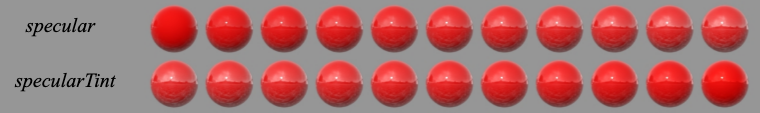
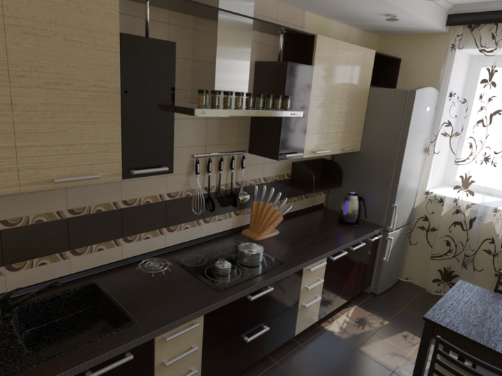
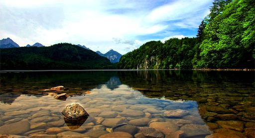

name: inverse
layout: true
class: center, middle, inverse
---

#### Prof. Dr. Lena Gieseke | l.gieseke@filmuniversitaet.de  
#### Film University Babelsberg KONRAD WOLF

# Materials and Shading Workshop

### Material Properties

<!--

Start server in /doc/

h or ?: Toggle the help window
j: Jump to next slide
k: Jump to previous slide
b: Toggle blackout mode
m: Toggle mirrored mode.
c: Create a clone presentation on a new window
p: Toggle PresenterMode
f: Toggle Fullscreen
t: Reset presentation timer
<number> + <Return>: Jump to slide <number>
-->

---
layout:false

.header[Material Properties]

## Disney's Principled BRDF

> We thoroughly debated the addition of each parameter. In the end we ended up with one color
parameter and ten scalar parameters.

--
  

1. Intuitive
2. As few as possible
3. Value range from zero to one
4. Extremes possible
5. Combinable

???
  

They compared existing models with measured surface values to accurately represent real-world materials and combined them with artist-friendly parameterization.

---

.center[ .imgref[[[disneyanimation]](https://disneyanimation.com/publications/physically-based-shading-at-disney/)]]

???
  

* *baseColor*: the surface color, usually supplied by texture maps.
* *subsurface*: controls diffuse shape using a subsurface approximation.
* *metallic*: the metallic-ness (0 = dielectric, 1 = metallic). This is a linear blend between two
different models. The metallic model has no diffuse component and also has a tinted incident
specular, equal to the base color.
* *specular*: incident specular amount. This is in lieu of an explicit index-of-refraction.
* *specularTint*: a concession for artistic control that tints incident specular towards the base color. Grazing specular is still achromatic.
* *roughness*: surface roughness, controls both diffuse and specular response.
* *anisotropic*: degree of anisotropy. This controls the aspect ratio of the specular highlight. (0 = isotropic, 1 = maximally anisotropic.)
* *sheen*: an additional grazing component, primarily intended for cloth.
* *sheenTint*: amount to tint sheen towards base color.
* *clearcoat*: a second, special-purpose specular lobe.
* *clearcoatGloss*: controls clearcoat glossiness (0 = a “satin” appearance, 1 = a “gloss” appearan

Some models include a diffuse Fresnel factor.

---
.header[Material Properties]

## Parameter Blending

All the parameters are normalized and perceptually linear. Hence materials can interpolate intuitively.

 

.center[ .imgref[[[disneyanimation]](https://disneyanimation.com/publications/physically-based-shading-at-disney/)]
]  

???
  

* Interpolating between two very different materials, shiny metallic gold and blue rubber,
using our model.
* https://arxiv.org/pdf/2302.03619.pdf

Currently, physically-based shading models usually include

* Diffuse & Specular
* Roughness / Micro-surface properties
* Translucency & Transparency
* Energy conservation
* Metals
* Fresnel

???
  

  
--
  
Models often include measured material properties.

.footnote[[[Marmoset]](https://marmoset.co/posts/physically-based-rendering-and-you-can-too/)]

???
  

* https://de45xmedrsdbp.cloudfront.net/Resources/files/2013SiggraphPresentationsNotes-26915738.pdf
* Beyond rendering quality, consistency is the biggest reason to use measured values. Having consistent base materials takes the guess work out of material creation for individual artists. It also makes it easier from an art direction perspective to ensure that content created by a team of artists will look great in every lighting condition.

<!----------------------------------------------------------------------------->
---
template:inverse
# Material Properties

---
.header[Material Properties | Diffuse & Specular]

## Base Color 

* Surface color, usually supplied by texture maps

--

### Albedo

--
* The fraction of the light that is diffusely reflected

.center[ .imgref[[[tobyrsmith]]([link](https://tobyrsmith.github.io/Astro150/Tutorials/Spectra/))]]

--
* $\text{Diffuse surface color} = \text{albedo} \cdot \text{incident light} \cdot \text{diffuse reflection}$

???
* A white surface has a high albedo, reflecting most of the light it receives
* A black surface has a low albedo, absorbing most of the light
* albedo = reflected light / incident light
*  the amount of light reflected by a diffuse surface is equal to the amount of light it receives multiplied by the albedo (the ratio of incident light that is reflected by the surface, i.e., not absorbed)
*  Diffuse surface color: albedo * incidendent light * diffuse reflection (N dot L)
* https://computergraphics.stackexchange.com/questions/350/albedo-vs-diffuse

--
* Sometimes as *base color* in combination with metal or roughness

---
.header[Material Properties]

## Sub-Surface Scattering

---

.center[ .imgref[[[cgcookie]](https://www.deviantart.com/cgcookie/art/Subsurface-Scattering-Tutorial-658412208)]]

???
* Why mentioned here? -> Can simple be diffusion below the surface

---
.header[Material Properties | Diffuse & Specular]

## Diffusion / Diffuse Reflection

.center[]  

.footnote[[[marmoset]](https://marmoset.co/posts/basic-theory-of-physically-based-rendering/)]

???

* In order for light to be diffused, light must penetrates the surface (that is, fail to reflect).

Diffusion and reflection – also known as “diffuse” and “specular” light respectively – are two terms describing the most basic separation of surface/light interactions. Most people will be familiar with these ideas on a practical level, but may not know how they are physically distinct.

When light hits a surface boundary some of it will reflect – that is, bounce off – from the surface and leave heading in a direction on the opposing side of the surface normal. This behavior is very similar to a ball thrown against the ground or a wall – it will bounce off at the opposite angle. On a smooth surface this will result in a mirror-like appearance. The word “specular”, often used to describe the effect, is derived from the latin for “mirror” (it seems “specularity” sounds less awkward than “mirrorness”).

Not all light reflects from a surface, however. Usually some will penetrate into the interior of the illuminated object. There it will either be absorbed by the material (usually converting to heat) or scattered internally. Some of this scattered light may make its way back out of the surface, then becoming visible once more to eyeballs and cameras. This is known by many names: “Diffuse Light”, “Diffusion”, “Subsurface Scattering” – all describe the same effect.

The absorption and scattering of diffuse light are often quite different for different wavelengths of light, which is what gives objects their color (e.g. if an object absorbs most light but scatters blue, it will appear blue). The scattering is often so uniformly chaotic that it can be said to appear the same from all directions – quite different from the case of a mirror! A shader using this approximation really just needs one input: “albedo”, a color which describes the fractions of various colors of light that will scatter back out of a surface. “Diffuse color” is a phrase sometimes used synonymously.

---
.header[Material Properties]

## Sub-Surface Scattering

* Diffusion below the surface: light scatters internally, e.g., skin or wax

???
* In many materials, light does not just reflect or absorb at the surface but penetrates into the material and scatters internally before exiting. This is referred to as subsurface scattering.

--
* *Wider scattering distances*: light travels a significant distance inside the material before emerging

???
This creates a soft and realistic appearance because light interacts with the internal structure of the material.

--
* Shape and thickness of the object are relevant
    * Thick: Scattering
    * Thin: almost translucent, little scattering and diffusion

???
* In some cases diffusion is more complicated – in materials that have wider scattering distances for example, like skin or wax. In these cases a simple color will usually not do, and the shading system must take into account the shape and thickness of the object being lit. If they are thin enough, such objects often see light scattering out the back side and can then be called translucent. If the diffusion is even lower yet (in for example, glass) then almost no scattering is evident at all and entire images can pass through an object from one side to another intact. These behaviors are different enough from the typical “close to the surface” diffusion that unique shaders are usually needed to simulate them

---
.header[Material Properties]

## Sub-Surface Scattering

.center[]  

.footnote[[[disneyanimation]](https://disneyanimation.com/publications/physically-based-shading-at-disney/)]

* *Subsurface*: controls diffuse shape using a subsurface approximation
* Appearance for materials with narrow scattering distances

???

* https://threejs.org/examples/?q=trans#webgl_materials_subsurface_scattering

Our subsurface parameter blends between the base diffuse shape and one inspired by the Hanrahan-Krueger subsurface BRDF [11]. This is useful for giving a subsurface appearance on distant objects and on objects where the average scattering path length is small; it’s not, however, a substitute for
doing full subsurface transport as it won’t bleed light into the shadows or through the surface.

---
.header[Material Properties | Sub-Surface Scattering]

.center[]  

.footnote[[ChatGPT 4o - L. Gieseke]]

---
.header[Material Properties]

## Translucency & Transparency

--

.center[]  
.imgref[[[bing.net]](https://external-content.duckduckgo.com/iu/?u=https%3A%2F%2Ftse2.mm.bing.net%2Fth%3Fid%3DOIP.wG7G2W2pbc_IPzWb-nO5dQHaC2%26pid%3DApi&f=1&ipt=53c5670b17a02ecc5148eaf4076e2ed393261f090d0af66e6ed2a54b58ff4c07&ipo=images)]

???
  

* What is the difference?
* https://threejs.org/examples/?q=trans#webgl_materials_physical_transmission_alpha
* https://threejs.org/examples/?q=trans#webgl_materials_physical_transmission

---
.header[Material Properties]

## Translucency & Transparency

* *Transparency*: allowing most of the light to pass through the material

???
  
* physical property
* without scattering it
* water glass

--

* *Translucency*: light passes through, but the photons might be scattered at either of the two interfaces, or their border

???
  

* In other words, a translucent material is made up of components with different indices of refraction
* Soap, frosted window

.footnote[[[wikipedia]](https://en.wikipedia.org/wiki/Transparency_and_translucency)]

--
* *Opaque*: material absorbs or reflects all of the light

???

.center[  
[[wikipedia]](https://en.wikipedia.org/wiki/Transparency_and_translucency)]

---
.header[Material Properties]

## Energy Conservation

* An object can not reflect more light than it receives

--
* Reflection and diffusion are mutually exclusive

---
.header[Material Properties]

## Energy Conservation

.center[]  
.footnote[[[marmoset]](https://marmoset.co/posts/basic-theory-of-physically-based-rendering/)]

???
  
* In order for light to be diffused, light must first penetrate the surface (that is, fail to reflect). 
* The brightness of the specular highlight is automatically linked to its size.
* This means highly reflective objects will show little to no diffuse light, simply because little to no light penetrates the surface, having been mostly reflected.

Energy conservation of this sort is an important aspect of physically-based shading. It allows the artist to work with reflectivity and albedo values for a material without accidentally violating the laws of physics (which tends to look bad). While enforcing these constraints in code isn’t strictly necessary to producing good looking art, it does serve a useful role as a kind of “nanny physicist” that will prevent artwork from bending the rules too far or becoming inconsistent under different lighting conditions.

--

Highly reflective objects show little to no diffuse light, simply because most light has been reflected.

???

* The converse is also true: if an object has bright diffusion, it cannot be especially reflective.
* The Albedo parameter controls the base color of the surface.

---
.header[Material Properties]

## Specular

--

.center[]  

.footnote[[[disneyanimation]](https://disneyanimation.com/publications/physically-based-shading-at-disney/)]

--

* *Specular*: incident specular amount. [...]
* *SpecularTint*: a concession for artistic control that tints incident specular towards the base color. [...]

???
* *Specular*: incident specular amount. This is in lieu of an explicit index-of-refraction
    * The incident specular amount represents how much light is reflected in the specular (mirror-like) direction. It is controlled by the material’s properties and the angle of incidence (the angle at which light hits the surface).
    * In this context, instead of explicitly using the IOR to compute the reflection (via complex Fresnel equations), a simpler value, the specular amount, is used directly to approximate the reflection.
* *SpecularTint*: a concession for artistic control that tints incident specular towards the base color. Grazing specular is still achromatic.
    * Achromatic means “without color.” It refers to something that is neutral in terms of color and does not exhibit or influence any particular hue. In the context of light, achromatic light or behavior means it affects all wavelengths of visible light equally, without favoring or altering specific colors.

---

.header[Material Properties]

## Glossiness

A well-defined mixture of diffuse und specular reflection is often called *glossiness*.

???
* in dielectric, you have both (and for physically based workflow they should never exceed 100%). If you have a certain amount of specular reflection you will have an inversely proportional amount of diffuse reflection and vice versa.
* Between the diffuse and specular BRDF. Broader highlights than a mirror, more view-dependent than a diffuse surface.
* Common term within BRDF research

--
* How shiny or polished a surface appears

---

.header[Material Properties | Glossiness]

.center[  
[[stackexchange]](https://computergraphics.stackexchange.com/questions/5482/what-is-the-difference-between-glossy-and-specular-reflectionl)]

???

One is the specularity or specular colour and gives the amount or brightness of the specular reflection. The other is the glossiness or roughness and shows how sharp the specular reflection is.

* Higher glossiness:
    * Sharper, smaller specular highlights, clearer reflections
* Lower glossiness:
    * Larger, blurrier specular highlights
    * More diffused reflections
* Glossiness is typically represented as a value ranging from 0 to 1:
* 1 (or 100%): Perfectly smooth, very shiny (e.g., mirror, polished metal).
* 0 (or 0%): Completely rough, matte finish (e.g., unpolished wood, chalkboard).

---

.header[Material Properties | Glossiness]

.center[ .imgref[[[strelok]](http://www.luxrender.net/forum/gallery2.php?g2_itemId=16543)]] .footnote[[TU Wien | Rendering 186.101 | Károly Zsolnai-Fehér]]

---

.header[Material Properties | Glossiness]

.center[ .imgref[[[strelok]](http://www.luxrender.net/forum/gallery2.php?g2_itemId=16543)]]

.footnote[[TU Wien | Rendering 186.101 | Károly Zsolnai-Fehér]]

---
.header[Material Properties]

## Roughness

--

.left-even[]  

--
.right-even[ 
    
 
$\text{Roughness} = 1 - \text{Glossiness}$
]

.footnote[[[marmoset]](https://marmoset.co/posts/basic-theory-of-physically-based-rendering/)]

---
.header[Material Properties]

## Roughness

.center[] 

* *Roughness*: surface roughness, controls both diffuse and specular response.

.footnote[[[disneyanimation]](https://disneyanimation.com/publications/physically-based-shading-at-disney/)]

???
* The analog in the ball/wall analogy would be a cliffside or something similarly uneven: the ball is still going to bounce off but at an unpredictable angle. In short, the rougher the surface gets, the more the reflected light will diverge or appear “blurry”.

--

* Microscopic surface irregularities that affect the quality of the reflections

???
High Roughness:
* Many microscopic bumps or irregularities, causing light to scatter widely
    * Blurry or diffused reflections
    * Larger, softer specular highlights
* Example: unpolished stone, dry concrete

Low Roughness:
* Fewer irregularities, causing light to scatter minimally
    * Sharp, well-defined reflections
    * Smaller, brighter specular highlights
* Example: polished metal, a wet surface

---
.header[Material Properties | Roughness / Micro-Surface Properties]

.center[]  
.footnote[[[marmoset]](https://marmoset.co/posts/basic-theory-of-physically-based-rendering/)]

???
  

* microsurface detail and reflectivity are tied together
* A good example would be water and mud: both have very similar reflectivity, but since mud is quite rough and the surface of a puddle is very smooth, they appear very different in terms of their reflections. 
* Microsurface properties have other subtle effects on reflection as well. For example, the “edges-are-brighter” Fresnel effect diminishes somewhat with rougher surfaces (the chaotic nature of a rough surface ‘scatters’ the Fresnel effect, preventing the viewer from being able to clearly resolve it). Further, large or concave microsurface features can “trap” light – causing it to reflect against the surface multiple times, increasing absorption and reducing brightness. Different rendering systems handle these details in different ways and to different extents, but the broad trend of rougher surfaces appearing dimmer is the same.

---
.header[Material Properties | Roughness / Micro-Surface Properties]

## Energy Conservation

.center[ ] 
.footnote[[[marmoset]](https://marmoset.co/posts/basic-theory-of-physically-based-rendering/)]

???
  

* As our hypothetical shading system is now taking microsurface detail into account, and spreading reflected light appropriately, it must take care to reflect the correct amount of light. Regrettably, many older rendering systems got this wrong, reflecting too much or too little light, depending on the microsurface roughness.
* **When the equations are properly balanced, a renderer should display rough surfaces as having larger reflection highlights which appear dimmer than the smaller, sharper highlights of a smooth surface.**
* It is this apparent difference in brightness that is key: both materials are reflecting the same amount of light, but the rougher surface is spreading it out in different directions, whereas the smoother surface is reflecting a more concentrated “beam”:
* Here we have a second form of energy conservation that must be maintained, in addition to the diffusion/reflection balance described earlier. Getting this right is one of the more important points required for any renderer aspiring to be “physically-based”.

--
  
 
Rough surfaces have larger reflection highlights which appear dimmer than the smaller, sharper highlights of a smooth surface.

---
.header[Material Properties]

## Metals

--

Metals are usually electrically conductive materials and to tend to be more reflective (60-90%) than insulators (non-conductors, 0-20%).

.footnote[[[Marmoset]](https://marmoset.co/posts/physically-based-rendering-and-you-can-too/)[[unrealengine]](https://docs.unrealengine.com/5.0/en-US/physically-based-materials-in-unreal-engine/)]

???
Conductors will usually exhibit reflectivities as high as 60-90%, whereas insulators are generally much lower, in the 0-20% range.

--
  
 
From nonmetal to metal:
.center[] 

--
* Little light reaches the interior and scatters, giving metals a *shiny* look

  

---
.header[Material Properties]

## Metals

* Almost no diffuse reflection
    * Penetrating light is absorbed rather than scatter

???
* Finally, electrical conductors will usually absorb rather than scatter any light that penetrates the surface. This means that in theory conductors will not show any evidence of diffuse light. In practice however there are often oxides or other residues on the surface of a metal that will scatter some small amounts of light.

--
* Reflectivity might vary

--
* Reflections appear tinted (e.g. gold, copper, and brass)

???
  
* Secondly, reflectivity on conductors will sometimes vary across the visible spectrum, which means that their reflections appear tinted. This coloring of reflection is rare even among conductors, but it does occur in some everyday materials (e.g. gold, copper, and brass). 
* Insulators as a general rule do not exhibit this effect, and their reflections are uncolored.
  

The duality of varying reflectivity and tinted reflections (?) between metals and just about everything else that leads some rendering systems to adopt “metalness” as a direct input. In such systems artists specify the degree to which a material behaves as a metal, rather than specifying only the albedo & reflectivity explicitly. This is sometimes preferred as a simpler means of creating materials, but is not necessarily a characteristic of physically-based rendering.

---
.header[Material Properties]

## Anisotropic Reflectance

--

.center[] .imgref[[[blenderguru]](https://www.blenderguru.com/tutorials/an-introduction-to-anisotropic-shading)]

---
.header[Material Properties]

## Anisotropic Reflectance

.center[] .imgref[[[blenderguru]](https://www.blenderguru.com/tutorials/an-introduction-to-anisotropic-shading)]

---
.header[Material Properties]

## Anisotropic Reflectance

.center[] .imgref[[[blenderguru]](https://www.blenderguru.com/tutorials/an-introduction-to-anisotropic-shading)]

---
.header[Material Properties]

## Anisotropic Reflectance

.center[] .imgref[[[blenderguru]](https://www.blenderguru.com/tutorials/an-introduction-to-anisotropic-shading)]

---
.header[Material Properties]

## Anisotropic Reflectance

.center[]  

.footnote[[[disneyanimation]](https://disneyanimation.com/publications/physically-based-shading-at-disney/)]

* *Anisotropic*: degree of anisotropy. This controls the aspect ratio of the specular highlight. (0 = isotropic, 1 = maximally anisotropic.)

---
.header[Material Properties]

## Anisotropic Reflectance

From round ("normal" reflection) to elongated (anisotropic):

.center[] .imgref[[[blenderguru]](https://www.blenderguru.com/tutorials/an-introduction-to-anisotropic-shading)]

> A path on which a reflection is stretched upon.

???
  

* Amount of anisotropy in the reflection; 0.0 gives a round highlight. Higher values give elongated highlights orthogonal to the tangent direction; negative values give highlights shaped along the tangent direction.

---
.header[Material Properties]

## Anisotropic Reflectance

From vertical over no to horizontal stretching:

.center[]

.footnote[[[pinimg]](https://i.pinimg.com/originals/a3/e8/b5/a3e8b5f700ff101ea34ea7df480a09d0.jpg)]

???
  

* From vertical (-0.9) over no (0) to horizontal stretching (0.9)

---
.header[Material Properties]

## Anisotropic Reflectance

* Possible parameter: rotation of the anisotropic tangent direction
* From vertical stretch with no rotation over 45, 90, 135 degree to a bitmapped anisotropy rotation:

.center[]
  
.footnote[[[pinimg]](https://i.pinimg.com/originals/a3/e8/b5/a3e8b5f700ff101ea34ea7df480a09d0.jpg)]

???
  
* Rotation parameter for the rotation of the anisotropic tangent direction. from vertical stretch with no rotation (0) over 45, 90, 135 degree to a bitmapped anisotropy rotation
* Tangent vector (t), this vector is perpendicular to nx and thus tangent to the surface at x. It is used to build a local reference system. BRDF expressions can be refered to. Isotropic BRDFs may use any tangent vector, however for anisotropic BRDFs this vector must be considered as an external parameter which fixes the orientation of the BRDF (with respect to rotations around nx).

---
.header[Material Properties]

## Sheen

--

.center[]  

.footnote[[[disneyanimation]](https://disneyanimation.com/publications/physically-based-shading-at-disney/)]

* *Sheen*: an additional grazing component, primarily intended for cloth.
* *SheenTint*: amount to tint sheen towards base color.

???
* Sheen highlights appear more prominently at grazing angles (when viewed at shallow angles relative to the surface), creating a soft halo-like effect along the edges of the object.
* It is often independent of direct reflections and instead contributes to the diffuse appearance of the material.

---
.header[Material Properties]

## Sheen
  
* Microfibers or fine structures scattering light at glancing angles
* Cloth, hair, or other soft-textured surfaces

---
.header[Material Properties | Sheen]

.center[] 

.footnote[[[docs.chaos]](https://docs.chaos.com/display/VBLD/V-Ray+Mtl+Sheen)]

---
.header[Material Properties]

## Sheen

.center[] 

Sheen/Sheen Tint: 0/0 | 1/0 | 1/1  

.footnote[[[egneva]](https://egneva.com/sheen-properties-in-principled-bsdf-node-blender-advanced-training/)]

---
.header[Material Properties]

## Clear Coat

--

.center[]  

--

.footnote[[[disneyanimation]](https://disneyanimation.com/publications/physically-based-shading-at-disney/)]

* *Clearcoat*: a second, special-purpose specular lobe.
* *ClearcoatGloss*: controls clearcoat glossiness (0 = a “satin” appearance, 1 = a “gloss” appearance).

---
.header[Material Properties]

## Clear Coat

Simulate an additional thin, transparent, and glossy layer on top of a material’s base surface.

.center[ .imgref[[marmoset](https://marmoset.co/posts/create-clearcoat-materials-in-toolbag-4/)]]

--

* Car paint, varnished wood, plastics, metallic surfaces

---
.header[Material Properties | Clear Coat]

.center[ .imgref[[marmoset](https://marmoset.co/posts/create-clearcoat-materials-in-toolbag-4/)]]

---
.header[Material Properties | Clear Coat]

.center[ .imgref[[marmoset](https://marmoset.co/posts/create-clearcoat-materials-in-toolbag-4/)]]

---
.header[Material Properties]

## Disney's Principled BRDF

.center[ ✓]

.footnote[[[disneyanimation]](https://disneyanimation.com/publications/physically-based-shading-at-disney/)]

---

.header[Material Properties]

## Disney's Principled BRDF

> Some models include a diffuse Fresnel factor.

---
.header[Material Properties]
## The Fresnel Effect

--

.center[]

.footnote[[[Dorian Iten]](https://www.dorian-iten.com/fresnel/)]

???

.task[ASK:]  

* What do you see?

---
.header[Material Properties]
## The Fresnel Effect

.center[ ]

The larger the angle between viewer and **surface normal**, the stronger the reflection.

.footnote[[[Dorian Iten]](https://www.dorian-iten.com/fresnel/)]

???

* The angle is here between viewer and surface, not surface normal

Intuitive explanation
* The area of the intersection of the ray with the surface at a shallow angle is greater than the area of intersection at steep angle.
* To a greater area correspond more atoms to reflect the light. 

* The angle is here between viewer and surface, not surface normal

---
.header[Material Properties]
## The Fresnel Effect

.center[]

.footnote[[[Dorian Iten]](https://www.dorian-iten.com/fresnel/)]

---
.header[Material Properties]
## The Fresnel Effect

.center[]

.footnote[[[Dorian Iten]](https://www.dorian-iten.com/fresnel/)]

---
.header[Material Properties]
## The Fresnel Effect

.center[]

.footnote[[[Dorian Iten]](https://www.dorian-iten.com/fresnel/)]

---
.header[Material Properties]
## The Fresnel Effect

It's a movement 🤓

.center[[[vray]](https://shop.spreadshirt.com/vrayinfo/everything+has+fresnel-A5d89cfe86bbdbb2e6a4903d7?productType=175)]  

???
[Everything has Fresnel](http://filmicworlds.com/blog/everything-has-fresnel/)

---
.header[Material Properties | The Fresnel Effect]

.center[]

---
.header[Material Properties]
## The Fresnel Effect

> The Fresnel effect models that the amount of light the viewer sees reflected from a surface depends on the viewing angle.

???
* Fresnel is the percentage of light that a surface reflects at grazing angles.

---
.header[Material Properties]
## The Fresnel Effect

> Fresnel generally should be set to 1 as all types of materials become 100% reflective at grazing angles. 
  
.footnote[[[filament]](https://google.github.io/filament/Filament.html)]

---
.header[Material Properties | The Fresnel Effect] 

## Reflections Change With Distance

???

.task[ASK:]  

* Any ideas how this could connect to a viewer's distance to an object?

--

.center[ ]

.footnote[[[Dorian Iten]](https://www.dorian-iten.com/fresnel/)]

???

  

* As you look down to the ground close to your feet, the angle of incidence is very steep. If you look at a point on the ground that’s further away from you, the angle gets more shallow – and the reflection becomes more visible.

---
.header[Material Properties | The Fresnel Effect | Reflections Change With Distance] 

.center[ 
]

.footnote[[[Dorian Iten]](https://www.dorian-iten.com/fresnel/)]

???

  

* As you look down to the ground close to your feet, the angle of incidence is very steep. If you look at a point on the ground that’s further away from you, the angle gets more shallow – and the reflection becomes more visible.

---
.header[Material Properties | The Fresnel Effect] 

## Reflective and Refractive Material

What is refraction?

--

.center[ .imgref[[[wiki]](http://en.wikipedia.org/wiki/Refraction)]]

.footnote[[TU Wien | Rendering 186.101 | Károly Zsolnai-Fehér]]

---
.header[Material Properties | The Fresnel Effect | Reflective and Refractive Material] 

???

.task[ASK:]  

* Any ideas how this could affect reflection and refraction? 
* Any related real world experiences you can think of?

--

.center[ ] .footnote[[[scratchapixel]](https://www.scratchapixel.com/lessons/3d-basic-rendering/introduction-to-shading/reflection-refraction-fresnel)]

???

.task[ASK:]  

* What do you see?

---
.header[Material Properties | The Fresnel Effect | Reflective and Refractive Material] 

.center[] .footnote[[[filament]](https://google.github.io/filament/Filament.html)]

???
  

* Well, imagine shooting a piece of glass with a gun. If you shoot at a glancing angle, it is more likely to ricochet off the glass without damaging it. This is because the impulse required to reflect the bullet is smaller for shallow grazing angles, as most of the bullets momentum is parallel to the interface. Now obviously the physics of reflecting a photon is very different than reflecting a bullet, but the analogy is that the impulse required to reflect the photon becomes smaller, and it becomes relatively "easier" for the medium to supply that small impulse than to let the photon go through. 
* https://physics.stackexchange.com/questions/12035/why-does-light-reflect-more-intensely-when-it-hits-a-surface-at-a-large-angle

---
.header[Material Properties | Fresnel Equations]

## Reflective and Refractive Material

The [Fresnel Equations](https://www.wikiwand.com/en/Fresnel_equations) define for transparent materials such as glass and water how much light is reflected vs. how much light is transmitted.  

???
  
* https://www.scratchapixel.com/lessons/3d-basic-rendering/introduction-to-shading/reflection-refraction-fresnel.html
  
* But how do we compute those reflected and refracted constants?
* These are given by the Fresnel Equations.  For a non-metal like water, all that you need for them is the refractive index of the material.  

.center[ [[psgraphics]](https://psgraphics.blogspot.com/2020/03/fresnel-equations-schlick-approximation.html)]

* Left: the light hitting the water divides between reflected and refracted based on angle (for this particular one it is 23% reflected).  Right: the eye sees 77% of whatever color comes from below the water and 23% of whatever color comes from above the water.
* E.g., `color = 0.77*color(refracted_ray) + 0.23*color(reflected_ray)`

---
.header[Material Properties | Fresnel Equations]

## Reflective and Refractive Material

More precisely, they describe **the reflection and transmission of light** from one medium to a different one by computing the ratio of reflected and transmitted energy. 

---
.header[Material Properties | Fresnel Equations]

## Reflective and Refractive Material

.center[]  

 .footnote[[[wiki]](https://www.wikiwand.com/en/Fresnel_equations)]

???

.task[TASK:]  

* Go to wikipage https://www.wikiwand.com/en/Fresnel_equations

---
.header[Material Properties | Fresnel Equations]

## Reflective and Refractive Material

.center[]  

 .footnote[[[wiki]](https://www.wikiwand.com/en/Fresnel_equations)]

???

.task[TASK:]  

* Go to wikipage https://www.wikiwand.com/en/Fresnel_equations

---
.header[Material Properties | Fresnel Equations]
 
## Schlick's Approximation 

In computer graphics, [Schlick's approximation](https://www.wikiwand.com/en/Schlick%27s_approximation) approximates the contribution of the Fresnel factor, shaping the reflection and transmission of light between media.

???

.task[TASK:]  

* https://web.archive.org/web/20200510114532/cs.virginia.edu/~jdl/bib/appearance/analytic%20models/schlick94b.pdf
* Go to [Filament](https://google.github.io/filament/Filament.html#materialsystem/specularbrdf/fresnel(specularf))

---
.header[Material Properties | Fresnel Equations]
 
## Schlick's Approximation 

The Fresnel factor is described as specular reflection coefficient $R$ with 

$R(θ) = R_0 + (1 − R_0) (1 − cos\theta)^5$

---
.header[Material Properties | Fresnel Equations | Schlick's Approximation ]

$R(θ) = R_0 + (1 − R_0) (1 − cos\theta)^5$

where

$R(θ) = ( \frac{n_1 − n_2}{n_1 + n_2})^2$

* $\theta$ is the angle between the direction from which the incident light is coming and the normal of the interface between the two media
    * $cos\theta = (\mathbf{N} ⋅ \mathbf{V})$
* $n_1$, $n_2$ are the indices of refraction of the two media at the interface
* $R_0$ is the reflection coefficient for light incoming parallel to the normal i.e., the value of the Fresnel term when $\theta = 0$ or minimal reflection
* In computer graphics, one of the interfaces is usually air, meaning that it can be approximated as 1
    * Then we have $R(θ) = ( \frac{n − 1}{n + 1})^2$ where $n$ is the material’s index of refraction.

???
  

*On a side note:* Check out this awesome renderer: [Filament](https://google.github.io/filament/)
* [Cheat Sheet](https://google.github.io/filament/Material%20Properties.pdf)
* [Material Overview](https://google.github.io/filament/Materials.html)
* [Theoretical Backgrounds](https://google.github.io/filament/Filament.html#imagingpipeline)

---
.header[Material Properties | Fresnel Equations]
 
## Schlick's Approximation 

\\(I_{Phong} = k_a + k_d \cdot max(N \cdot L, 0) \cdot I_d  + k_s \cdot max(R \cdot V, 0)^n \cdot I_s \\)

  
 
  
could then used as
  
 
  

\\(I_{Phong} = k_a + k_d \cdot max(N \cdot L, 0) \cdot I_d  + Schlick(k_s) \cdot max(R \cdot V, 0)^n \cdot I_s \\)

--

[Three.js Example ↗︎](https://fresnel-shader-material.vercel.app/)

---
.header[Material Properties]
## Iridescence

--

.left-even[.imgref[[[entagma]](https://entagma.com/bubbles-yet-again-implementing-glassners-bubble-triplets-in-vex/)[[houdini masterclass]](https://www.youtube.com/watch?v=TwOjsRtWpBA)]]

--

.right-even[
A gradual color change depending on the angle of view and the the angle of illumination.

]

???
Iridescence (also known as goniochromism) is the phenomenon of certain surfaces that appear gradually to change colour as the angle of view or the angle of illumination changes. Iridescence is caused by wave interference of light in microstructures or thin films. Examples of iridescence include soap bubbles, feathers, butterfly wings and seashell nacre, and minerals such as opal. Pearlescence is a related effect where some or most of the reflected light is white. The term pearlescent is used to describe certain paint finishes, usually in the automotive industry, which actually produce iridescent effects. 

---
.header[Material Properties]
## Special Cases

.center[.imgref[[[entagma]](https://entagma.com/bubbles-yet-again-implementing-glassners-bubble-triplets-in-vex/)[[houdini masterclass]](https://www.youtube.com/watch?v=TwOjsRtWpBA)]]

---
.header[Material Properties]
## Special Cases

.center[] .footnote[[[BigWIngs]](https://www.shadertoy.com/view/sllGDN)]

???
* https://threejs.org/examples/webgl_materials_cubemap_refraction.html

---
.header[Material Properties]
## Layering

.center[  ]  .imgref[[[entagma]](https://entagma.com/bubbles-yet-again-implementing-glassners-bubble-triplets-in-vex/)]

---
.header[Material Properties]

.center[] .footnote[[[dorian-iten]](https://www.dorian-iten.com/light/)]

<!----------------------------------------------------------------------------->
---
template:inverse
# Summary

---

## Summary

.left-even[
* Base Color
* Albedo
* Diffuse / Diffusion
* Sub-Surface Scattering
* Translucency & Transparency
* Energy Conservation
* Specular
* Glossiness
* Roughness

]

.right-even[
* Metals
* Anisotropic Reflectance
* Sheen
* Clear Coat
* The Fresnel Effect
* Iridescence
* Special Cases
* Layering
* Lighting & Shadows
]

---
template:inverse

