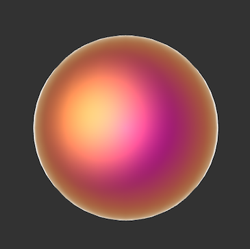
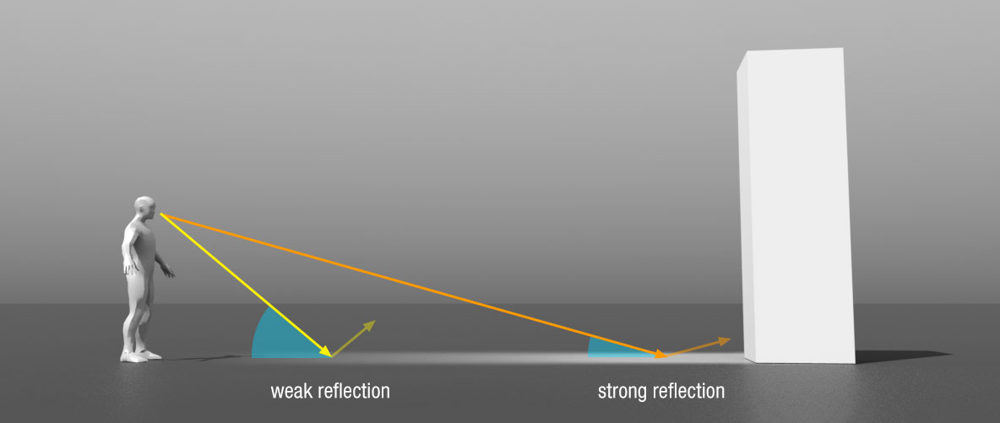
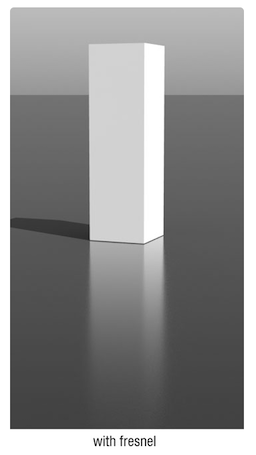
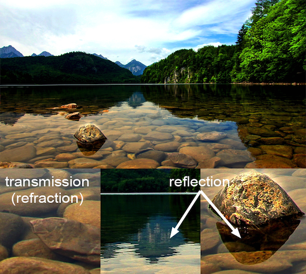
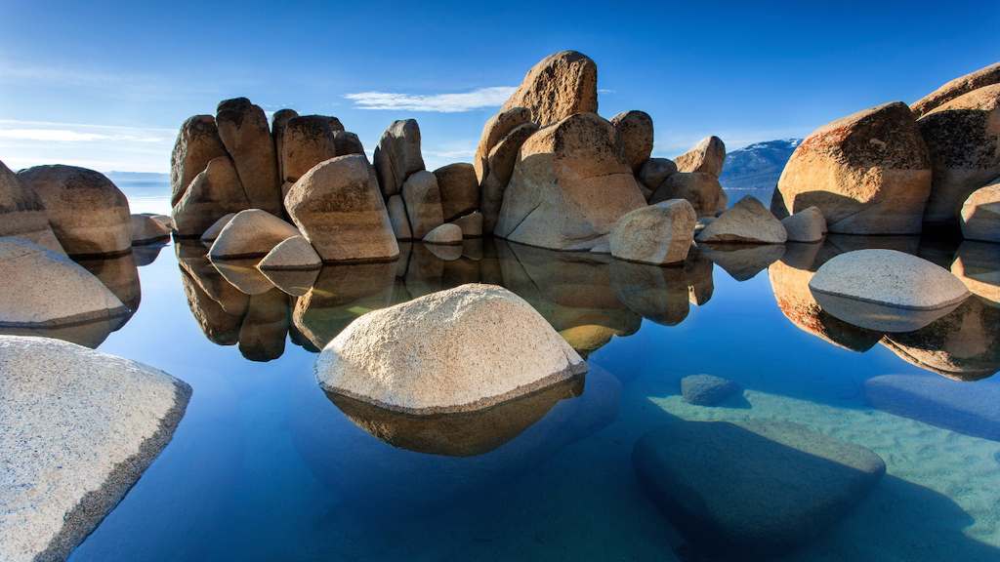
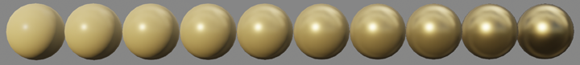
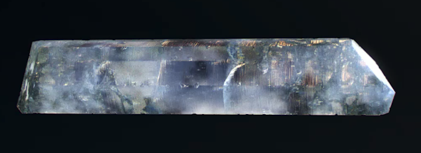

name: inverse
layout: true
class: center, middle, inverse
---

#### Prof. Dr. Lena Gieseke | l.gieseke@filmuniversitaet.de  
#### Film University Babelsberg KONRAD WOLF

# Materials and Shading Workshop

### Material Properties

<!--

Start server in /doc/

h or ?: Toggle the help window
j: Jump to next slide
k: Jump to previous slide
b: Toggle blackout mode
m: Toggle mirrored mode.
c: Create a clone presentation on a new window
p: Toggle PresenterMode
f: Toggle Fullscreen
t: Reset presentation timer
<number> + <Return>: Jump to slide <number>
-->

---
layout:false

.header[Material Properties]

## Disney's Principled BRDF

> We thoroughly debated the addition of each parameter. In the end we ended up with one color
parameter and ten scalar parameters.

---

.center[ .imgref[[[disneyanimation]](https://disneyanimation.com/publications/physically-based-shading-at-disney/)]]

???
  

* *baseColor*: the surface color, usually supplied by texture maps.
* *subsurface*: controls diffuse shape using a subsurface approximation.
* *metallic*: the metallic-ness (0 = dielectric, 1 = metallic). This is a linear blend between two
different models. The metallic model has no diffuse component and also has a tinted incident
specular, equal to the base color.
* *specular*: incident specular amount. This is in lieu of an explicit index-of-refraction.
* *specularTint*: a concession for artistic control that tints incident specular towards the base color. Grazing specular is still achromatic.
* *roughness*: surface roughness, controls both diffuse and specular response.
* *anisotropic*: degree of anisotropy. This controls the aspect ratio of the specular highlight. (0 = isotropic, 1 = maximally anisotropic.)
* *sheen*: an additional grazing component, primarily intended for cloth.
* *sheenTint*: amount to tint sheen towards base color.
* *clearcoat*: a second, special-purpose specular lobe.
* *clearcoatGloss*: controls clearcoat glossiness (0 = a “satin” appearance, 1 = a “gloss” appearan

Some models include a diffuse Fresnel factor.

---
.header[Material Properties]

## Physically-Based Shading

Currently, physically-based shading models usually include

--
* Diffusion & Reflection

--
* Translucency & Transparency

--
* Fresnel

--
* Roughness / micro-surface properties

--
* Metals

--
* Energy conservation

???
  

* In some cases diffusion is more complicated – in materials that have wider scattering distances for example, like skin or wax. In these cases a simple color will usually not do, and the shading system must take into account the shape and thickness of the object being lit. If they are thin enough, such objects often see light scattering out the back side and can then be called translucent. If the diffusion is even lower yet (in for example, glass) then almost no scattering is evident at all and entire images can pass through an object from one side to another intact. These behaviors are different enough from the typical “close to the surface” diffusion that unique shaders are usually needed to simulate them

  
--
  
Models often include measured material properties.

.footnote[[[Marmoset]](https://marmoset.co/posts/physically-based-rendering-and-you-can-too/)]

???
  

* https://de45xmedrsdbp.cloudfront.net/Resources/files/2013SiggraphPresentationsNotes-26915738.pdf
* Beyond rendering quality, consistency is the biggest reason to use measured values. Having consistent base materials takes the guess work out of material creation for individual artists. It also makes it easier from an art direction perspective to ensure that content created by a team of artists will look great in every lighting condition.

<!----------------------------------------------------------------------------->
---
template:inverse
## Roughness
## Micro-surface Properties

---
.header[Material Properties]

## Glossiness

The next image is from: [TU Wien | Rendering 186.101 | Károly Zsolnai-Fehér]

.center[ .imgref[[[strelok]](http://www.luxrender.net/forum/gallery2.php?g2_itemId=16543)]]

.footnote[[TU Wien | Rendering 186.101 | Károly Zsolnai-Fehér]]

---
.header[Material Properties]

## Roughness / Micro-Surface Properties 

.center[  
[[marmoset]](https://marmoset.co/posts/basic-theory-of-physically-based-rendering/)]

???
  

* microsurface detail and reflectivity are tied together
* A good example would be water and mud: both have very similar reflectivity, but since mud is quite rough and the surface of a puddle is very smooth, they appear very different in terms of their reflections. 
* Microsurface properties have other subtle effects on reflection as well. For example, the “edges-are-brighter” Fresnel effect diminishes somewhat with rougher surfaces (the chaotic nature of a rough surface ‘scatters’ the Fresnel effect, preventing the viewer from being able to clearly resolve it). Further, large or concave microsurface features can “trap” light – causing it to reflect against the surface multiple times, increasing absorption and reducing brightness. Different rendering systems handle these details in different ways and to different extents, but the broad trend of rougher surfaces appearing dimmer is the same.

<!----------------------------------------------------------------------------->
---
template:inverse
## Energy Conservation

---
.header[Material Properties]

## Energy Conservation

Reflection and diffusion are mutually exclusive...

.center[  
[[marmoset]](https://marmoset.co/posts/basic-theory-of-physically-based-rendering/)]

???
  

One consequence of the energy conservation is that the brightness of the specular highlight is automatically linked to its size.

* This is because, in order for light to be diffused, light must first penetrate the surface (that is, fail to reflect). 
* This is easy to enforce in a shading system: one simply subtracts reflected light before allowing the diffuse shading to occur. 
* **This means highly reflective objects will show little to no diffuse light, simply because little to no light penetrates the surface, having been mostly reflected. **
* The converse is also true: if an object has bright diffusion, it cannot be especially reflective.
* The Albedo parameter controls the base color of the surface.

Energy conservation of this sort is an important aspect of physically-based shading. It allows the artist to work with reflectivity and albedo values for a material without accidentally violating the laws of physics (which tends to look bad). While enforcing these constraints in code isn’t strictly necessary to producing good looking art, it does serve a useful role as a kind of “nanny physicist” that will prevent artwork from bending the rules too far or becoming inconsistent under different lighting conditions.

--
.center[  
[[marmoset]](https://marmoset.co/posts/basic-theory-of-physically-based-rendering/)]

???
  

* As our hypothetical shading system is now taking microsurface detail into account, and spreading reflected light appropriately, it must take care to reflect the correct amount of light. Regrettably, many older rendering systems got this wrong, reflecting too much or too little light, depending on the microsurface roughness.
* **When the equations are properly balanced, a renderer should display rough surfaces as having larger reflection highlights which appear dimmer than the smaller, sharper highlights of a smooth surface.**
* It is this apparent difference in brightness that is key: both materials are reflecting the same amount of light, but the rougher surface is spreading it out in different directions, whereas the smoother surface is reflecting a more concentrated “beam”:
* Here we have a second form of energy conservation that must be maintained, in addition to the diffusion/reflection balance described earlier. Getting this right is one of the more important points required for any renderer aspiring to be “physically-based”.

<!----------------------------------------------------------------------------->
---
template:inverse
## Translucency & Transparency

---
.header[Material Properties]

## Translucency & Transparency

???
  

* What is the difference?

--

*Transparency* is the physical property of allowing most of the light to pass through the material.

???
  

* without scattering it
* water glass

--

*Translucency* allows light to pass through, but the photons might be scattered at either of the two interfaces, or their border. 

???
  

* In other words, a translucent material is made up of components with different indices of refraction
* Soap, frosted window

.footnote[[[wikipedia]](https://en.wikipedia.org/wiki/Transparency_and_translucency)]

--
*Opaque* material absorbs or reflects all of the light that hits it.

--
.center[  
[[bing.net]](https://external-content.duckduckgo.com/iu/?u=https%3A%2F%2Ftse2.mm.bing.net%2Fth%3Fid%3DOIP.wG7G2W2pbc_IPzWb-nO5dQHaC2%26pid%3DApi&f=1&ipt=53c5670b17a02ecc5148eaf4076e2ed393261f090d0af66e6ed2a54b58ff4c07&ipo=images)]

---
.header[Material Properties]

## Translucency & Transparency

.center[  
[[wikipedia]](https://en.wikipedia.org/wiki/Transparency_and_translucency)]

---
template:inverse

# The Fresnel Effect

---
layout:false

## The Fresnel Effect

.center[]

.footnote[[[Dorian Iten]](https://www.dorian-iten.com/fresnel/)]

???

.task[ASK:]  

* What do you see?

---

## The Fresnel Effect

.center[]

.center[ ]

.footnote[[[Dorian Iten]](https://www.dorian-iten.com/fresnel/)]

???

  

* The angle is here between viewer and surface, not surface normal

Intuitive explanation
* The area of the intersection of the ray with the surface at a shallow angle is greater than the area of intersection at steep angle.
* To a greater area correspond more atoms to reflect the light. 

---

## The Fresnel Effect

.center[ ]

The larger the angle between viewer and **surface normal**, the stronger the reflection.

.footnote[[[Dorian Iten]](https://www.dorian-iten.com/fresnel/)]

???

  

* The angle is here between viewer and surface, not surface normal

---

## The Fresnel Effect

.center[]

.footnote[[[Dorian Iten]](https://www.dorian-iten.com/fresnel/)]

---

## The Fresnel Effect

.center[]

.footnote[[[Dorian Iten]](https://www.dorian-iten.com/fresnel/)]

---

## The Fresnel Effect

.center[]

.footnote[[[Dorian Iten]](https://www.dorian-iten.com/fresnel/)]

---

## The Fresnel Effect

[Everything has Fresnel](http://filmicworlds.com/blog/everything-has-fresnel/)

.center[[[vray]](https://shop.spreadshirt.com/vrayinfo/everything+has+fresnel-A5d89cfe86bbdbb2e6a4903d7?productType=175)]

---

## The Fresnel Effect

.center[]

---

## The Fresnel Effect

> The Fresnel effect models the fact that the amount of light the viewer sees reflected from a surface depends on the viewing angle.

---

## The Fresnel Effect

### Reflections Change With Distance

???

.task[ASK:]  

* Any ideas how this could connect to a viewer's distance to an object?

--

.center[ ]

.footnote[[[Dorian Iten]](https://www.dorian-iten.com/fresnel/)]

???

  

* As you look down to the ground close to your feet, the angle of incidence is very steep. If you look at a point on the ground that’s further away from you, the angle gets more shallow – and the reflection becomes more visible.

---

## The Fresnel Effect

### Reflections Change With Distance

.center[ 
]

.footnote[[[Dorian Iten]](https://www.dorian-iten.com/fresnel/)]

???

  

* As you look down to the ground close to your feet, the angle of incidence is very steep. If you look at a point on the ground that’s further away from you, the angle gets more shallow – and the reflection becomes more visible.

---

## The Fresnel Effect

### Reflective and Refractive Material

.center[ [[wiki]](http://en.wikipedia.org/wiki/Refraction)]

.footnote[[TU Wien | Rendering 186.101 | Károly Zsolnai-Fehér]]

---

## Fresnel Equations

### Reflective and Refractive Material

???

.task[ASK:]  

* Any ideas how this could affect reflection and refraction? 
* Any related real world experiences you can think of?

--

.center[ [[scratchapixel]](https://www.scratchapixel.com/lessons/3d-basic-rendering/introduction-to-shading/reflection-refraction-fresnel)]

???

.task[ASK:]  

* What do you see?

---

## Fresnel Equations

### Reflective and Refractive Material

.center[ [[scratchapixel]](https://www.scratchapixel.com/lessons/3d-basic-rendering/introduction-to-shading/reflection-refraction-fresnel)]

---

## Fresnel Equations

### Reflective and Refractive Material

.center[ [[filament]](https://google.github.io/filament/Filament.html)]

???
  

* Well, imagine shooting a piece of glass with a gun. If you shoot at a glancing angle, it is more likely to ricochet off the glass without damaging it. This is because the impulse required to reflect the bullet is smaller for shallow grazing angles, as most of the bullets momentum is parallel to the interface. Now obviously the physics of reflecting a photon is very different than reflecting a bullet, but the analogy is that the impulse required to reflect the photon becomes smaller, and it becomes relatively "easier" for the medium to supply that small impulse than to let the photon go through. 
* https://physics.stackexchange.com/questions/12035/why-does-light-reflect-more-intensely-when-it-hits-a-surface-at-a-large-angle

---

## Fresnel Equations

### Reflective and Refractive Material

The [Fresnel Equations](https://www.wikiwand.com/en/Fresnel_equations) define for transparent materials such as glass and water how much light is reflected vs. how much light is transmitted.  

???
  

* But how do we compute those reflected and refracted constants?
* These are given by the Fresnel Equations.  For a non-metal like water, all that you need for them is the refractive index of the material.  

.center[ [[psgraphics]](https://psgraphics.blogspot.com/2020/03/fresnel-equations-schlick-approximation.html)]

* Left: the light hitting the water divides between reflected and refracted based on angle (for this particular one it is 23% reflected).  Right: the eye sees 77% of whatever color comes from below the water and 23% of whatever color comes from above the water.
* E.g., `color = 0.77*color(refracted_ray) + 0.23*color(reflected_ray)`

---

## Fresnel Equations

### Reflective and Refractive Material

More precisely, they describe **the reflection and transmission of light** from one medium to a different one by computing the ratio of reflected and transmitted energy. 

--

.center[ [[wiki]](https://www.wikiwand.com/en/Fresnel_equations)]

???

.task[TASK:]  

* Go to wikipage

---

## Fresnel Equations

### Schlick's Approximation 

In computer graphics, [Schlick's approximation](https://www.wikiwand.com/en/Schlick%27s_approximation) is a formula for approximating the contribution of the Fresnel factor, shaping the reflection and transmission of light between media.

???

.task[TASK:]  

* https://web.archive.org/web/20200510114532/cs.virginia.edu/~jdl/bib/appearance/analytic%20models/schlick94b.pdf
* Go to [Filament](https://google.github.io/filament/Filament.html#materialsystem/specularbrdf/fresnel(specularf))

---

## Fresnel Equations

### Schlick's Approximation 

Schlick's approximation describes the Fresnel factor as specular reflection coefficient $R$ with 

$R(θ) = R_0 + (1 − R_0) (1 − cos\theta)^5$

where

$R(θ) = ( \frac{n_1 − n_2}{n_1 + n_2})^2$

* $\theta$ is the angle between the direction from which the incident light is coming and the normal of the interface between the two media
    * $cos\theta = (\mathbf{N} ⋅ \mathbf{V})$
* $n_1$, $n_2$ are the indices of refraction of the two media at the interface
* $R_0$ is the reflection coefficient for light incoming parallel to the normal i.e., the value of the Fresnel term when $\theta = 0$ or minimal reflection
* In computer graphics, one of the interfaces is usually air, meaning that it can be approximated as 1
    * Then we have $R(θ) = ( \frac{n − 1}{n + 1})^2$ where $n$ is the material’s index of refraction.

???
  

*On a side note:* Check out this awesome renderer: [Filament](https://google.github.io/filament/)
* [Cheat Sheet](https://google.github.io/filament/Material%20Properties.pdf)
* [Material Overview](https://google.github.io/filament/Materials.html)
* [Theoretical Backgrounds](https://google.github.io/filament/Filament.html#imagingpipeline)

---

## Fresnel Equations

### Schlick's Approximation 

\\(I_{Phong} = k_a + k_d \cdot max(N \cdot L, 0) \cdot I_d  + k_s \cdot max(R \cdot V, 0)^n \cdot I_s \\)

could then used as

\\(I_{Phong} = k_a + k_d \cdot max(N \cdot L, 0) \cdot I_d  + Schlick(k_s) \cdot max(R \cdot V, 0)^n \cdot I_s \\)

<!----------------------------------------------------------------------------->
---
template:inverse
## Metals

---
.header[Material Properties]

## Metals

Metals as electrically conductive materials.

.center[  
[[unrealengine]](https://docs.unrealengine.com/5.0/en-US/physically-based-materials-in-unreal-engine/)]

.footnote[[[Marmoset]](https://marmoset.co/posts/physically-based-rendering-and-you-can-too/)]

--
* tend to be much more reflective than insulators (non-conductors)

???
  

* Conductors will usually exhibit reflectivities as high as 60-90%, whereas insulators are generally much lower, in the 0-20% range.
* These high reflectivities prevent most light from reaching the interior and scattering, giving metals a very “shiny” look.
  
--
* reflectivity might vary and their reflections appear tinted (e.g. gold, copper, and brass)

???
  

* Insulators as a general rule do not exhibit this effect, and their reflections are uncolored.

--
* absorb rather than scatter any light that penetrates the surface, hence no diffuse reflection
    * oxides or residues on the surface might scatter some small amounts of light

???
  

* It is this duality between metals and just about everything else that leads some rendering systems to adopt “metalness” as a direct input. In such systems artists specify the degree to which a material behaves as a metal, rather than specifying only the albedo & reflectivity explicitly. This is sometimes preferred as a simpler means of creating materials, but is not necessarily a characteristic of physically-based rendering.

---
template:inverse

## Anisotropic Reflectance

---
.header[Material Properties]

## Anisotropic Reflectance

.center[  
[[blenderguru]](https://www.blenderguru.com/tutorials/an-introduction-to-anisotropic-shading)]

---
.header[Material Properties]

## Anisotropic Reflectance

.center[  
[[blenderguru]](https://www.blenderguru.com/tutorials/an-introduction-to-anisotropic-shading)]

---
.header[Material Properties]

## Anisotropic Reflectance

.center[  
[[blenderguru]](https://www.blenderguru.com/tutorials/an-introduction-to-anisotropic-shading)]

---
.header[Material Properties]

## Anisotropic Reflectance

.center[  
[[blenderguru]](https://www.blenderguru.com/tutorials/an-introduction-to-anisotropic-shading)]

---
.header[Material Properties]

## Anisotropic Reflectance

.center[  
[[blenderguru]](https://www.blenderguru.com/tutorials/an-introduction-to-anisotropic-shading)]

???
  

* Amount of anisotropy in the reflection; 0.0 gives a round highlight. Higher values give elongated highlights orthogonal to the tangent direction; negative values give highlights shaped along the tangent direction.

---
.header[Material Properties]

## Anisotropic Reflectance

.center[  
[[pinimg]](https://i.pinimg.com/originals/a3/e8/b5/a3e8b5f700ff101ea34ea7df480a09d0.jpg)]

???
  

* From vertical (-0.9) over no (0) to horizontal stretching (0.9)

---
.header[Material Properties]

## Anisotropic Reflectance

.center[  
[[pinimg]](https://i.pinimg.com/originals/a3/e8/b5/a3e8b5f700ff101ea34ea7df480a09d0.jpg)]

???
  

* Rotation parameter for the rotation of the anisotropic tangent direction. from vertical stretch with no rotation (0) over 45, 90, 135 degree to a bitmapped anisotropy rotation
* Tangent vector (t), this vector is perpendicular to nx and thus tangent to the surface at x. It is used to build a local reference system. BRDF expressions can be refered to. Isotropic BRDFs may use any tangent vector, however for anisotropic BRDFs this vector must be considered as an external parameter which fixes the orientation of the BRDF (with respect to rotations around nx).

<!----------------------------------------------------------------------------->
---
template:inverse
# Complex Properties

---

---
.header[Material Properties]
## Complex Properties

.center[  ]  [[entagma]](https://entagma.com/bubbles-yet-again-implementing-glassners-bubble-triplets-in-vex/)[[houdini masterclass]](https://www.youtube.com/watch?v=TwOjsRtWpBA)

---
.header[Material Properties]
## Layering

.center[  ]  .imgref[[[entagma]](https://entagma.com/bubbles-yet-again-implementing-glassners-bubble-triplets-in-vex/)]

<!----------------------------------------------------------------------------->
---
template:inverse
# Shadows

---

.center[ .imgref[[[dorian-iten]](https://www.dorian-iten.com/light/)]]

<!----------------------------------------------------------------------------->
---
template:inverse
# Summary

---

## Summary

.todo[TODO:Summary]

---
template:inverse

