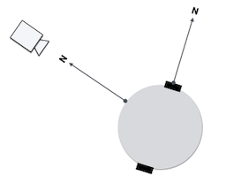
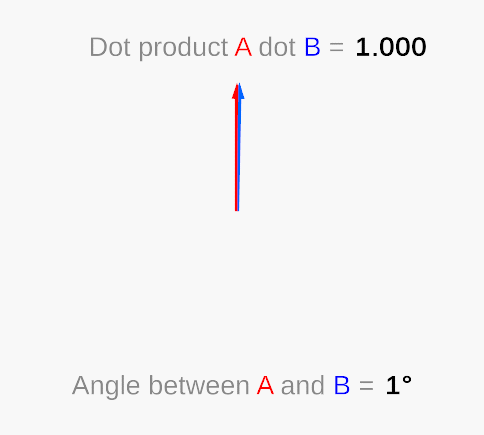

name: inverse
layout: true
class: center, middle, inverse
---

#### Prof. Dr. Lena Gieseke | l.gieseke@filmuniversitaet.de  
#### Film University Babelsberg KONRAD WOLF

# Materials and Shading Workshop

### NPR

<!--
h or ?: Toggle the help window
j: Jump to next slide
k: Jump to previous slide
b: Toggle blackout mode
m: Toggle mirrored mode.
c: Create a clone presentation on a new window
p: Toggle PresenterMode
f: Toggle Fullscreen
t: Reset presentation timer
<number> + <Return>: Jump to slide <number>
-->

---
layout:false

##  Non-Photorealistic Rendering (NPR)

Non-photorealistic rendering (NPR) focuses on enabling a variety of expressive styles.
  
The goal is to provide control over style and abstraction.

--
  
We need to differentiate between

* Image and video stylization
* Shading
* Rendering
* Post-Processing Effects

---


## NPR

.left-even[
* Example toon
]
.right-even[]

---

## NPR

.left-even[
* Example toon
* Example Fresnel effect
]
.right-even[ ]

---
.header[NPR]

## Non-Photorealistic Shading

.center[]

Bouguereau, 1891 vs. van Gogh, 1889

---
.header[NPR]

## Started Early On...

NPR hast been around as long as Computer Graphics...

---
.header[NPR]

## Started Early On...

Simulating various media:

.center[]

.footnote[[NPR, COS426, Spring 2020, Princeton University]]

---
.header[NPR]

## Started Early On...

Illustrations / visualizations:

.center[]

.footnote[[NPR, COS426, Spring 2020, Princeton University]]

---
## NPR

.footnotes[J. E. Kyprianidis, J. Collomosse, T. Wang and T. Isenberg, **"[State of the "Art”: A Taxonomy of Artistic Stylization Techniques for Images and Video](https://hal.inria.fr/hal-00781502/file/Kyprianidis_2013_SAT.pdf),"** in IEEE Transactions on Visualization and Computer Graphics, vol. 19, no. 5, pp. 866-885, May 2013, doi: 10.1109/TVCG.2012.160.]

.center[]

--

* [State of the Art Non-Photorealistic Rendering (NPR) Techniques](https://www.cs.princeton.edu/courses/archive/spring15/cos426/papers/Sayeed06.pdf)
* [A comprehensive survey on NPR and benchmark developments for image abstraction and stylization](https://link.springer.com/article/10.1007/s42044-019-00034-1)


???
.task[COMMENT:]  

* [Ref-NPR: Reference-Based Non-Photorealistic Radiance Field](https://arxiv.org/pdf/2212.02766.pdf)

1. Stroke-based rendering
2. Image analogy
3. Region-based techniques
4. Image processing and filtering techniques


---
.header[NPR]

## Non-Photorealistic Shading


.center[  ]


.footnote[[NPR, COS426, Spring 2020, Princeton University]]


???
.task[COMMENT:]  

Applications

* Explanation
* Illustration 
* Storytelling 
* Design


---
.header[NPR]

## Which Effects Do We See?

.left-even[]
.right-even[]

.footnote[[NPR, COS426, Spring 2020, Princeton University]]

---
.header[NPR]

## Which Effects Do We See?

.left-even[]
.right-even[
* Outlines
* Toon Shading
* Stylized Strokes
* Paper Effect
* Hatching

]

.footnote[[NPR, COS426, Spring 2020, Princeton University]]


???
.task[COMMENT:]  


* Outlines: http://dl.lcg.ufrj.br/cg2/downloads/non-photorealistic%20rendering/Intro%20to%203D%20NPR%20Silhouettes%20and%20Outlines.pdf

---
.header[NPR]

## Paper Effect

Peaks catch pigment, valleys resist pigmentation. Implement it, e.g., with a noise and a height field.

 

.footnote[[NPR, COS426, Spring 2020, Princeton University, [shadertoy, wyatt](https://www.shadertoy.com/view/fsjyR3)]]

---
.header[NPR]

## Paper Effect

.center[]

---
.header[NPR]

## Hatching

Closely spaced parallel lines to create tonal or shading effects.

 


???
.task[COMMENT:]  


* https://citeseerx.ist.psu.edu/document?repid=rep1&type=pdf&doi=467f7e313e9902ad084defcbecbcb603a4e02813
* https://scholarsarchive.byu.edu/cgi/viewcontent.cgi?article=2045&context=etd
* Distribute strokes along the lines of principal curvature.

.center[]


* https://www.researchgate.net/profile/Matthias-Trapp-2/publication/358523901/inline/jsViewer/62061b63cf7c2349ca08c7fb

---
.header[NPR]

## Stippling

Control the density of the dots by $N \cdot L$, meaning the orientation towards the light.

.center[]  
[[blender]](https://blender.stackexchange.com/questions/143884/how-can-stipple-shading-be-replicated-in-blender/144160)


???
.task[COMMENT:]  

* https://www.sciencedirect.com/science/article/abs/pii/S0097849317300432
* https://citeseerx.ist.psu.edu/document?repid=rep1&type=pdf&doi=c5df697c3fc7366212b4e6ad616aef03c9383196
* http://www.umsl.edu/~kangh/

---
.header[NPR]

## Seven Grand Challenges in NPR

.footnotes[J. E. Kyprianidis, J. Collomosse, T. Wang and T. Isenberg, **"State of the "Art”: A Taxonomy of Artistic Stylization Techniques for Images and Video,"** in IEEE Transactions on Visualization and Computer Graphics, vol. 19, no. 5, pp. 866-885, May 2013, doi: 10.1109/TVCG.2012.160.]

--
* Algorithmic Aesthetics
    * How can we quantify success and how can aesthetic ‘beauty’ be defined?
--
* Abstraction
    * How do you capture the ‘essence’ of an object, image, or painterly style? 
???
.task[COMMENT:]  

* The reduction of an image to a sketch or structure was discussed.
  
--
* Visualization
    * How can you use NPR to communicate information most effectively?
--
* Interactivity
    * How can you develop automated tools that support creativity and the artist?

---
.header[NPR]

## Seven Grand Challenges in NPR

.footnotes[J. E. Kyprianidis, J. Collomosse, T. Wang and T. Isenberg, **"State of the "Art”: A Taxonomy of Artistic Stylization Techniques for Images and Video,"** in IEEE Transactions on Visualization and Computer Graphics, vol. 19, no. 5, pp. 866-885, May 2013, doi: 10.1109/TVCG.2012.160.]

* Artistic Turing Test
    * Can you make artistic computer images and animations that are indistinguishable from those created by hand?
--
* New Art Forms
    * Can NPR be used to create some entirely new and original forms of art?
--
* Naming the Field
    * NPR is too broad of a term.

--

For the authors "New Art Forms" remains the most promising direction.

> NPR should not just imitate and emulate styles of the past but create styles for the future.


---

## NPR Shading

.center[]

???

.task[ASK:]  

* Show live version
* What properties do you see?
    * Flat shading
    * Step function for diffuse shading
    * Outline
    * Small light highlight
    * Outline around highlight 


---

## NPR Shading

Many NPR shaders make use of the outline of an object.

???

.task[ASK:]  

* How do we detect the outline?

--

The outline of an object is detected by the angle between the normal of the surface point and the view vector.

--

.center[]

---

## NPR Shading

Many NPR shaders make use of the outline of an object.

The outline of an object is detected by the angle between the normal of the surface point and the view vector.

.center[]

---

## NPR Shading

Many NPR shaders make use of the outline of an object.

The outline of an object is detected by the angle between the normal of the surface point and the view vector.

.center[]

--

\\({cos θ}\\) = **V** ∙ **N**

--

```js
float cos_view_normal = max(0.0, dot(view_dir, normal));
```
---

## NPR Shading

Once again...

\\({cos θ}\\) = **A** ∙ **B**

.center[]

---

## NPR Shading

.center[]


Let's Implement This! 👩🏽‍💻 🧑🏻‍💻

---

## NPR Shading II

.center[]

???

.task[ASK:]  

* What do you see?
* smooth transitions, more than one rim, no diffuse shading

--

This effect is based on the *Fresnel effect*.  
Let's Implement This! 👩🏽‍💻 🧑🏻‍💻

???

.task[ASK:]  

* Show code file
* Live coding together, go step by step as questions
* [sphere_toon_smooth_steps](../../shader_sphere_toon_smooth/shader_sphere_toon_smooth/sphere_toon_smooth_steps.md)
