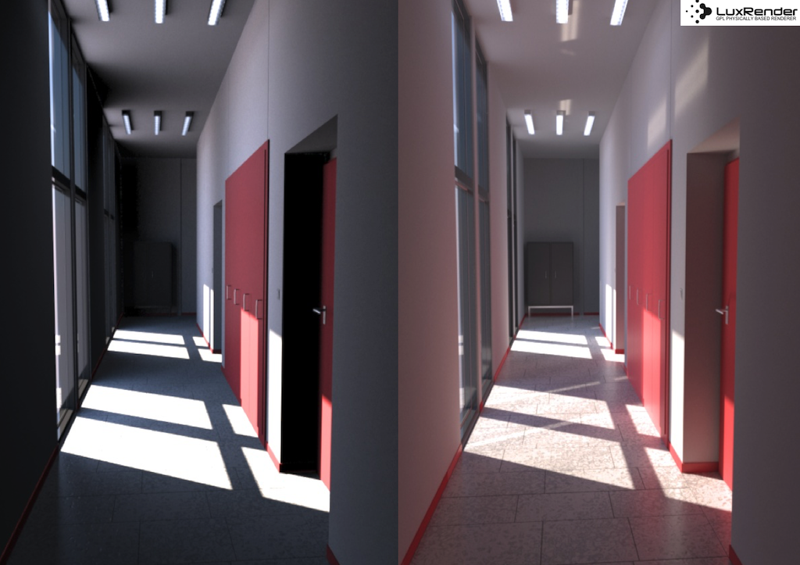
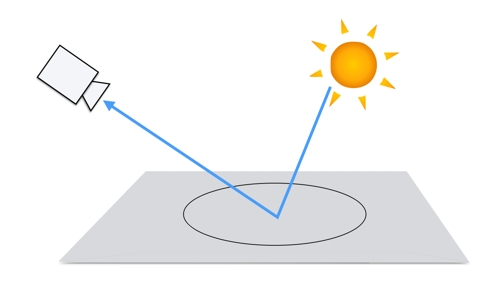
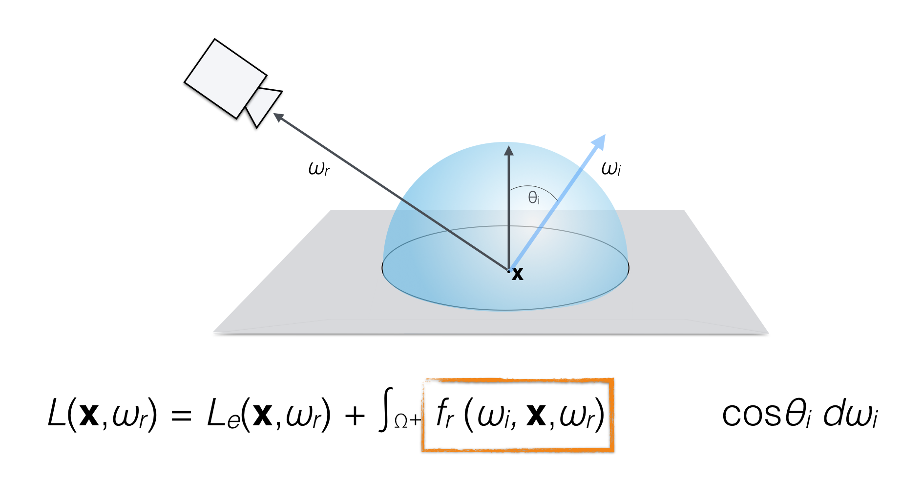
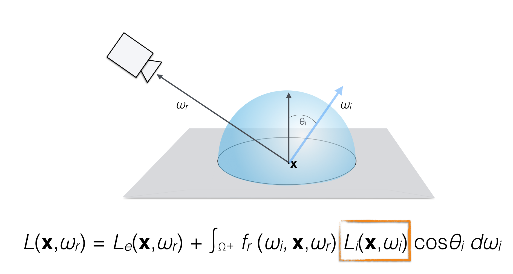
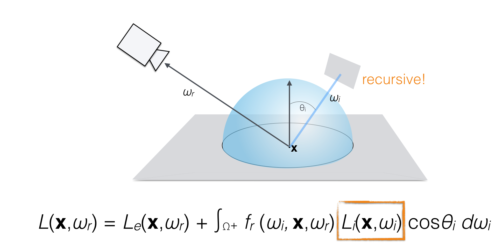
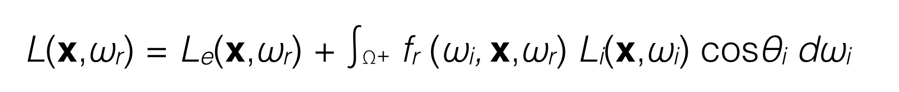

name: inverse
layout: true
class: center, middle, inverse
---

#### Prof. Dr. Lena Gieseke | l.gieseke@filmuniversitaet.de  
#### Film University Babelsberg KONRAD WOLF

# Materials and Shading Workshop

### Global Illumination

<!--
h or ?: Toggle the help window
j: Jump to next slide
k: Jump to previous slide
b: Toggle blackout mode
m: Toggle mirrored mode.
c: Create a clone presentation on a new window
p: Toggle PresenterMode
f: Toggle Fullscreen
t: Reset presentation timer
<number> + <Return>: Jump to slide <number>
-->

---
layout:false

## Local Illumination

We can now define for each surface point how the incoming light is reflected.

--

Well, that is all nice and well but what is still missing?

---
## Indirect Illumination

.center[  
[Lux Renderer]]

.footnote[[TU Wien | Rendering 186.101 | Károly Zsolnai-Fehér]]

---

## Indirect Illumination

.center[  
[[fantasylab]](http://www.fantasylab.com/newpages/back.jpg)]

.footnote[[TU Wien | Rendering 186.101 | Károly Zsolnai-Fehér]]

---

## Indirect Illumination

.center[  
[[aztadom]](http://aztadom.co/wp-content/uploads/2014/04/cuki_aranyos_allat_10.jpg
)]

.footnote[[TU Wien | Rendering 186.101 | Károly Zsolnai-Fehér]]

---

## Global Illumination

We need light from all directions!

.center[]

---

## Global Illumination

We need light from all directions!

.center[]

---

## Global Illumination

We need light from all directions!

.center[]

---

## Local Illumination

.center[ ]  
[[wiki]](https://www.wikiwand.com/en/Global_illumination)

---

## Global Illumination

.center[]  
[[wiki]](https://www.wikiwand.com/en/Global_illumination)

    Local illumination – idea that objects are only illuminated directly by the light sources
    Global illumination – idea that objects do not only reflect light to the viewer, but also to other objects

---
template: inverse

## Rendering Equation

---

## Rendering Equation

How much light is emitted and reflected on surface point x?

--

.center[]

---

## Rendering Equation

Light from all directions...

--

.center[]

???
.task[COMMENT:]  

* Cosine is the Lambert's cosine law to recognize how the light ray is oriented toward the surface normal
* https://developer.nvidia.com/blog/ray-tracing-essentials-part-6-the-rendering-equation/

---

## Rendering Equation

Reflectance?

--

BRDF!

--

.center[]

---

## Rendering Equation

BRDF with what? Which light do we get?

--

.center[]

---

## Rendering Equation

Bad news:

--

The incoming light in x is the rendering equation of y...

--

.center[]

---

## Rendering Equation

.center[]

???
.task[COMMENT:]  

* Meaning: at a particular position and direction, the outgoing light (Lo) is the sum of the emitted light (Le) and the reflected light. The reflected light being the sum of the incoming light (Li) from all directions, multiplied by the surface reflection and incoming angle. By connecting outward light to inward light, via an interaction point, this equation stands for the whole 'light transport' – all the movement of light – in a scene. 

--

Infinite-dimensional!

--

.center[]

---

## Rendering Equation

Once again, 'solutions' are acceptable approximations...

???
.task[COMMENT:]  

* https://en.wikipedia.org/wiki/Rendering_(computer_graphics)

---
.header[Global Illumination]

## Ray Tracing With More Rays

???
.task[COMMENT:]  

* Ray casting – technique of constructing a ray and finding out what it intersects.
* Ray tracing – technique of doing ray casting recursively, reflecting the rays as they hit the geometry.

--

Rays for reflections, refractions, shadows, etc.

???
.task[COMMENT:]  

* But light rarely hits an object and that light gets completely absorbed. In reality, there's a lot of reflection and refraction going on, so if you want the most realistic rendering possible, new vector equations are generated, one each for the reflected and refracted rays.

https://www.techspot.com/article/2485-path-tracing-vs-ray-tracing/

--

.center[]

---
.header[Global Illumination]

## Ray Tracing With More Rays

.center[]

???
.task[COMMENT:]  

* Rays get traced until they also hit an object, and the sequence continues until a chain of rays is finally bounced all the way back to a source of light in the scene.  

???
.task[COMMENT:]  

* Rinse and repeat across all of the other pixels in the frame, and the end result is a realistically lit scene... although a fair bit of additional processing is still needed to tidy up the final image.
* But even with the most powerful of GPUs and CPUs, a fully ray traced frame takes an enormous amount of time to make -- far, far longer than a traditionally rendered one, using compute and pixel shaders.

---
.header[Global Illumination]

## Ray Tracing With More Rays

The number of rays traced grows exponentially with every bounce.

.center[]

???
.task[COMMENT:]  

* Rinse and repeat across all of the other pixels in the frame, and the end result is a realistically lit scene... although a fair bit of additional processing is still needed to tidy up the final image.
* But even with the most powerful of GPUs and CPUs, a fully ray traced frame takes an enormous amount of time to make -- far, far longer than a traditionally rendered one, using compute and pixel shaders.

* Ray tracing, radiosity, (bi-directional) path tracing, Metropolis light transport, precomputed radiance transfer, (stochastic progressive) photon mapping, irradiance caching, path space regularization, vertex connection and merging

---
.header[Global Illumination]

## Ray Tracing With More Rays

What millions of rays can achieve...

.center[]  
[[Gilles Tran, wiki]](https://commons.wikimedia.org/wiki/File:Glasses_800_edit.png) [[techspot]](https://www.techspot.com/article/2485-path-tracing-vs-ray-tracing/)

---
.header[Global Illumination]

## Path Tracing

???
.task[COMMENT:]  

* The short and sweet answer to this question is... "path tracing is just ray tracing." 
* The equations for modelling the behavior of light are the same, the use of data structures to accelerate the searching for ray-triangle interactions are the same, too, and modern GPUs use the same units to accelerate the process. It's also very computationally intensive.

--

Path tracing started as Monte Carlo ray tracing (James Kajiya once again!), which randomly traces possible light paths. 

--

.center[]

???
.task[COMMENT:]  

* statistical sampling of scene
* Repeated sampling of any given pixel will eventually cause the average of the samples to converge on the correct solution of the rendering equation, making it one of the most physically accurate 3D graphics rendering methods in existence.

--
Repeated sampling will eventually cause the average of the samples to converge on the correct solution of the rendering equation.

???
.task[COMMENT:]  

* think of it in terms of polls. Let's say you want to know the average height of the entire adult population of a country. You can measure each person's height, sum up all the heights and divide this sum by the total number of people. Of course, there are too many people in this population, and it would take too long to do so. We say the problem is intractable. Instead, you measure the height of a small sample of that population, sum up the numbers and divide the sum by the sample size (let's call this number N). The technique works if people making up that sample are chosen randomly and with equiprobability (each individual making up the sample has the same chance to be part of the sample as any other individual making up the population). This is what we call a poll. The result is probably not the exact number, but it is generally a "good" estimation of that number. We are increasing N, increasing (in terms of probability) the quality of your estimation. The principle is the same for approximating or estimating the amount of light reflected towards by other objects in the scene. The problem is also intractable because we can't account for all the directions in the hemisphere (as mentioned before, surfaces are continuous, and there's an infinity of points on their surface and therefore an infinity of directions, thus the problem is intractable here as well). Therefore we select a few directions randomly and take the average of their contribution.

---
.header[Global Illumination]

## Path Tracing

Nowadays, you can understand path tracing as taking *smart paths*, e.g. tracing only the rays that are the most likely path for the light.

???
.task[COMMENT:]  

* Path tracing differs with ray tracing in that instead of following lots of rays, throughout an entire scene, the algorithm only traces the most likely path for the light.

--

.center[]

???
.task[COMMENT:]  

* Evaluates integrals based on a selection of random samples in the integration domain.
* It is essentially a statistical method that is based on the idea that you can approximate or estimate how much light is redirected towards by other objects in the scene by casting rays from in random directions above the surface and evaluating the color of the objects these rays intersect (if they do intersect geometry). 

---
.header[Global Illumination]

## Monte Carlo Path Tracing

Fewer rays would result in a less realistic lighting, but since the surface color is not affected by most of the secondary rays, dumping rays has often almost no effect.

---
.header[Global Illumination]

## Monte Carlo Path Tracing

How to sample and reduce variance is a advanced research topic.

--

Just remember that the Monte Carlo integration method only provides you with an approximation of the real solution - but looks almost as good (or even better)!

???
.task[COMMENT:]  

* So there you have -- path tracing, the fast cousin of ray tracing. Looks almost as good, works a heck of a lot quick
* The "quality" of this approximation mostly depends on N, the number of samples used. The higher N, the more likely you are to get a result close to the actual result of this integral. We will come back to this topic in the next chapter. https://www.techspot.com/article/2485-path-tracing-vs-ray-tracing/
* https://history-computer.com/ray-tracing-vs-path-tracing-whats-the-difference/
* Path tracing is the most accurate way of rendering but is also computationally intensive due to the simulation of light/material interaction through many bounces. 

---
.header[Global Illumination]

## Path Tracing

.center[]  
[[nvidia]](https://blogs.nvidia.com/blog/2022/03/23/what-is-path-tracing/)

---
.header[Global Illumination]

## What Is Next?

NVIDIA provides hardware that supports real-time ray and path tracing, making it incredibly fast.

???
.task[COMMENT:]  

* With recent advances in hardware ray tracing, systems research, stochastic light sampling, and denoising, we are building a path towards path tracing of scenes with billions of triangles and millions of light emitters in real time. This talk presents an overview of our latest research results and performance optimizations working toward real-time path tracing. We also show how to integrate the GeForce SDKs together into a reference path tracer.

---
.header[Global Illumination]

## Path Tracing

Published by NVIDIA for its RTX Path Tracing SDK: real-time path tracing of a scene called “Transparent Machines,” created by artist Mike Winkelman. Rendering this glass machine requires light to bounce more than 60 times per light path:

.center[]  
[[nvidia]](https://developer.nvidia.com/rtx/path-tracing) 
  

???
.task[COMMENT:]  

* With recent advances in hardware ray tracing, systems research, stochastic light sampling, and denoising, we are building a path towards path tracing of scenes with billions of triangles and millions of light emitters in real time. This talk presents an overview of our latest research results and performance optimizations working toward real-time path tracing. We also show how to integrate the GeForce SDKs together into a reference path tracer.

---

## Global Illumination Rendering Algorithms

* Monte-Carlo Ray and Path Tracing
    * Stochastic integral solutions
    * Noise from variance in stochastic processes
* Photon Mapping
    * Distribute light particles in scene, then ray tracing
    * Good for spatially focused light effects such as caustics
* Radiosity
    * Finite element method: surfaces are divided into one or more smaller surfaces
    * Light is simulated between patches based on a view factor
    * Reduces the infinite dimensional rendering equation to a finite number of dimensions
    * Efficient for overall smooth lighting and reflections

See wiki's [List of methods](https://en.wikipedia.org/wiki/Global_illumination) for rendering global illumination.

???
.task[COMMENT:]  

* https://herbertsstuff.wordpress.com/2015/06/07/rendering-algorithms-photon-mapping/
* https://cglearn.codelight.eu/pub/computer-graphics/global-illumination
* https://ohiostate.pressbooks.pub/graphicshistory/chapter/19-5-global-illumination/

* Radiosity is a method of rendering using lighting that comes not only from the light source but also the objects in the scene that reflect the light. Using the radiosity algorithm, the light emission is calculated so that rays of light from their sources are scattered over the rendered objects and, colliding with their surface, break into smaller particles, thereby spreading light throughout the scene. Thus, the render looks very photorealistic.
* Pros:
    More physically accurate
    Each object’s surface is covered
    Realistic light effects
    Allows for diffuse interreflection
* Cons:
    Challenging to visualize

---
.header[Global Illumination Rendering Algorithms]

## Example Unreal

???
.task[COMMENT:]  

* Unreal Engine provides multiple lighting paths to choose from for global illumination solutions, and often they are not exclusive to one another and can be seamlessly blended. For example, 

https://docs.unrealengine.com/5.0/en-US/global-illumination-in-unreal-engine/

--

* [Precomputed](https://docs.unrealengine.com/5.0/en-US/cpu-lightmass-global-illumination-in-unreal-engine/) 
    * *Lightmass Global Illumination system*
    * Textures
    * Lighting can't change
    * Difficult for large, open-world environments

???
.task[COMMENT:]  

* Ideal for scenes where lighting doesn't need to change.
* Performance costs are relative to the memory required to load and store the lightmap textures.
* Quality and accuracy of results is set by the texture resolution of the lightmap texture being baked and applied to geometry.
* Supports Static Mesh and BSP geometry by default.
* Static Meshes require setting up a Lightmap UV to store lighting data.
* Can be used in combination with dynamic lighting. 
* Large, open-world environments present impractical requirements for baked lighting (even without a time-of-day system). Bake times, memory usage, texture storage and playback are considerable factors to use dynamic GI.

The light baking system in Unreal Engine computes lighting data on the CPU, or GPU, using the Lightmass Global Illumination system. This method of precomputing lighting is used to achieve high-quality results that aren't compromised by real-time limitations by storing the information in textures that are then applied to geometry. This method of lighting cannot be changed dynamically and is ideal for projects where lighting doesn't need to change, or for mobile projects where dynamic lighting is limited. 

--
* Dynamic
    * *Lumen system*
    * Uses "multiple ray tracing methods"
    * Performance costs very high
    * Some GI effects are not possible

???
.task[COMMENT:]  

* Ideal for times where lighting needs to change, such as turning a light on or off, or a time-of-day system.
* Large, open-world environments present impractical requirements for baked lighting (even without a time-of-day system). Bake times, memory usage, texture storage and playback are considerable factors to use dynamic GI.
* Performance costs can be significantly more expensive to calculate in real-time depending on the method being used.
* Quality and accuracy is often traded with performance. Some Dynamic GI methods are limited by real-time usage.
* Supports all geometry types by default.
* Can be used in combination with precomputed lighting. 

Dynamic Global Illumination

The dynamic global illumination methods in Unreal Engine provide real-time scalable solutions for dynamic indirect lighting in your projects. This means being able to place, move, and light objects in the world without additional costs of baking lighting or having additional set up. Dynamic indirect lighting also means being able to accurately simulate time-of-day transitions or something as simple as turning a light on and off and having light bounce and reflect accurately. 

Lumen is a fully dynamic global illumination and reflection system that is designed for next-generation consoles. It is the default dynamic global illumination system and uses multiple ray tracing methods to solve global illumination and reflections at scale.
https://docs.unrealengine.com/5.0/en-US/lumen-global-illumination-and-reflections-in-unreal-engine/

Screen Space Global Illumination (SSGI) is a post processing effect that generates global illumination for objects within the scene based solely on the current visible objects within the camera view. This is a low-cost and most effectively used in conjunction with existing precomputed or dynamic global illumination methods as an additive effect. 
https://docs.unrealengine.com/5.0/en-US/lumen-technical-details-in-unreal-engine/

--

It is possible to have both dynamic lighting and baked lighting within the same scene. 

---
.header[Global Illumination Rendering Algorithms]

## Neural Global Illumination

Thomas Müller, Fabrice Rousselle, Jan Novák, and Alexander Keller. 2021. **Real-time neural radiance caching for path tracing**. ACM Trans. Graph. 40, 4, Article 36 (August 2021), 16 pages. https://doi.org/10.1145/3450626.3459812

???
.task[COMMENT:]  

* learning a neural representation of illumination on large numbers of ground truth images

--

.center[]  
[[nvidia]](https://developer.nvidia.com/blog/nvidia-research-learning-and-rendering-dynamic-global-illumination-with-one-tiny-neural-network-in-real-time/) 

---
.header[Global Illumination Rendering Algorithms]

## Neural Global Illumination

.center[]  
[[nvidia]](https://developer.nvidia.com/blog/nvidia-research-learning-and-rendering-dynamic-global-illumination-with-one-tiny-neural-network-in-real-time/) 

---
.header[Global Illumination Rendering Algorithms]

## Neural Global Illumination

Stavros Diolatzis, Julien Philip, and George Drettakis. 2022. **Active Exploration for Neural Global Illumination of Variable Scenes**. ACM Trans. Graph. 41, 5, Article 171 (October 2022), 18 pages. https://doi.org/10.1145/3522735

???
.task[COMMENT:]  

* https://repo-sam.inria.fr/fungraph/active-exploration/

---

## STAR Neural Rendering

Tewari, A.; Fried, O.; Thies, J.; Sitzmann, V.; Lombardi, S.; Sunkavalli, K.; Martin‐Brualla, R.; Simon, T.; Saragih, J.; Nießner, M.; Pandey, R.; Fanello, S.; Wetzstein, G.; Zhu, J.‐Y.; Theobalt, C.; Agrawala, M.; Shechtman, E.; Goldman, D. B.; Zollhöfer, M. (2020). **State of the Art on Neural Rendering**. Computer Graphics Forum. 39 (2): 701–727. arXiv:2004.03805. doi:10.1111/cgf.14022. S2CID 215416317.
