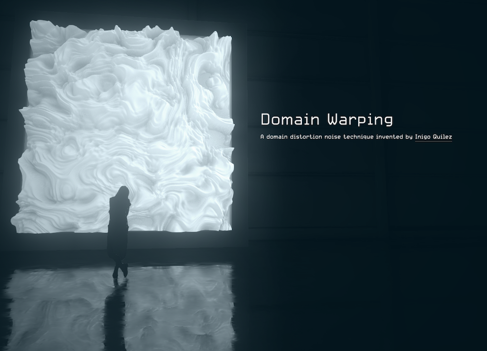

name: inverse
layout: true
class: center, middle, inverse
---

#### Prof. Dr. Lena Gieseke | l.gieseke@filmuniversitaet.de  
#### Film University Babelsberg KONRAD WOLF

# Materials and Shading Workshop

### Summary

<!--

Start server in /doc/

h or ?: Toggle the help window
j: Jump to next slide
k: Jump to previous slide
b: Toggle blackout mode
m: Toggle mirrored mode.
c: Create a clone presentation on a new window
p: Toggle PresenterMode
f: Toggle Fullscreen
t: Reset presentation timer
<number> + <Return>: Jump to slide <number>
-->

---
layout:false

## Workshop Topics

* Shading
* Local Illumination
* Re-cap Shader Programming Environment
* Example: Implementation of a basic material
* BRDFs
* Material Properties
* (Non Photorealistic Rendering (NPR))
* *On a Side Note*: Implementation of NPR materials
* Global Illumination
* Example: Implementation of a complex (material) GPU based scene

---
.header[Workshop Topics]

.center[]

---
.header[Workshop Topics]

.center[ ]

---
.header[Workshop Topics]

.center[ ]

---
.header[Workshop Topics]

.center[ ]

---
.header[Workshop Topics]

.center[]

---

## Learning Objectives

* Understand what shading is
* Grasp core theoretical concepts of shading and lighting
* Be able to implement basic shading concept within a given software and as fragment shader
* Be able to go from there to explore creative shading options

---

## What Next?

--
* Advanced material creation in the environment of your choice

--
* Focus on building your own world
    * Which environment (engine vs. from scratch)
    * Shading as a part of that  
    * Combine CC1, PGS, Shader Programming and Material & Shading

???

* https://www.shadertoy.com/view/WtdBDM
* https://www.shadertoy.com/view/ldySDh
* https://www.shadertoy.com/view/WtSBzh
* https://www.shadertoy.com/view/lsX3DH
  
* https://www.shadertoy.com/view/Xds3zN
* https://www.shadertoy.com/view/wlyfWw

--
* What for?
    * Artistic expression
    * Real-time applications
    * Web content

???

.center[  
  
[[cineshader]](https://cineshader.com) [[lusion]](https://lusion.co/work)]

---

## Your Interests

Brainstorm and summarize what you would like to learn and work on next:

* Which content, project type, etc.?
* Which context, e.g. software
* NPR vs. Photorealistic?
* ...

---
template: inverse

That's it...

## Bye 

# 👋🏻 👋🏼 👋🏽 👋🏾 👋🏿
