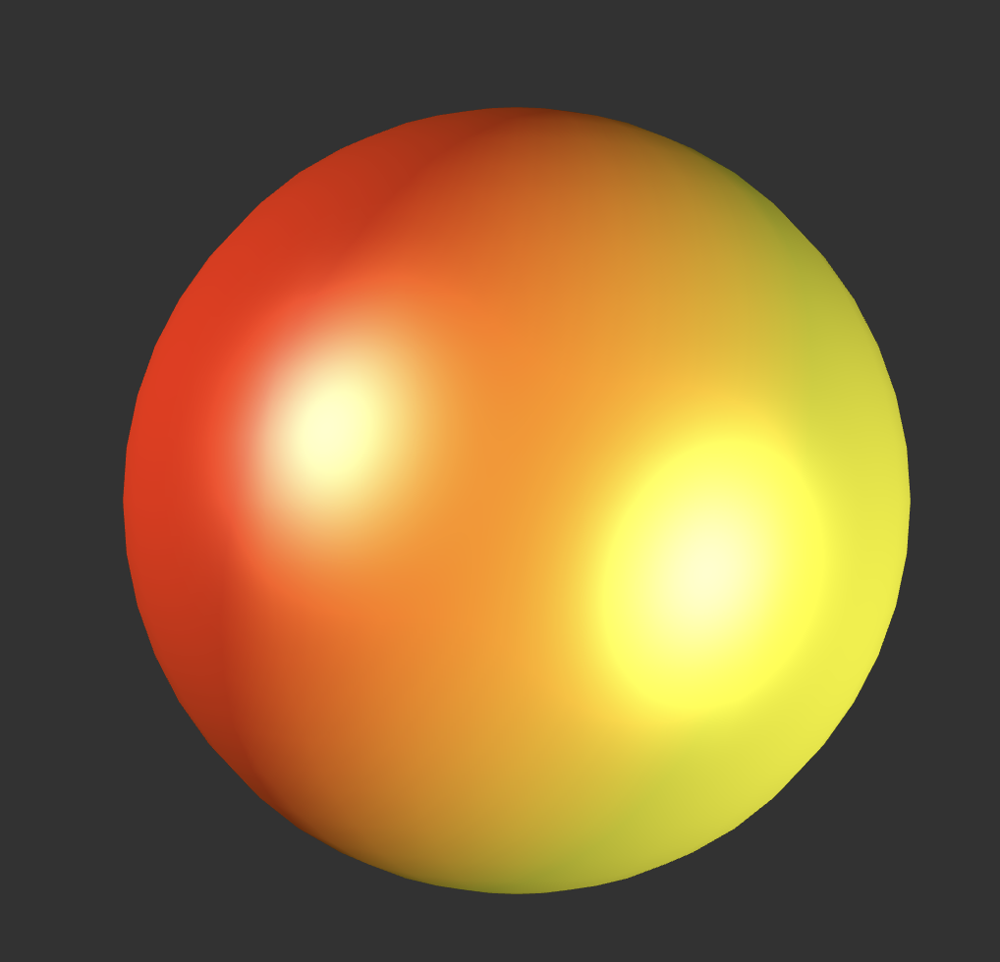
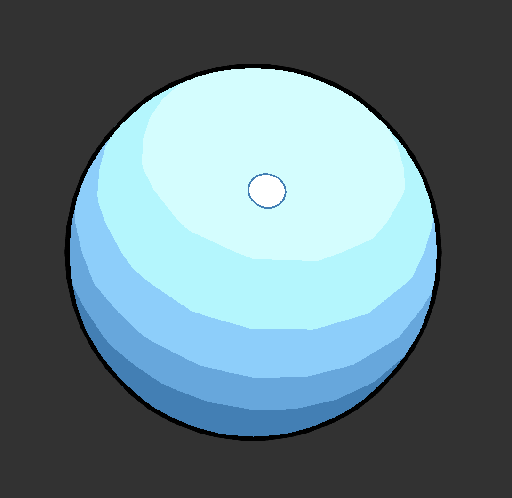
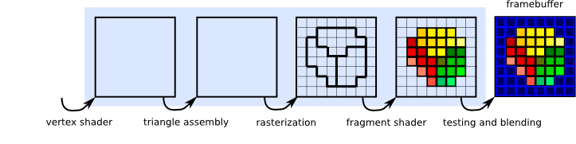
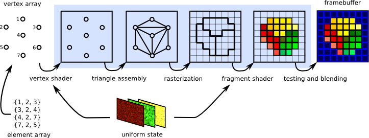
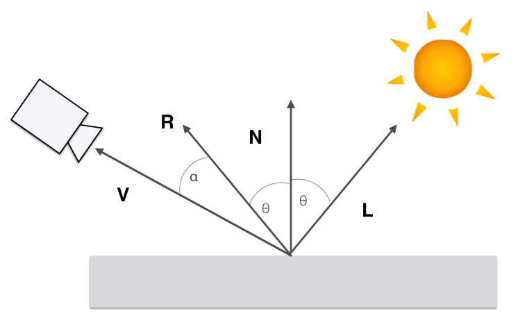
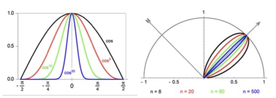

name: inverse
layout: true
class: center, middle, inverse
---

#### Prof. Dr. Lena Gieseke | l.gieseke@filmuniversitaet.de  
#### Film University Babelsberg KONRAD WOLF

# Materials and Shading Workshop

### 04 - Overview

<!--
h or ?: Toggle the help window
j: Jump to next slide
k: Jump to previous slide
b: Toggle blackout mode
m: Toggle mirrored mode.
c: Create a clone presentation on a new window
p: Toggle PresenterMode
f: Toggle Fullscreen
t: Reset presentation timer
<number> + <Return>: Jump to slide <number>
-->

---
layout:false

## p5's Materials

--

.center[ ]

--

# 👩🏽‍💻 🧑🏻‍💻 👩🏼‍💻

--

* Implementation of p5's shading functionalities
* NPR Materials, Example: Toon


---

### ***Insight 1:*** We describe the scene setup with vectors

--

We interpret the light transport as the radiance traveling along rays, where

* **L** points to the direction the light is coming from,
* **V** points to the observer and is the direction the light is reflected towards.

||**L**|| = ||**v**|| = 1

.center[]


---

### ***Insight 2:*** We iterate over all lights and sum up their contribution

--

This is based on the physical fact that the contribution of each light adds up linearly. This means that the contribution of each light just needs to be **summed up**.

.center[ [[Scratchapixel]](https://www.scratchapixel.com/lessons/3d-basic-rendering/introduction-to-shading/shading-multiple-lights)]


---

### ***Insight 3:*** We work with numeric properties for the lights

--

The computation of the different light intensities, e.g. for a spot light is given by formulas. Today we do not consider these. 

Today we work with (for the sake of simplicity):

* a constant rgb-color for the ambient light, and
* a direction vector and a constant rgb-color for each directional light.


---
template:inverse

### Goal:

## Let's Re-Implement p5's Materials!


---
template:inverse

### Remember

## The Shader Pipeline

---
## The Shader Pipeline

What we worked with in the Shader Programming workshop:

.center[]

---

## The Shader Pipeline

What we are working with now:



--
* The 3D engine / host program fills OpenGL-managed memory buffers with arrays of vertices

--
* These vertices are projected into screen space, assembled into triangles, and rasterized into pixel-sized fragments. 

--
* Finally, the fragments are assigned color values and drawn to the framebuffer. 

[[Evas GL Programming Guide]](https://www.enlightenment.org/playground/evas-gl.md)

---

### ***Insight 4:*** Phong Shading Model (BRDF)

--

.center[]

--

A model that recreates believable behavior but has almost no real physical basis.

???

What we just learned refers to one of the most famous and excessively used shading models, namely the *Phong* shading model.

---

## Phong Shading Model (BRDF)

\\( I_{Phong} = I_A + I_D + I_S \\)


With the components modelled as


\\(I_{Ambient} = k_a\\)

\\(I_{Diffuse} = k_d  max(N \cdot L, 0)\\)

\\(I_{Specular} = k_s max(R \cdot V, 0)^n\\)


---
.header[Phong Shading Model]

## Ambient and Diffuse Reflection

\\( I_{Phong} = I_A + I_D + I_S \\)

Let's start with:

```js
light_ambient + light_diffuse * max(L ∙ N, 0);
```

*Reminder:* `light_x` is a rgb color in our context.

--

#  👩🏽‍💻 🧑🏻‍💻 👩🏼‍💻


???
.task[COMMENT:]  

* Code steps 1-17
* Let's implement that! 


---
.header[Phong Shading Model]

## Specular Reflection

.center[ ]

\\[{cos^{n}\alpha} = max(0, R \cdot V)^{n}\\]

With n as a *shininess* exponent.

---
.header[Phong Shading Model]

## Shininess exponent

The specular or shininess exponent n controls the sharpness of the specular highlight. 


.center[]

---
.header[Phong Shading Model]

## Specular Reflection

Now, we can compute the specular component of Phong with

```glsl
light_specular * max(0, R ∙ V)^n;
```
--

Hence, in total for Phong we have:

```glsl
light_ambient + shading_diffuse + light_specular * max(0, R ∙ V)^n;
```

--

# 👩🏽‍💻 🧑🏻‍💻 👩🏼‍💻


???
.task[COMMENT:]  

* Code steps 18 on
* Go through code
* Note: specular highlight color can only be set with spec light color
  
    
* Show p5 source: https://github.com/processing/p5.js/blob/main/src/webgl/shaders/lighting.glsl
* Find uniform variables coming from the environment
* https://github.com/processing/p5.js/blob/1b13b400fcbe2e6c6290262fcf06425dbf4efcf5/contributor_docs/webgl_mode_architecture.md
* Example shadertoy: https://www.shadertoy.com/howto

---
template:inverse

# Done!


???
.task[COMMENT:]  

* Now we are experts as this is pretty much the same implementation as p5 is using under the hood (or is p5 here just embarrassingly simple?)...

    
* Show p5 source: https://github.com/processing/p5.js/blob/main/src/webgl/shaders/lighting.glsl
* Find uniform variables coming from the environment
* https://github.com/processing/p5.js/blob/1b13b400fcbe2e6c6290262fcf06425dbf4efcf5/contributor_docs/webgl_mode_architecture.md
* Example shadertoy: https://www.shadertoy.com/howto
