name: inverse
layout: true
class: center, middle, inverse
---

#### Prof. Dr. Lena Gieseke | l.gieseke@filmuniversitaet.de  
#### Film University Babelsberg KONRAD WOLF

# Materials and Shading Workshop

### 05 - BRDF

<!--
h or ?: Toggle the help window
j: Jump to next slide
k: Jump to previous slide
b: Toggle blackout mode
m: Toggle mirrored mode.
c: Create a clone presentation on a new window
p: Toggle PresenterMode
f: Toggle Fullscreen
t: Reset presentation timer
<number> + <Return>: Jump to slide <number>
-->

---
template: inverse

## BRDF?

---
layout:false

## Phong BRDF

In summary, for shading a surface with the Phong material, we compute how much of the incoming light intensity is reflected on a surface point for a certain view vector, based on the Phong formula.

--

\\(I_{Phong} = k_a + k_d \cdot max(N \cdot L, 0) \cdot I_d  + k_s \cdot max(R \cdot V, 0)^n \cdot I_s \\)

--

> A BRDF computes the ratio of the incoming to the exiting light.

--

BRDF stand for ***Bidirectional Reflectance Distribution Function***.

---

## Bidirectional Reflectance Distribution Function

The BRDF \\( {f(\omega_{\text{i}}, \omega{\text{r}})} \\) is a function of four variables:
<!-- The BRDF \\({f(\omega\us{\text{i}}, \omega\us{\text{r}})}\\) is a function of four variables: -->

.center[  
[[Wikipedia]](https://en.wikipedia.org/wiki/Bidirectional_reflectance_distribution_function)]

???

* Each direction \omega is itself parameterized by azimuth angle \phi and zenith angle \theta, therefore the BRDF as a whole is a function of 4 variables. 
* The BRDF has units sr−1, with steradians (sr) being a unit of solid angle. 

---

## Bidirectional Reflectance Distribution Function

The BRDF \\( {f(\omega_{\text{i}}, \omega{\text{r}})} \\) is a function of four variables:
<!-- The BRDF \\({f(\omega\us{\text{i}}, \omega\us{\text{r}})}\\) is a function of four variables: -->

.center[  
[[Wikipedia]](https://en.wikipedia.org/wiki/Bidirectional_reflectance_distribution_function)]

\\(\omega_{\text{i}}\\) and \\(\omega{\text{r}}\\) are equivalent to **L**  and **V**.
 

--

The BRDF returns the *ratio* of incoming irradiance to reflected radiance. 

???

The correct  computation of BRDFs an be very complex and mathematically challenging.

The units of radiance and irradiance are quite crucial here, but of ot scope of this workshop.  

If the material is homogeneous – every surface point has the same appearance

--

By computing the value of a given BRDF for all surface points, we have a description of the surface's shading behavior.

---

## Bidirectional Reflectance Distribution Functions

To describe the reflectance behavior on a surface point there are various different BRDFs.

--

.center[  
[[Montes 2012]](https://digibug.ugr.es/bitstream/handle/10481/19751/rmontes_LSI-2012-001TR.pdf)]

???
.task[COMMENT:]  

* Legend: (star) if the BRDF has this property; (triangle) if the BRDF, does not; (...) unknown value.
* Physically plausible: a function that obeys non-negativity, reciprocity and the law of energy conservation. A BRDF with this property can be used safely in a rendering system, avoiding situations where energy is created wrong.
* Sampling: appropriate for importance sampling of Monte-Carlo integration
* Fresnel: refelction behaviour, we will cover next time
* Isotropic and anisotropic are terms that describe whether or not the properties of materials depend on direction. When a property is the same in all directions, the material is isotropic. When a property varies according to direction, the material is anisotropic. 

---

.header[BRDFs]

## Diffuse Reflection

.center[[[wiki]](http://en.wikipedia.org/wiki/Oren–Nayar_reflectance_model
)]

???
.task[COMMENT:]  

* Lambert is too dark when we compute it in gazing angles.
* Solution: Oren-Nayar BRDF model
* https://dl.acm.org/doi/pdf/10.1145/192161.192213

---

.header[BRDFs]

## Diffuse Reflection

.center[  [[filament]](https://google.github.io/filament/Filament.html#materialsystem)]

Lambertian diffuse BRDF vs. Disney diffuse BRDF

???
.task[COMMENT:]  

*  a comparison between a simple Lambertian diffuse BRDF and the higher quality Disney diffuse BRDF, using a fully rough dielectric material. For comparison purposes, the right sphere was mirrored. The surface response is very similar with both BRDFs but the Disney one exhibits some nice retro-reflections at grazing angles (look closely at the left edge of the spheres). 

---

.header[BRDFs]

## Diffuse & Specular Reflection

.center[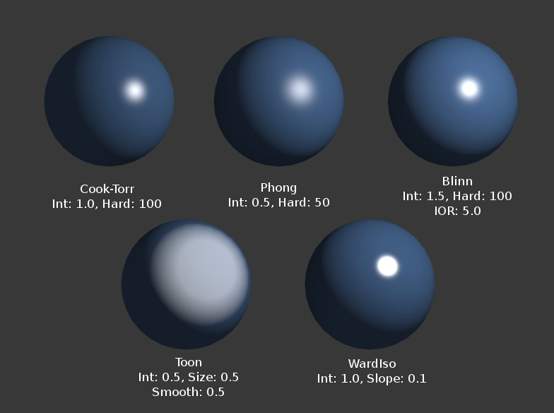  
[[blender]](https://docs.blender.org/manual/en/2.79/render/blender_render/materials/properties/diffuse_shaders.html)]

---

.header[BRDFs]

## Glossiness

.center[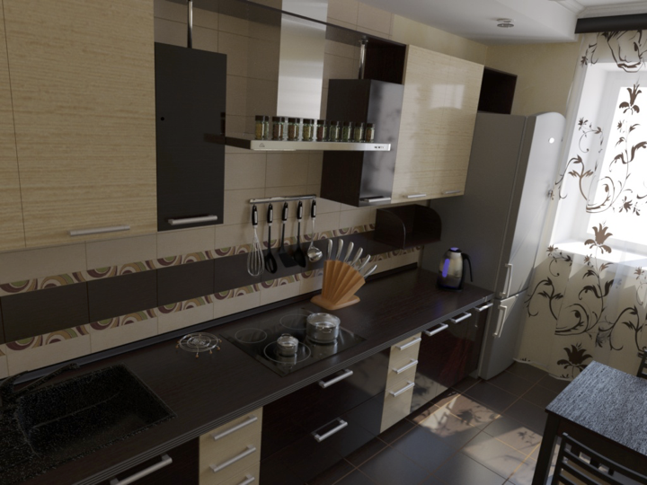[[strelok]](http://www.luxrender.net/forum/gallery2.php?g2_itemId=16543)]

.footnote[[TU Wien | Rendering 186.101 | Károly Zsolnai-Fehér]]

---

.header[BRDFs]

## Glossiness

.center[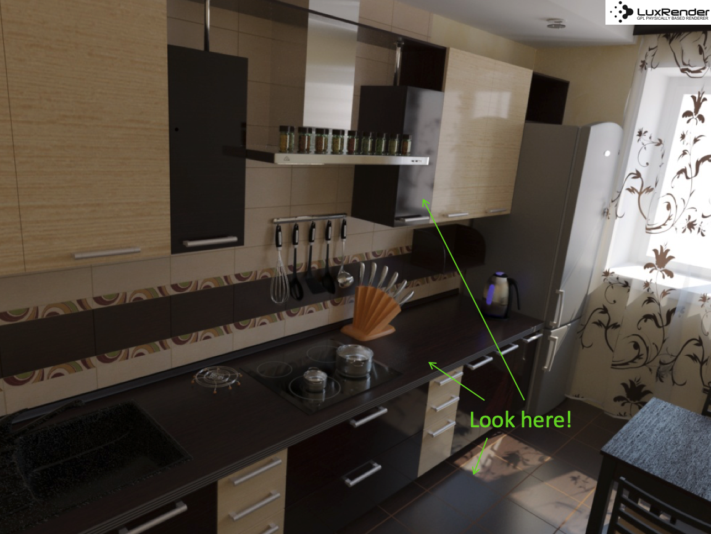[[strelok]](http://www.luxrender.net/forum/gallery2.php?g2_itemId=16543)]

.footnote[[TU Wien | Rendering 186.101 | Károly Zsolnai-Fehér]]

---

.header[BRDFs]

## Glossiness

BRDFs are often a careful mixture of diffuse und specular reflection, e.g. to control *glossiness*.

???
.task[COMMENT:]  

* in dielectric, you have both (and for physically based workflow they should never exceed 100%). If you have a certain amount of specular reflection you will have an inversely proportional amount of diffuse reflection and vice versa.

--

.center[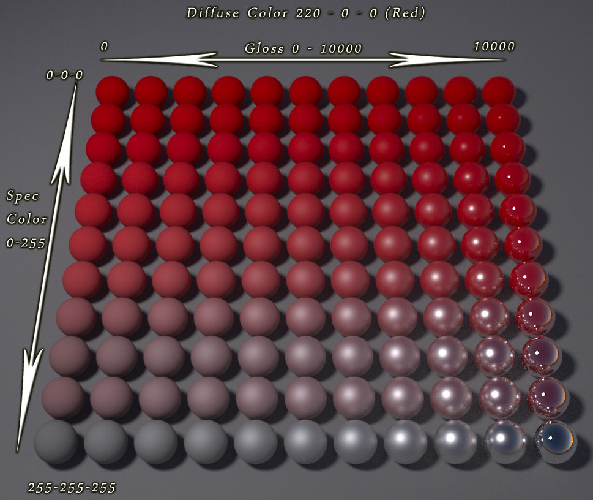  
[[stackexchange]](https://computergraphics.stackexchange.com/questions/5482/what-is-the-difference-between-glossy-and-specular-reflectionl)]

---

.header[BRDFs]

## Glossiness

Glossiness usually describes how shiny a surface is based on its *smoothness* and how clear the reflections are.

* A smooth surface produces small and sharp highlights and has high glossiness.
* A rough surface produces large and blurry highlights and has low glossiness.

.footnote[[[daz3d]](https://www.daz3d.com/forums/discussion/54435/what-is-the-difference-between-glossiness-specularity-and-reflection)]

???
.task[COMMENT:]  

* Specular Strength is how strong the highlights are.
* Usually the two are related, low Glossiness tends to go with low specular strength
* Reflection Strength controls how visible reflections are
* Glossiness is between the diffuse and specular BRDF. It has broader highlights than a mirror and is more view-dependent than a diffuse surface.

--

In a modern physically-based rendering context the same effect are usually described with the smoothness and metalness of a surface instead (we will come back to this).

???
.task[COMMENT:]  

* the metalness does not describe a different type of reflection, but it basically makes sure that when increasing the specular reflections, the diffuse reflections are lowered proportionally. (so basically, when you increase specular reflections to 100%, even if there is a colour assigned to the diffuse colour channel you won't see it because it would be weighted down to 0%)

---

.header[BRDFs | Glossiness]

.center[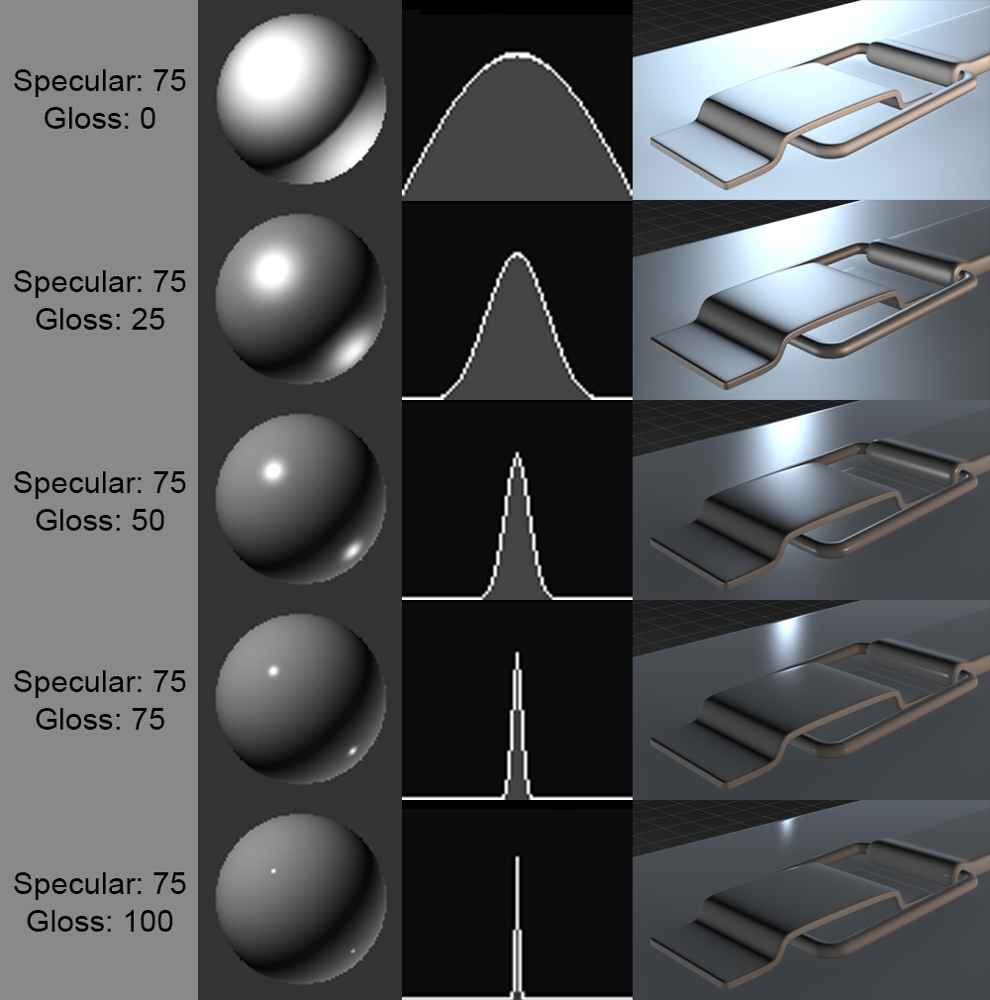  
[[stackexchange]](https://computergraphics.stackexchange.com/questions/5482/what-is-the-difference-between-glossy-and-specular-reflectionl)]

---
template:inverse

# Anisotropic Reflectance

---
.header[BRDFs]

## Anisotropic Reflectance

.center[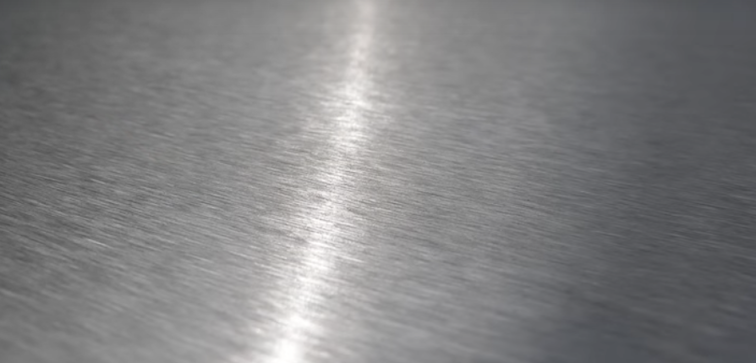  
[[blenderguru]](https://www.blenderguru.com/tutorials/an-introduction-to-anisotropic-shading)]

---
.header[BRDFs]

## Anisotropic Reflectance

.center[  
[[blenderguru]](https://www.blenderguru.com/tutorials/an-introduction-to-anisotropic-shading)]

---
.header[BRDFs]

## Anisotropic Reflectance

.center[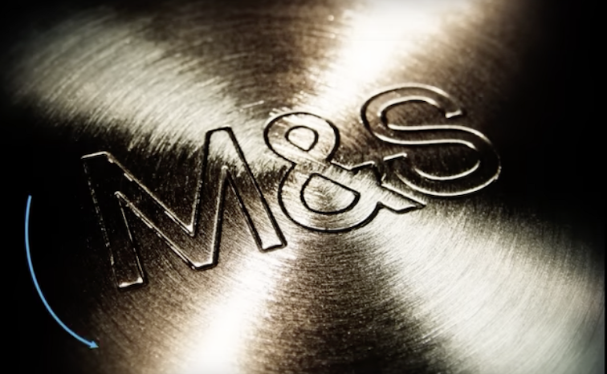  
[[blenderguru]](https://www.blenderguru.com/tutorials/an-introduction-to-anisotropic-shading)]

---
.header[BRDFs]

## Anisotropic Reflectance

.center[  
[[blenderguru]](https://www.blenderguru.com/tutorials/an-introduction-to-anisotropic-shading)]

---
.header[BRDFs]

## Anisotropic Reflectance

.center[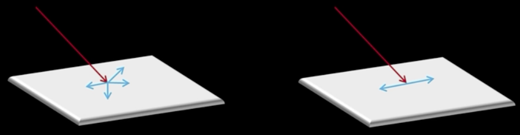  
[[blenderguru]](https://www.blenderguru.com/tutorials/an-introduction-to-anisotropic-shading)]

???
.task[COMMENT:]  

* Amount of anisotropy in the reflection; 0.0 gives a round highlight. Higher values give elongated highlights orthogonal to the tangent direction; negative values give highlights shaped along the tangent direction.

---
.header[BRDFs]

## Anisotropic Reflectance

.center[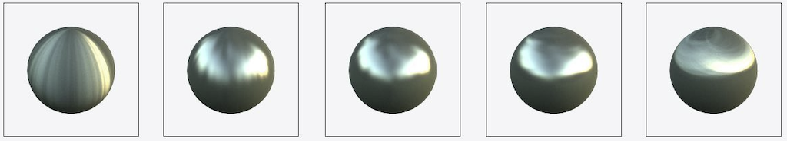  
[[pinimg]](https://i.pinimg.com/originals/a3/e8/b5/a3e8b5f700ff101ea34ea7df480a09d0.jpg)]

???
.task[COMMENT:]  

* From vertical (-0.9) over no (0) to horizontal stretching (0.9)

---
.header[BRDFs]

## Anisotropic Reflectance

.center[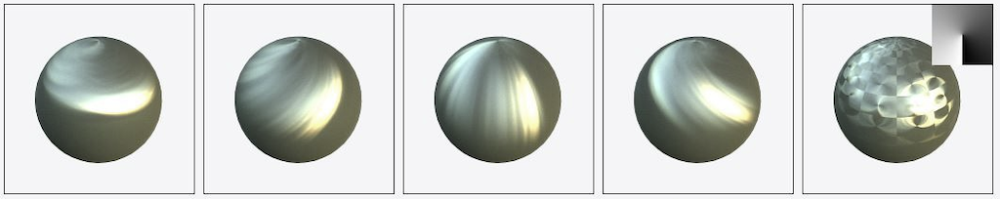  
[[pinimg]](https://i.pinimg.com/originals/a3/e8/b5/a3e8b5f700ff101ea34ea7df480a09d0.jpg)]

???
.task[COMMENT:]  

* Rotation parameter for the rotation of the anisotropic tangent direction. from vertical stretch with no rotation (0) over 45, 90, 135 degree to a bitmapped anisotropy rotation
* Tangent vector (t), this vector is perpendicular to nx and thus tangent to the surface at x. It is used to build a local reference system. BRDF expressions can be refered to. Isotropic BRDFs may use any tangent vector, however for anisotropic BRDFs this vector must be considered as an external parameter which fixes the orientation of the BRDF (with respect to rotations around nx).

---
template:inverse

# The Fresnel Effect

---
layout:false

## The Fresnel Effect

.center[]

.footnote[[[Dorian Iten]](https://www.dorian-iten.com/fresnel/)]

???

.task[ASK:]  

* What do you see?

---

## The Fresnel Effect

.center[]

.center[ ]

.footnote[[[Dorian Iten]](https://www.dorian-iten.com/fresnel/)]

???

.task[COMMENT:]  

* The angle is here between viewer and surface, not surface normal

Intuitive explanation
* The area of the intersection of the ray with the surface at a shallow angle is greater than the area of intersection at steep angle.
* To a greater area correspond more atoms to reflect the light. 

---

## The Fresnel Effect

.center[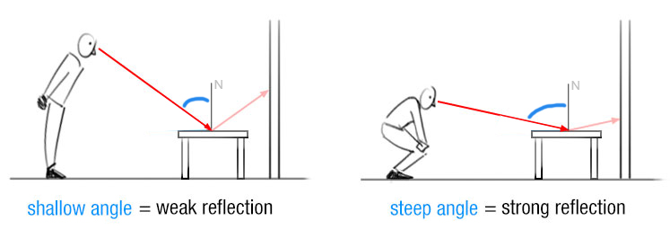 ]

The larger the angle between viewer and **surface normal**, the stronger the reflection.

.footnote[[[Dorian Iten]](https://www.dorian-iten.com/fresnel/)]

???

.task[COMMENT:]  

* The angle is here between viewer and surface, not surface normal

---

## The Fresnel Effect

.center[]

.footnote[[[Dorian Iten]](https://www.dorian-iten.com/fresnel/)]

---

## The Fresnel Effect

.center[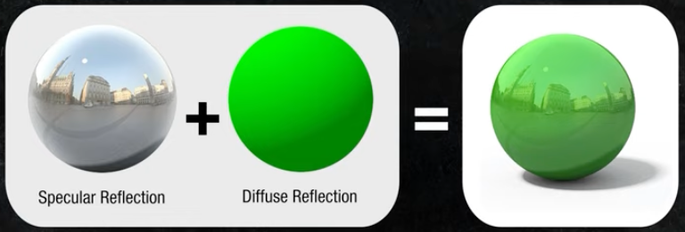]

.footnote[[[Dorian Iten]](https://www.dorian-iten.com/fresnel/)]

---

## The Fresnel Effect

.center[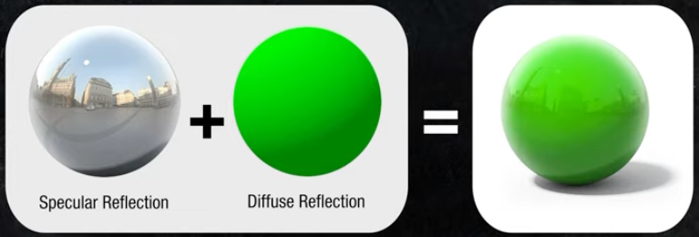]

.footnote[[[Dorian Iten]](https://www.dorian-iten.com/fresnel/)]

---

## The Fresnel Effect

[Everything has Fresnel](http://filmicworlds.com/blog/everything-has-fresnel/)

.center[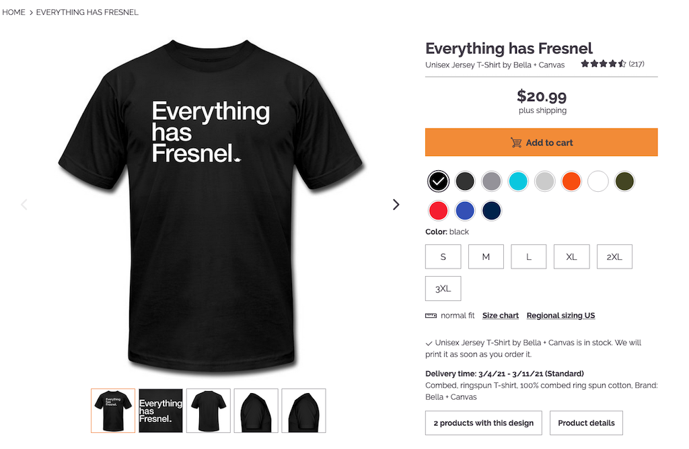[[vray]](https://shop.spreadshirt.com/vrayinfo/everything+has+fresnel-A5d89cfe86bbdbb2e6a4903d7?productType=175)]

---

## The Fresnel Effect

.center[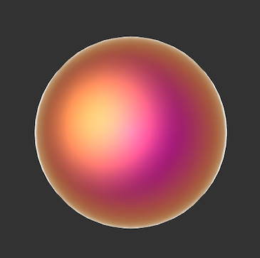]

---

## The Fresnel Effect

> The Fresnel effect models the fact that the amount of light the viewer sees reflected from a surface depends on the viewing angle.

---

## The Fresnel Effect

### Reflections Change With Distance

???

.task[ASK:]  

* Any ideas how this could connect to a viewer's distance to an object?

--

.center[ ]

.footnote[[[Dorian Iten]](https://www.dorian-iten.com/fresnel/)]

???

.task[COMMENT:]  

* As you look down to the ground close to your feet, the angle of incidence is very steep. If you look at a point on the ground that’s further away from you, the angle gets more shallow – and the reflection becomes more visible.

---

## The Fresnel Effect

### Reflections Change With Distance

.center[ 
]

.footnote[[[Dorian Iten]](https://www.dorian-iten.com/fresnel/)]

???

.task[COMMENT:]  

* As you look down to the ground close to your feet, the angle of incidence is very steep. If you look at a point on the ground that’s further away from you, the angle gets more shallow – and the reflection becomes more visible.

---

## The Fresnel Effect

### Reflective and Refractive Material

.center[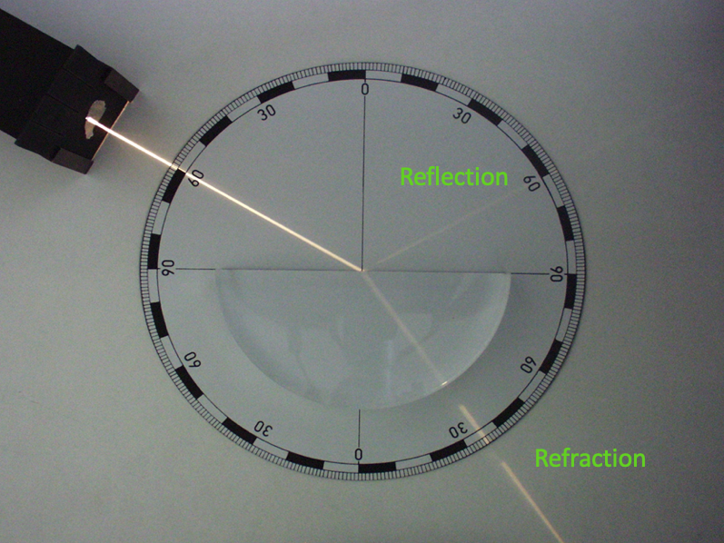 [[wiki]](http://en.wikipedia.org/wiki/Refraction)]

.footnote[[TU Wien | Rendering 186.101 | Károly Zsolnai-Fehér]]

---

## Fresnel Equations

### Reflective and Refractive Material

???

.task[ASK:]  

* Any ideas how this could affect reflection and refraction? 
* Any related real world experiences you can think of?

--

.center[ [[scratchapixel]](https://www.scratchapixel.com/lessons/3d-basic-rendering/introduction-to-shading/reflection-refraction-fresnel)]

???

.task[ASK:]  

* What do you see?

---

## Fresnel Equations

### Reflective and Refractive Material

.center[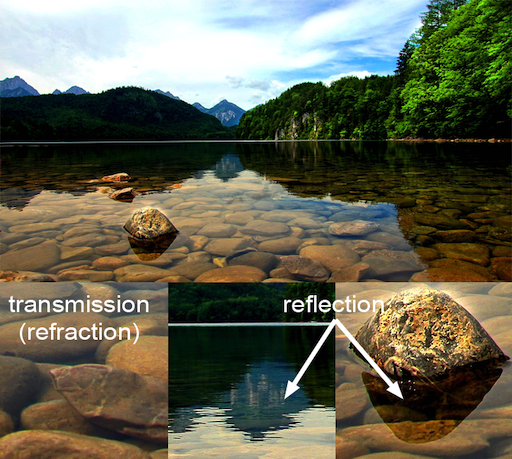 [[scratchapixel]](https://www.scratchapixel.com/lessons/3d-basic-rendering/introduction-to-shading/reflection-refraction-fresnel)]

---

## Fresnel Equations

### Reflective and Refractive Material

.center[ [[filament]](https://google.github.io/filament/Filament.html)]

???
.task[COMMENT:]  

* Well, imagine shooting a piece of glass with a gun. If you shoot at a glancing angle, it is more likely to ricochet off the glass without damaging it. This is because the impulse required to reflect the bullet is smaller for shallow grazing angles, as most of the bullets momentum is parallel to the interface. Now obviously the physics of reflecting a photon is very different than reflecting a bullet, but the analogy is that the impulse required to reflect the photon becomes smaller, and it becomes relatively "easier" for the medium to supply that small impulse than to let the photon go through. 
* https://physics.stackexchange.com/questions/12035/why-does-light-reflect-more-intensely-when-it-hits-a-surface-at-a-large-angle

---

## Fresnel Equations

### Reflective and Refractive Material

The [Fresnel Equations](https://www.wikiwand.com/en/Fresnel_equations) define for transparent materials such as glass and water how much light is reflected vs. how much light is transmitted.  

???
.task[COMMENT:]  

* But how do we compute those reflected and refracted constants?
* These are given by the Fresnel Equations.  For a non-metal like water, all that you need for them is the refractive index of the material.  

.center[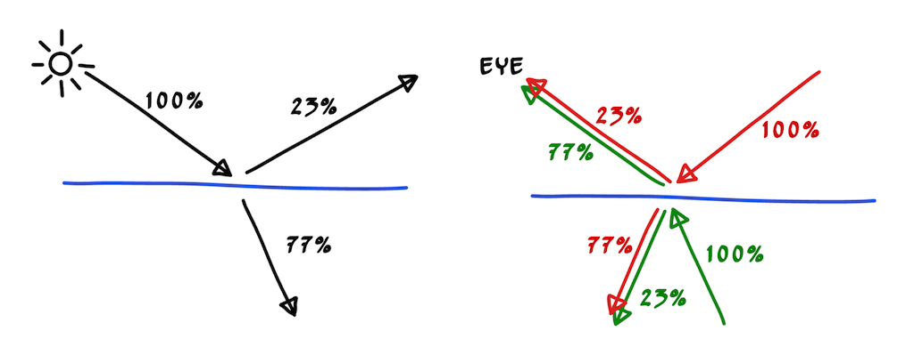 [[psgraphics]](https://psgraphics.blogspot.com/2020/03/fresnel-equations-schlick-approximation.html)]

* Left: the light hitting the water divides between reflected and refracted based on angle (for this particular one it is 23% reflected).  Right: the eye sees 77% of whatever color comes from below the water and 23% of whatever color comes from above the water.
* E.g., `color = 0.77*color(refracted_ray) + 0.23*color(reflected_ray)`

---

## Fresnel Equations

### Reflective and Refractive Material

More precisely, they describe **the reflection and transmission of light** from one medium to a different one by computing the ratio of reflected and transmitted energy. 

--

.center[ [[wiki]](https://www.wikiwand.com/en/Fresnel_equations)]

???

.task[TASK:]  

* Go to wikipage

---

## Fresnel Equations

### Schlick's Approximation 

In computer graphics, [Schlick's approximation](https://www.wikiwand.com/en/Schlick%27s_approximation) is a formula for approximating the contribution of the Fresnel factor, shaping the reflection and transmission of light between media.

???

.task[TASK:]  

* https://web.archive.org/web/20200510114532/cs.virginia.edu/~jdl/bib/appearance/analytic%20models/schlick94b.pdf
* Go to [Filament](https://google.github.io/filament/Filament.html#materialsystem/specularbrdf/fresnel(specularf))

---

## Fresnel Equations

### Schlick's Approximation 

Schlick's approximation describes the Fresnel factor as specular reflection coefficient $R$ with 

$R(θ) = R_0 + (1 − R_0) (1 − cos\theta)^5$

where

$R(θ) = ( \frac{n_1 − n_2}{n_1 + n_2})^2$

* $\theta$ is the angle between the direction from which the incident light is coming and the normal of the interface between the two media
    * $cos\theta = (\mathbf{N} ⋅ \mathbf{V})$
* $n_1$, $n_2$ are the indices of refraction of the two media at the interface
* $R_0$ is the reflection coefficient for light incoming parallel to the normal i.e., the value of the Fresnel term when $\theta = 0$ or minimal reflection
* In computer graphics, one of the interfaces is usually air, meaning that it can be approximated as 1
    * Then we have $R(θ) = ( \frac{n − 1}{n + 1})^2$ where $n$ is the material’s index of refraction.

???
.task[COMMENT:]  

*On a side note:* Check out this awesome renderer: [Filament](https://google.github.io/filament/)
* [Cheat Sheet](https://google.github.io/filament/Material%20Properties.pdf)
* [Material Overview](https://google.github.io/filament/Materials.html)
* [Theoretical Backgrounds](https://google.github.io/filament/Filament.html#imagingpipeline)

---

## Fresnel Equations

### Schlick's Approximation 

\\(I_{Phong} = k_a + k_d \cdot max(N \cdot L, 0) \cdot I_d  + k_s \cdot max(R \cdot V, 0)^n \cdot I_s \\)

could then used as

\\(I_{Phong} = k_a + k_d \cdot max(N \cdot L, 0) \cdot I_d  + Schlick(k_s) \cdot max(R \cdot V, 0)^n \cdot I_s \\)

---
## BRDFs

Where are BRDFs coming from?

--

* Measured from material samples using calibrated cameras and lightsources
    * In tabular form: expensive, requires interpolation for rendering
    * Editing is difficult

---
.header[BRDFs]

### MERL BRDF Database

.center[ [[Matusik 2003]](https://www.merl.com/brdf/)]

???

The MERL BRDF database contains reflectance functions of 100 different materials.  

* A set of 100 isotropic BRDF material samples was captured by Matusik et al. in 2003 [18] covering a wide range of materials including paints, woods, metals, fabric, stone, rubber, plastic, and other synthetic materials. This data set is freely available from Mitsubishi Electric Research Laboratories at www.merl.com/brdf and is commonly used for evaluating new BRDF models. Slices of these BRDFs are shown in Figure 1.
* Each BRDF in the MERL 100 is densely sampled into a 90 by 90 by 180 cube along the θh, θd, and φd axes respectively. These correspond to 1 degree increments except for the θh axis which was warped to concentrate data samples near the specular peak. The measurements have been filtered and extrapolated as needed so that there are no holes in the data. This is good in that the data is easy to use, but it’s not clear how accurate the data is, particularly near the horizon. Because of this, some researchers discard data near the horizon when performing fitting, but this data is still useful to consider as it can have a profound effect on the material appearance.

---

## BRDFs

How do we get BRDFs?

* Measured from material samples using calibrated cameras and lightsources
    * In tabular form: expensive, requires interpolation for rendering
    * Editing is difficult

* Phenomenologically motivated models
    * Few, intuitive parameters
    * Only limited realism
    * Phong [1975], Blinn-Phong [1977], Ward [1992], Lafortune et al. [1997], Ashikhmin et al. [2000],...

???

There are phenomenological BRDF models. They use mathematical expressions to create a function that reproduces an intended physical effect.

Examples: the Phong model [Phong 1975], the Blinn-Phong model [Blinn 1977], the Ward model [Ward 1992] (some physical motivation, though), the Lafortune model [Lafortune et al. 1997], the Ashikhmin-Shirley model [Ashikhmin and Shirley 2000]

--

* Physically motivated models
    * More exact results
    * Tuning parameters more difficult
    * Cook-Torrance [1981], He et al. [1991]

---

## BRDFs

The previously mentioned BRDFs were all models for the "simple" case of

.center[]

---

## BRDFs

But what about?

.center[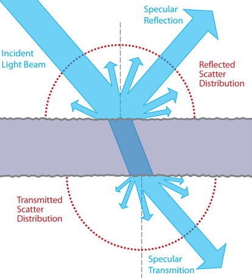]

---

## BRDFs

BSDF (bidirectional scattering distribution function)

.center[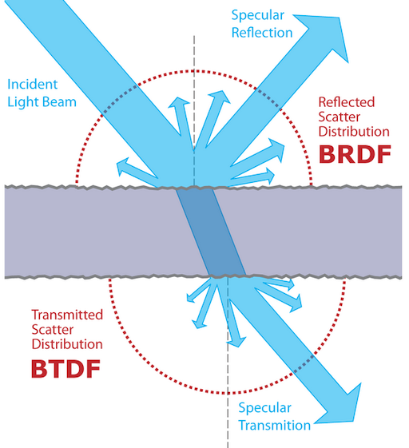  
[[wiki]](https://www.wikiwand.com/en/Bidirectional_scattering_distribution_function)]

---

## BRDFs

BSSRDF (Bidirectional scattering-surface reflectance distribution function or Bidirectional surface scattering RDF)

.center[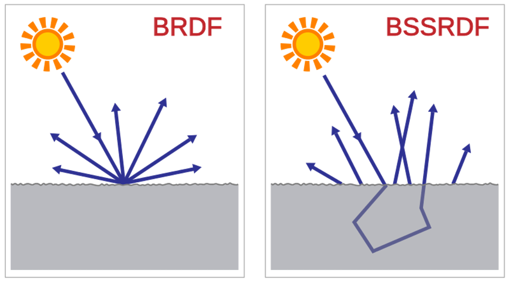  
[[wiki]](https://www.wikiwand.com/en/Bidirectional_scattering_distribution_function)]

--

More variables are needed!

---

## BRDFs

.center[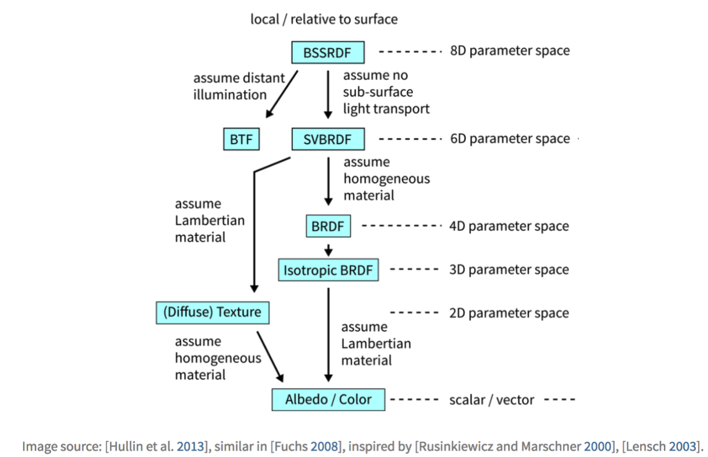]

???

* Isotropic reflection: reflection doesn't vary as the surface os rotated
* SVBRDF: Spatially varying
* BSSRDF: Bidirectional scattering distribution function

---

## BRDFs

* Hybrid models
    * Maximize artist ease-of-use 
    * Physical realism
    * *Disney*-BRDF [Burley 2012a] / [Burley 2012b]

???

* https://people.cs.clemson.edu/~ekp/courses/dpa8090/assets/papers/PBS_at_Disney.pdf

* Research on BRDFs is still going strong
    * https://wangningbei.github.io/2022/NLBRDF.html
    * https://conferences.eg.org/eg2021/program/full-papers/
* https://github.com/romanlarionov/BRDFViewer
* https://github.com/chicio/Spectral-BRDF-Explorer

--

.center[ [[Disney]](https://github.com/wdas/brdf)]

---

## BRDFs

* Hybrid models
    * Maximize artist ease-of-use 
    * Physical realism
    * *Disney*-BRDF [Burley 2012a] / [Burley 2012b]
  

=> Leading to **physically-based** models and rendering (PBR)
