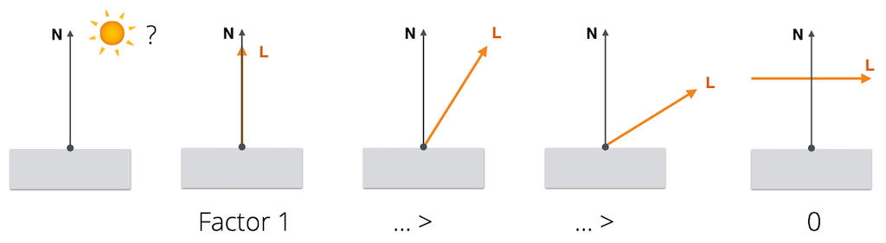
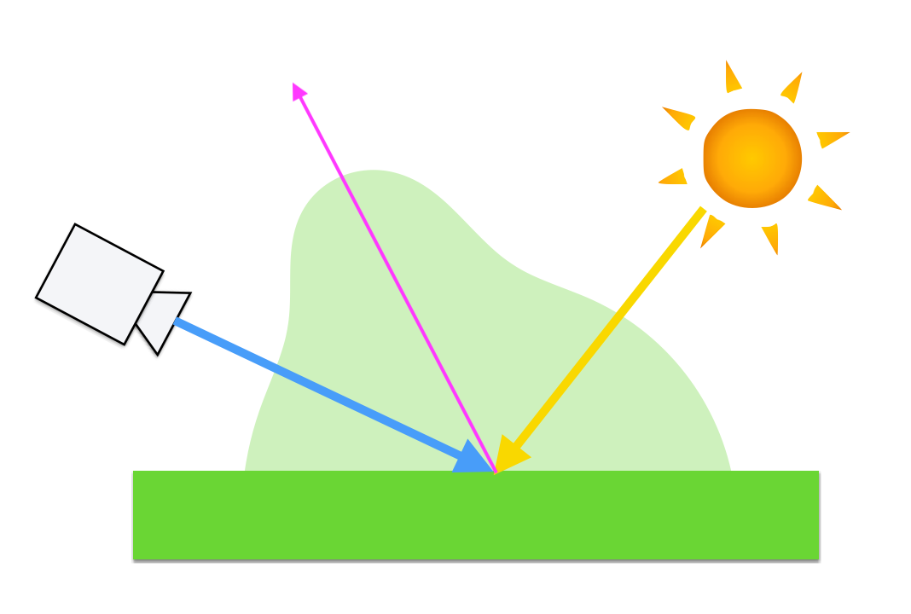
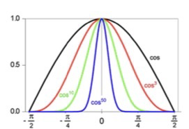
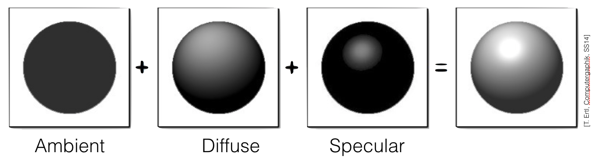
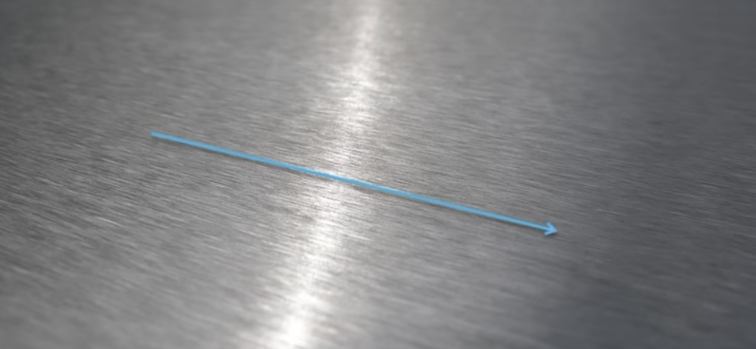
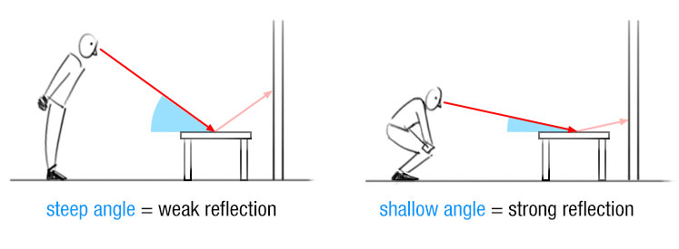
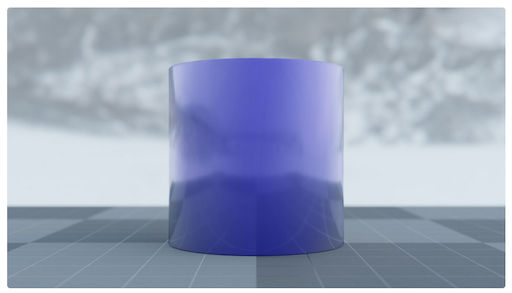
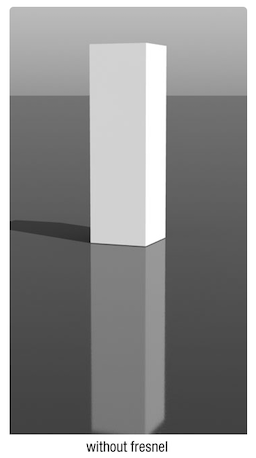
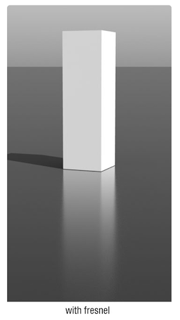
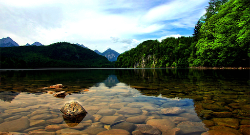

name: inverse
layout: true
class: center, middle, inverse
---

#### Prof. Dr. Lena Gieseke | l.gieseke@filmuniversitaet.de  
#### Film University Babelsberg KONRAD WOLF

# Materials and Shading Workshop

### 06 - Overview 3

<!--
h or ?: Toggle the help window
j: Jump to next slide
k: Jump to previous slide
b: Toggle blackout mode
m: Toggle mirrored mode.
c: Create a clone presentation on a new window
p: Toggle PresenterMode
f: Toggle Fullscreen
t: Reset presentation timer
<number> + <Return>: Jump to slide <number>
-->

---
layout:false

## What happened so far?

* Intro to Shading
* Local Illumination
* Local Shading Models
* Implementation of p5's material

---

## Today

--
* Global Illumination

--
* Advanced Material Properties & Physically-based Shading

--
* NPR

--

Next time: Scene rendering in a fragment shader

---
template:inverse

## Recap

---

## Local Illumination

???

.task[ASK:]  

* How do you describe local illumination

--

.center[]

---

## BRDFs

???

.task[ASK:]  

* What is a BRDF?

--

BRDF stands for ***Bidirectional Reflectance Distribution Functions (BRDF)***.
 
BRDFs describe the reflectance behavior on a surface point. A BRDF returns the *ratio* of incoming irradiance to reflected radiance. 

The BRDF \\( {f(\omega{\text{i}}, \omega{\text{r}})} \\) is a function of four variables:
<!-- The BRDF \\({f(\omega\us{\text{i}}, \omega\us{\text{r}})}\\) is a function of four variables: -->

.center[ [[Wikipedia]](https://en.wikipedia.org/wiki/Bidirectional_reflectance_distribution_function)]

???

.task[COMMENT:]  

* Each direction \omega is itself parameterized by azimuth angle \phi and zenith angle \theta, therefore the BRDF as a whole is a function of 4 variables. 
* Research on BRDFs is still going strong: https://conferences.eg.org/eg2021/program/full-papers/
* https://github.com/romanlarionov/BRDFViewer
* https://github.com/chicio/Spectral-BRDF-Explorer

---

## Diffuse Reflection

.center[]

--

Thus, we need to decrease in the intensity of the light (per unit surface area) by a factor of \\({cos θ}\\). 

--

The value of \\({cos θ}\\) is given by the dot product between the normal vector **N** and the unit direction to the light source **L**. 

\\({cos θ}\\) = **L** ∙ **N**

---

## Specular Reflection

.center[ ]

???
.task[COMMENT:]  

* Hence, unlike the diffuse reflection, the specular reflection depends on the position of the viewer! 

--

The intensity of the specular reflection is strongly related to the reflection vector R.

---

## Specular Reflection

.center[ ]

--

\\[{cos^{n}\alpha} = max(0, R \cdot V)^{n}\\]

With $n$ as a *shininess* exponent.

---
.header[BRDFs]

## Phong Model

--

\\( I_{Phong} = I_A + I_D + I_S \\)

--

.center[]

--

\\(I_{Phong} = k_a + k_d \cdot max(N \cdot L, 0) \cdot I_d  + k_s \cdot max(R \cdot V, 0)^n \cdot I_s \\)

---

## Anisotropic Reflectance

--

.center[  
[[blenderguru]](https://www.blenderguru.com/tutorials/an-introduction-to-anisotropic-shading)]

---

## The Fresnel Effect

.center[]

.center[ ]

.footnote[[[Dorian Iten]](https://www.dorian-iten.com/fresnel/)]

???

.task[COMMENT:]  

* The angle is here between viewer and surface, not surface normal

Intuitive explanation
* The area of the intersection of the ray with the surface at a shallow angle is greater than the area of intersection at steep angle.
* To a greater area correspond more atoms to reflect the light. 

---

## The Fresnel Effect

> The Fresnel effect models the fact that the amount of light the viewer sees reflected from a surface depends on the viewing angle.

---

## The Fresnel Effect

.center[]

.footnote[[[Dorian Iten]](https://www.dorian-iten.com/fresnel/)]

---

## The Fresnel Effect

### Reflections Change With Distance

.center[ 
]

.footnote[[[Dorian Iten]](https://www.dorian-iten.com/fresnel/)]

???

.task[COMMENT:]  

* As you look down to the ground close to your feet, the angle of incidence is very steep. If you look at a point on the ground that’s further away from you, the angle gets more shallow – and the reflection becomes more visible.

---

## Fresnel Equations

### Reflective and Refractive Material

.center[ [[scratchapixel]](https://www.scratchapixel.com/lessons/3d-basic-rendering/introduction-to-shading/reflection-refraction-fresnel)]

???
.task[COMMENT:]  

* Well, imagine shooting a piece of glass with a gun. If you shoot at a glancing angle, it is more likely to ricochet off the glass without damaging it. This is because the impulse required to reflect the bullet is smaller for shallow grazing angles, as most of the bullets momentum is parallel to the interface. Now obviously the physics of reflecting a photon is very different than reflecting a bullet, but the analogy is that the impulse required to reflect the photon becomes smaller, and it becomes relatively "easier" for the medium to supply that small impulse than to let the photon go through. 
* https://physics.stackexchange.com/questions/12035/why-does-light-reflect-more-intensely-when-it-hits-a-surface-at-a-large-angle

---

## Fresnel Equations

### Schlick's Approximation 

In computer graphics, [Schlick's approximation](https://www.wikiwand.com/en/Schlick%27s_approximation) is a formula for approximating the contribution of the Fresnel factor, shaping the reflection and transmission of light between media.

???

.task[TASK:]  

* https://web.archive.org/web/20200510114532/cs.virginia.edu/~jdl/bib/appearance/analytic%20models/schlick94b.pdf
* Go to [Filament](https://google.github.io/filament/Filament.html#materialsystem/specularbrdf/fresnel(specularf))

---

## Fresnel Equations

### Schlick's Approximation 

Schlick's approximation describes the Fresnel factor as specular reflection coefficient $R$ with 

$R(θ) = R_0 + (1 − R_0) (1 − cos\theta)^5$

where

$R(θ) = ( \frac{n_1 − n_2}{n_1 + n_2})^2$

* $\theta$ is the angle between the direction from which the incident light is coming and the normal of the interface between the two media
    * $cos\theta = (\mathbf{N} ⋅ \mathbf{V})$
* $n_1$, $n_2$ are the indices of refraction of the two media at the interface
* $R_0$ is the reflection coefficient for light incoming parallel to the normal i.e., the value of the Fresnel term when $\theta = 0$ or minimal reflection
* In computer graphics, one of the interfaces is usually air, meaning that it can be approximated as 1
    * Then we have $R(θ) = ( \frac{n − 1}{n + 1})^2$ where $n$ is the material’s index of refraction.

???
.task[COMMENT:]  

*On a side note:* Check out this awesome renderer: [Filament](https://google.github.io/filament/)
* [Cheat Sheet](https://google.github.io/filament/Material%20Properties.pdf)
* [Material Overview](https://google.github.io/filament/Materials.html)
* [Theoretical Backgrounds](https://google.github.io/filament/Filament.html#imagingpipeline)

