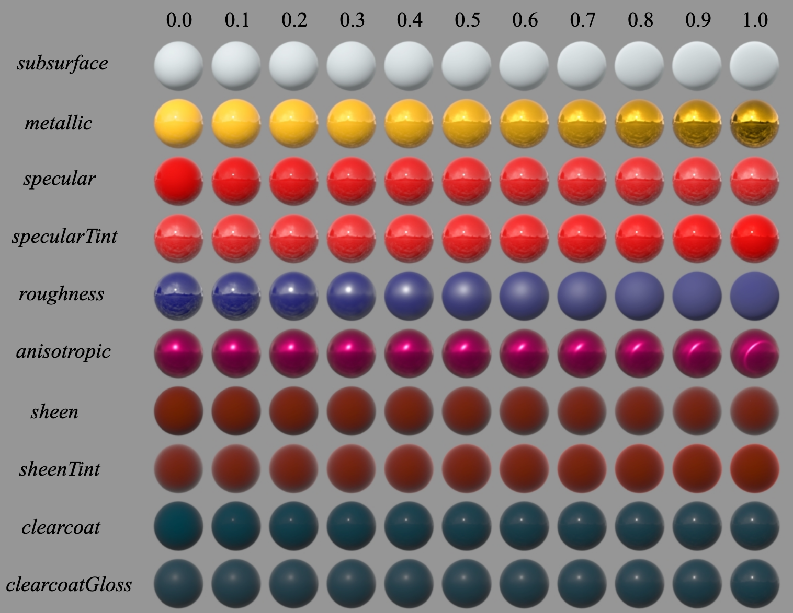
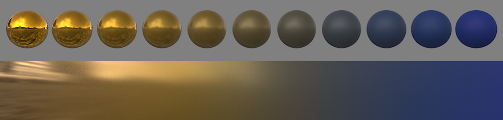
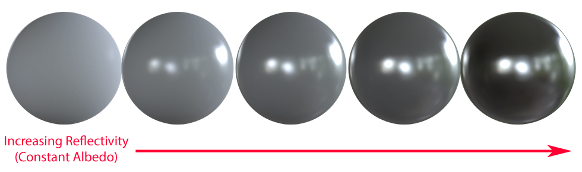
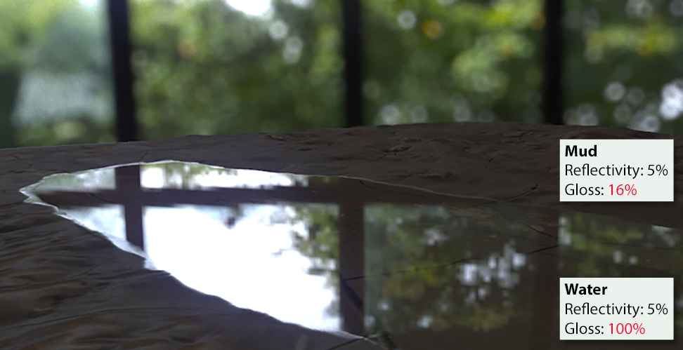
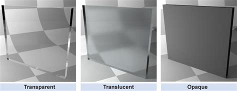
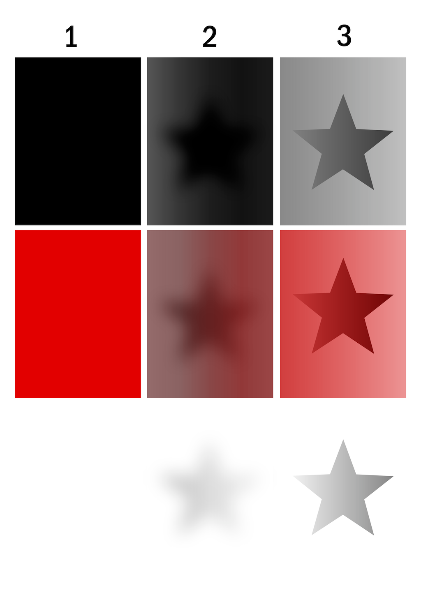

name: inverse
layout: true
class: center, middle, inverse
---

#### Prof. Dr. Lena Gieseke | l.gieseke@filmuniversitaet.de  
#### Film University Babelsberg KONRAD WOLF

# Materials and Shading Workshop

### 08 - Physically-Based Materials

<!--
h or ?: Toggle the help window
j: Jump to next slide
k: Jump to previous slide
b: Toggle blackout mode
m: Toggle mirrored mode.
c: Create a clone presentation on a new window
p: Toggle PresenterMode
f: Toggle Fullscreen
t: Reset presentation timer
<number> + <Return>: Jump to slide <number>
-->

---
layout:false

## Physically-Based Shading

Computational capabilities have advanced enough that some of the old approximations can now be safely discarded.

???
.task[COMMENT:]  

* This led to models that are physically more accurate models.

--
At the same time a trend developed to improve upon the usability of models.  
  
--
  
Both aspects - realistic looking and usable models - led to the term Physically-Based Rendering (PBR).
  
--
  
PBR is more a *concept* than a strict set of rules, and as such, the exact implementations of PBR systems tend to vary.
  
---
layout:false

## Physically-Based Shading
  
Disney's BRDF was one of the first to pick up on the concept with their *principled* BRDF. 

--
  
Brent Burley. 2012. **Physically Based Shading at Disney**. Physically Based Shading in Film and Game Production, ACM SIGGRAPH 2012 Courses. 

---
.header[Physically-Based Shading]

## Disney's Principled BRDF

A shading model should be **art directable** and not necessarily physically correct. Because of that, Disney developed a **principled model** rather than a strictly physical one.  
  
--
  
The principles are

--
1. Intuitive rather than physical parameters should be used.

--
2. There should be as few parameters as possible.

--
3. Parameters should be zero to one over their plausible range.

--
4. Parameters should be allowed to be pushed beyond their plausible range where it makes sense.

--
5. All combinations of parameters should be as robust and plausible as possible.

???
.task[COMMENT:]  

* They compared existing models with measured surface values to accurately represent real-world materials and combined them with artist-friendly parameterization.

---
.header[Physically-Based Shading | Disney's Principled BRDF]

## Parameter

???
.task[COMMENT:]  

* We thoroughly debated the addition of each parameter. In the end we ended up with one color
parameter and ten scalar parameters described in the following section

---

.center[  
[[disneyanimation]](https://disneyanimation.com/publications/physically-based-shading-at-disney/)]

???
.task[COMMENT:]  

* *baseColor*: the surface color, usually supplied by texture maps.
* *subsurface*: controls diffuse shape using a subsurface approximation.
* *metallic*: the metallic-ness (0 = dielectric, 1 = metallic). This is a linear blend between two
different models. The metallic model has no diffuse component and also has a tinted incident
specular, equal to the base color.
* *specular*: incident specular amount. This is in lieu of an explicit index-of-refraction.
* *specularTint*: a concession for artistic control that tints incident specular towards the base color. Grazing specular is still achromatic.
* *roughness*: surface roughness, controls both diffuse and specular response.
* *anisotropic*: degree of anisotropy. This controls the aspect ratio of the specular highlight. (0 = isotropic, 1 = maximally anisotropic.)
* *sheen*: an additional grazing component, primarily intended for cloth.
* *sheenTint*: amount to tint sheen towards base color.
* *clearcoat*: a second, special-purpose specular lobe.
* *clearcoatGloss*: controls clearcoat glossiness (0 = a “satin” appearance, 1 = a “gloss” appearan

Some models include a diffuse Fresnel factor.

---
.header[Physically-Based Shading | Disney's Principled BRDF]

## Parameter Blending

All the parameters are normalized and perceptually linear. Hence materials can interpolate intuitively.

.center[  
[[disneyanimation]](https://disneyanimation.com/publications/physically-based-shading-at-disney/)]

???
.task[COMMENT:]  

* Interpolating between two very different materials, shiny metallic gold and blue rubber,
using our model.
* https://arxiv.org/pdf/2302.03619.pdf

---
## Physically-Based Shading

Currently, physically-based shading models usually include

* diffusion & reflection
* translucency & transparency
* fresnel
* roughness / micro-surface properties
* metals
* energy conservation

in a unified manner.  

???
.task[COMMENT:]  

* In some cases diffusion is more complicated – in materials that have wider scattering distances for example, like skin or wax. In these cases a simple color will usually not do, and the shading system must take into account the shape and thickness of the object being lit. If they are thin enough, such objects often see light scattering out the back side and can then be called translucent. If the diffusion is even lower yet (in for example, glass) then almost no scattering is evident at all and entire images can pass through an object from one side to another intact. These behaviors are different enough from the typical “close to the surface” diffusion that unique shaders are usually needed to simulate them

  
--
  
Models often include measured material properties.

.footnote[[[Marmoset]](https://marmoset.co/posts/physically-based-rendering-and-you-can-too/)]

???
.task[COMMENT:]  

* https://de45xmedrsdbp.cloudfront.net/Resources/files/2013SiggraphPresentationsNotes-26915738.pdf
* Beyond rendering quality, consistency is the biggest reason to use measured values. Having consistent base materials takes the guess work out of material creation for individual artists. It also makes it easier from an art direction perspective to ensure that content created by a team of artists will look great in every lighting condition.

---
.header[Physically-Based Shading]

## Energy Conservation

Reflection and diffusion are mutually exclusive...

.center[  
[[marmoset]](https://marmoset.co/posts/basic-theory-of-physically-based-rendering/)]

???
.task[COMMENT:]  

One consequence of the energy conservation is that the brightness of the specular highlight is automatically linked to its size.

* This is because, in order for light to be diffused, light must first penetrate the surface (that is, fail to reflect). 
* This is easy to enforce in a shading system: one simply subtracts reflected light before allowing the diffuse shading to occur. 
* **This means highly reflective objects will show little to no diffuse light, simply because little to no light penetrates the surface, having been mostly reflected. **
* The converse is also true: if an object has bright diffusion, it cannot be especially reflective.
* The Albedo parameter controls the base color of the surface.

Energy conservation of this sort is an important aspect of physically-based shading. It allows the artist to work with reflectivity and albedo values for a material without accidentally violating the laws of physics (which tends to look bad). While enforcing these constraints in code isn’t strictly necessary to producing good looking art, it does serve a useful role as a kind of “nanny physicist” that will prevent artwork from bending the rules too far or becoming inconsistent under different lighting conditions.

--
.center[  
[[marmoset]](https://marmoset.co/posts/basic-theory-of-physically-based-rendering/)]

???
.task[COMMENT:]  

* As our hypothetical shading system is now taking microsurface detail into account, and spreading reflected light appropriately, it must take care to reflect the correct amount of light. Regrettably, many older rendering systems got this wrong, reflecting too much or too little light, depending on the microsurface roughness.
* **When the equations are properly balanced, a renderer should display rough surfaces as having larger reflection highlights which appear dimmer than the smaller, sharper highlights of a smooth surface.**
* It is this apparent difference in brightness that is key: both materials are reflecting the same amount of light, but the rougher surface is spreading it out in different directions, whereas the smoother surface is reflecting a more concentrated “beam”:
* Here we have a second form of energy conservation that must be maintained, in addition to the diffusion/reflection balance described earlier. Getting this right is one of the more important points required for any renderer aspiring to be “physically-based”.

---
.header[Physically-Based Shading]

## Roughness / Micro-Surface Properties 

.center[  
[[marmoset]](https://marmoset.co/posts/basic-theory-of-physically-based-rendering/)]

???
.task[COMMENT:]  

* microsurface detail and reflectivity are tied together
* A good example would be water and mud: both have very similar reflectivity, but since mud is quite rough and the surface of a puddle is very smooth, they appear very different in terms of their reflections. 
* Microsurface properties have other subtle effects on reflection as well. For example, the “edges-are-brighter” Fresnel effect diminishes somewhat with rougher surfaces (the chaotic nature of a rough surface ‘scatters’ the Fresnel effect, preventing the viewer from being able to clearly resolve it). Further, large or concave microsurface features can “trap” light – causing it to reflect against the surface multiple times, increasing absorption and reducing brightness. Different rendering systems handle these details in different ways and to different extents, but the broad trend of rougher surfaces appearing dimmer is the same.

---
.header[Physically-Based Shading]

## Translucency & Transparency

???
.task[COMMENT:]  

* What is the difference?

--

*Transparency* is the physical property of allowing most of the light to pass through the material.

???
.task[COMMENT:]  

* without scattering it
* water glass

--

*Translucency* allows light to pass through, but the photons might be scattered at either of the two interfaces, or their border. 

???
.task[COMMENT:]  

* In other words, a translucent material is made up of components with different indices of refraction
* Soap, frosted window

.footnote[[[wikipedia]](https://en.wikipedia.org/wiki/Transparency_and_translucency)]

--
*Opaque* material absorbs or reflects all of the light that hits it.

--
.center[  
[[bing.net]](https://external-content.duckduckgo.com/iu/?u=https%3A%2F%2Ftse2.mm.bing.net%2Fth%3Fid%3DOIP.wG7G2W2pbc_IPzWb-nO5dQHaC2%26pid%3DApi&f=1&ipt=53c5670b17a02ecc5148eaf4076e2ed393261f090d0af66e6ed2a54b58ff4c07&ipo=images)]

---
.header[Physically-Based Shading]

## Translucency & Transparency

.center[  
[[wikipedia]](https://en.wikipedia.org/wiki/Transparency_and_translucency)]

---
.header[Physically-Based Shading]

## Metals

Metals as electrically conductive materials.

.center[  
[[unrealengine]](https://docs.unrealengine.com/5.0/en-US/physically-based-materials-in-unreal-engine/)]

.footnote[[[Marmoset]](https://marmoset.co/posts/physically-based-rendering-and-you-can-too/)]

--
* tend to be much more reflective than insulators (non-conductors)

???
.task[COMMENT:]  

* Conductors will usually exhibit reflectivities as high as 60-90%, whereas insulators are generally much lower, in the 0-20% range.
* These high reflectivities prevent most light from reaching the interior and scattering, giving metals a very “shiny” look.
  
--
* reflectivity might vary and their reflections appear tinted (e.g. gold, copper, and brass)

???
.task[COMMENT:]  

* Insulators as a general rule do not exhibit this effect, and their reflections are uncolored.

--
* absorb rather than scatter any light that penetrates the surface, hence no diffuse reflection
    * oxides or residues on the surface might scatter some small amounts of light

???
.task[COMMENT:]  

* It is this duality between metals and just about everything else that leads some rendering systems to adopt “metalness” as a direct input. In such systems artists specify the degree to which a material behaves as a metal, rather than specifying only the albedo & reflectivity explicitly. This is sometimes preferred as a simpler means of creating materials, but is not necessarily a characteristic of physically-based rendering.

---

## Physically-Based Shading

Models are not still not physically accurate representations!  

--

But PBR **looks and behaves** more realistic, e.g., by relating the different quantities.

???
.task[COMMENT:]  

* More special shading effects
    * https://docs.unrealengine.com/5.1/en-US/shading-models-in-unreal-engine/
    * https://www.sidefx.com/docs/houdini/nodes/vop/principledshader.html

--

*Which materials did you find?*

???
.task[COMMENT:]  

* TODO: https://docs.unrealengine.com/5.0/en-US/physically-based-materials-in-unreal-engine/
