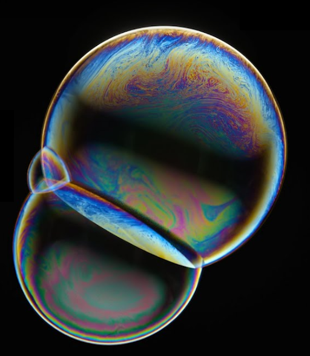
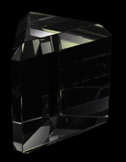
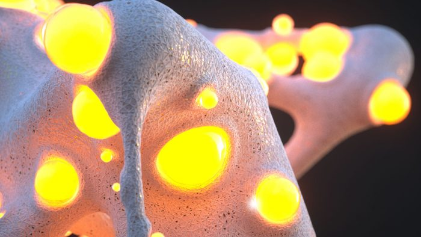
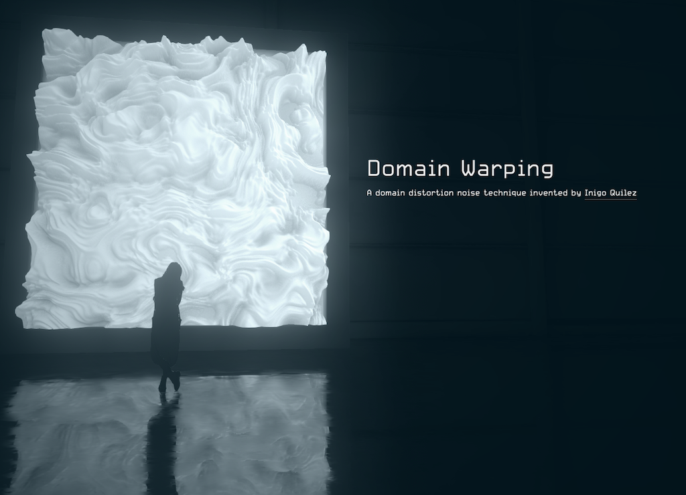

name: inverse
layout: true
class: center, middle, inverse
---

## Materials and Shading Workshop

Prof. Dr. Lena Gieseke | l.gieseke@filmuniversitaet.de | Film University Babelsberg *KONRAD WOLF*

## 10 - Overview 4

<!--
h or ?: Toggle the help window
j: Jump to next slide
k: Jump to previous slide
b: Toggle blackout mode
m: Toggle mirrored mode.
c: Create a clone presentation on a new window
p: Toggle PresenterMode
f: Toggle Fullscreen
t: Reset presentation timer
<number> + <Return>: Jump to slide <number>
-->

---

# What Next?

---
layout:false

## What Next?

### Materials & Shading

--

* Seeing and understanding shading in more detail.

--

.center[  [[dorian-iten]](https://www.dorian-iten.com/light/)]

---

## What Next?

### Materials & Shading

* Seeing and understanding shading in more detail.
* Writing more complex and custom shading and lighting effects
    * Within a specific context

---

## What Next?

### Materials & Shading

.center[  ]  [[entagma]](https://entagma.com/bubbles-yet-again-implementing-glassners-bubble-triplets-in-vex/)[[houdini masterclass]](https://www.youtube.com/watch?v=TwOjsRtWpBA)

---

## What Next?

### Materials & Shading

.center[  ]  [[entagma]](https://entagma.com/bubbles-yet-again-implementing-glassners-bubble-triplets-in-vex/)

---

## What Next?

### (Materials & Shading)

* Focus on building your own world, e.g. in a fragement shader
    * Shading as a part of that  
    * Will also need a rendering algorithm
???

* https://www.shadertoy.com/view/WtdBDM
* https://www.shadertoy.com/view/ldySDh
* https://www.shadertoy.com/view/WtSBzh
* https://www.shadertoy.com/view/lsX3DH
  
* https://www.shadertoy.com/view/Xds3zN
* https://www.shadertoy.com/view/wlyfWw

--
* What for?
    * Artistic expression
    * Real-time applications
    * Web content

---

## What Next?

### (Materials & Shading)

.center[  
  
[[cineshader]](https://cineshader.com) [[lusion]](https://lusion.co/work)]

---
template: inverse

# Your Interests & Next Steps

---

## Your Interests

Brainstorm and summarize what you would like to learn and work on next in regard to materials & shading?

--

* Which content, project type, etc.?
* Which context, e.g. software
* NPR vs. Photorealistic?
* ...

---
template: inverse

That's it...

## Bye 

# 👋🏻 👋🏼 👋🏽 👋🏾 👋🏿
