name: inverse
layout: true
class: center, middle, inverse
---

#### Prof. Dr. Lena Gieseke | l.gieseke@filmuniversitaet.de  
#### Film University Babelsberg KONRAD WOLF

# Materials and Shading Workshop

### 03 - Local Illumination

<!--

Start server in /doc/


h or ?: Toggle the help window
j: Jump to next slide
k: Jump to previous slide
b: Toggle blackout mode
m: Toggle mirrored mode.
c: Create a clone presentation on a new window
p: Toggle PresenterMode
f: Toggle Fullscreen
t: Reset presentation timer
<number> + <Return>: Jump to slide <number>
-->


---
template:inverse

### Goal:

## Let's Re-Implement Some of Three.js' Materials!
# 😁

???

.task[TASK:] 

* ...and modify them!
* Show scene visuals, no code yet


---
layout: false

## Goal

.center[ ]


---

## Goal

.todo[TODO: three.js rendering]


---

## Lighting and Shading

.left-even[
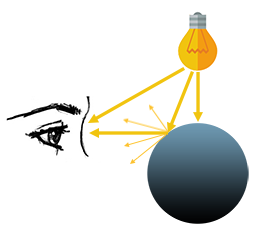

.footnote[[[based on: scratchapixel]](https://www.scratchapixel.com/lessons/3d-basic-rendering/rendering-3d-scene-overview/3d-rendering-overview)]
]

--

.right-even[

1. How much light reaches the surface?
]

---
## Lighting and Shading

.left-even[


.footnote[[[based on: scratchapixel]](https://www.scratchapixel.com/lessons/3d-basic-rendering/rendering-3d-scene-overview/3d-rendering-overview)]
]

.right-even[

1. How much light reaches the surface?
2. How much light reaches the camera?
]


---
.header[Lighting and Shading]

### How Much Light Reaches The Surface?

.center[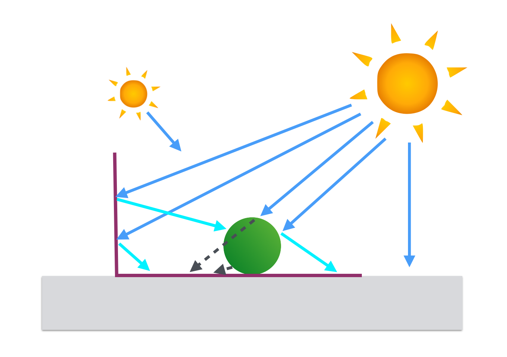]


---
.header[Lighting and Shading]

### How Much Light Reaches The Camera?

.center[]

---
.header[Lighting and Shading]

### How Much Light Reaches The Camera?

.center[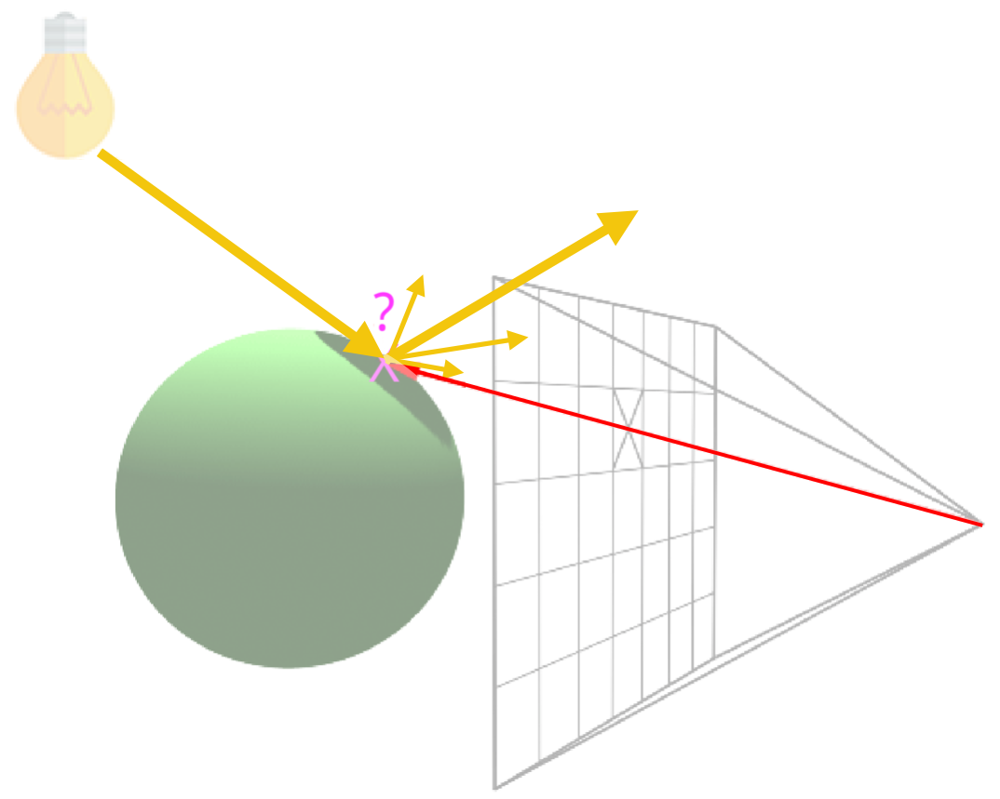]


---
.header[Lighting and Shading]

### How Much Do We Need To Adjust The Brightness?

.center[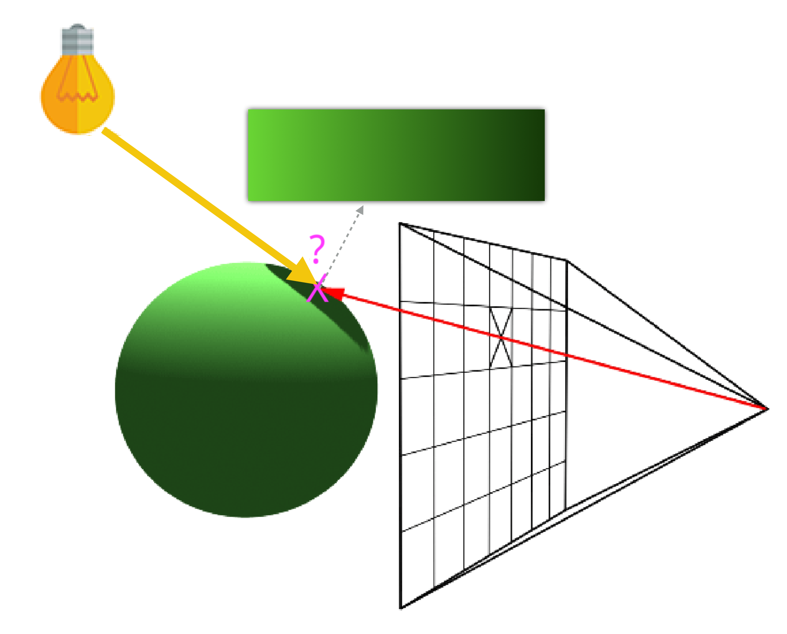]


---
layout: false

## Goal

.center[ ]


---
.header[Lighting and Shading | How Much Light Reaches The Camera?]

.center[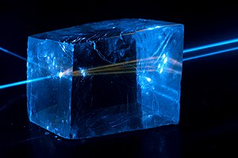  
.imgref[[[Wikipedia]](https://upload.wikimedia.org/wikipedia/commons/thumb/3/39/Fluorescence_in_calcite.jpg/300px-Fluorescence_in_calcite.jpg)]]


???
.task[COMMENT:]  

A photon is a piece of energy that 
* has no mass
* moves at the speed of light
* acts like a particle
* has momentum
The energy of a photon is quantized.

* A photon is the smallest discrete amount or quantum of electromagnetic radiation. It is the basic unit of all light
* Photons are always in motion and, in a vacuum, travel at a constant speed...
    * ...to all observers of 2.998 x 108 m/s. This is commonly referred to as the speed of light, denoted by the letter c. 

The basic properties of photons are:

* They have zero mass and rest energy. They only exist as moving particles.
* They are elementary particles despite lacking rest mass.
* They have no electric charge.
* They are stable.
* They are spin-1 particles which makes them bosons.
* They carry energy and momentum which are dependent on the frequency.
* They can have interactions with other particles such as electrons, such as the Compton effect.
* They can be destroyed or created by many natural processes, for instance when radiation is absorbed or emitted.
* When in empty space, they travel at the speed of light.

https://www.zmescience.com/science/what-is-photon-definition-04322/

Photons can be 

* *absorbed*, 
* *reflected*, or 
* *transmitted*  
 
when they strike the surface of a material.  


---
.header[Lighting and Shading | How Much Light Reaches The Camera?]


.center[ .imgref[[[Wikipedia]](https://en.wikipedia.org/wiki/File:BSDF05_800.png)]]


???
.task[COMMENT:]  

Photons can be 

* *absorbed*, 
* *reflected*, or 
* *transmitted*  
 
when they strike the surface of a material.  


---

## Lighting & Shading

.center[  .imgref[[[Wikipedia]](https://en.wikipedia.org/wiki/File:BSDF05_800.png)]]

--

To model this interaction using the whole of today’s knowledge of physics would be far too computationally time-consuming.  

---

## Lighting & Shading

Instead, we settle for models that ***approximate*** the expected appearance of a surface.

--

> Essentially, all models are wrong, but some are useful. – George E. P. Box

---
template: inverse

# Local Illumination

---

## Local Illumination


One approach to make light-surface interaction more handlebar, is to only consider
  
--
***local* interaction** between 

--
* defined lights, 

--
* a viewer, and 

--
* a surface point.

--

This powerful approximation is called ***local illumination*** and one of the oldest but still used techniques for shading.

???

Let's have a look at what local illumination exactly is.

---

## Local Illumination


.center[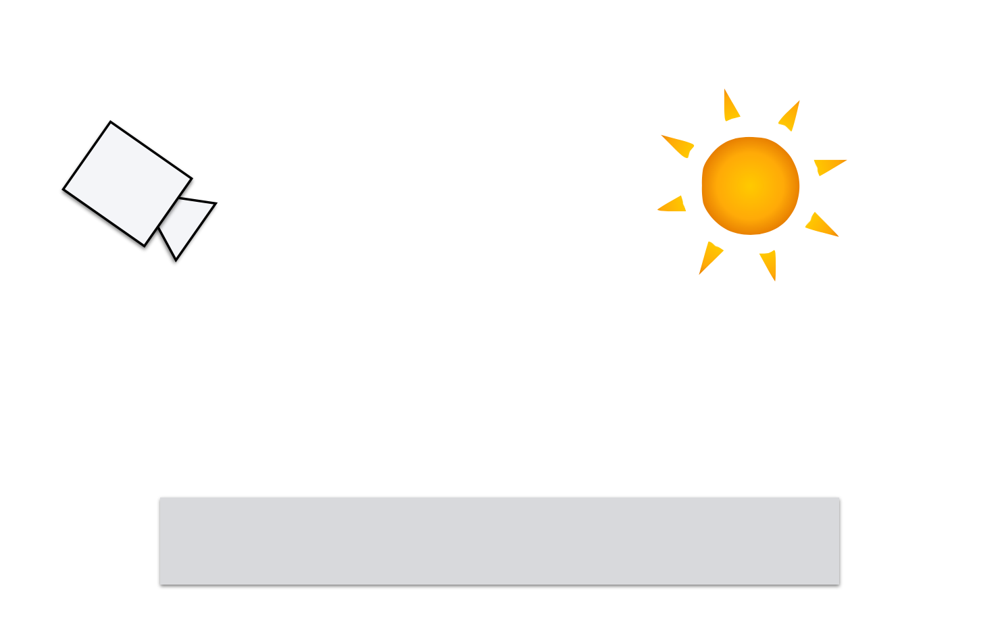]

???

We have a nicely defined 3d scene with a camera, light and sufficient information about the surface, such as its normal at the point to shade

---

## Local Illumination

.center[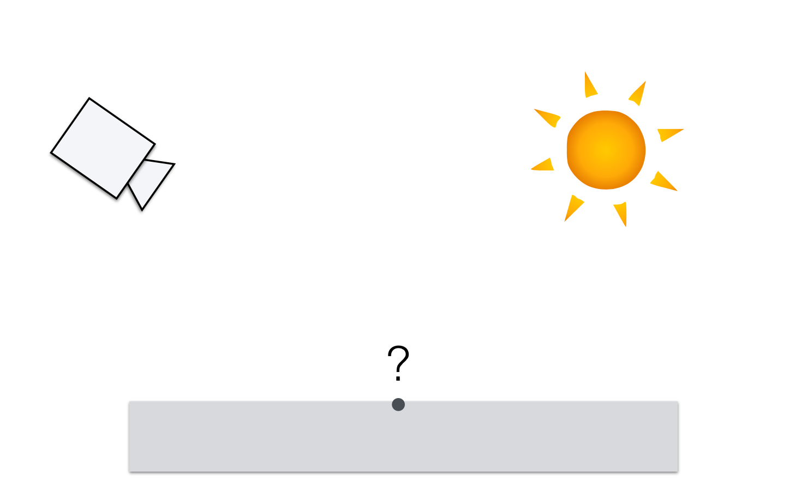]

???

... and ask our selfs how to compute the color value of a point on a surface (what p5 currently does for us)?

---

## Local Illumination

*Lighting* or *illumination* is used to describe the process by which the color and intensity of light *reaching a surface* is determined. 


.center[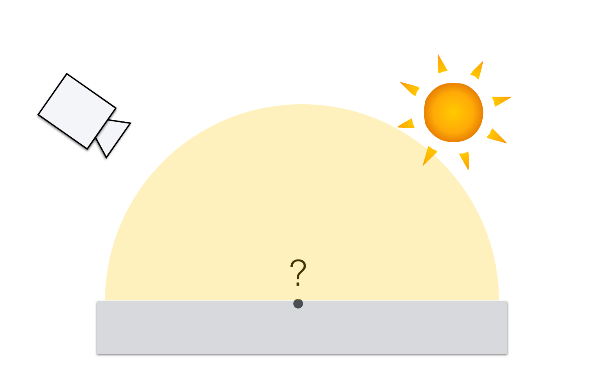]


---

## Local Illumination

*Local Illumination* considers light only provided directly emitted from a light source, travelling in a straight path to the illuminated point.

.footnote[[[Autodesk]](https://knowledge.autodesk.com/support/maya-lt/learn-explore/caas/CloudHelp/cloudhelp/2015/ENU/MayaLT/files/BoL-Indirect-global-vs-direct-illumination-htm.html)]


.center[]


???

With properties such as color and intensity

---

## Local Illumination

*Shading* describes the methods used to determine the color and intensity of light *reaching the viewer* for each point on a surface. 

.center[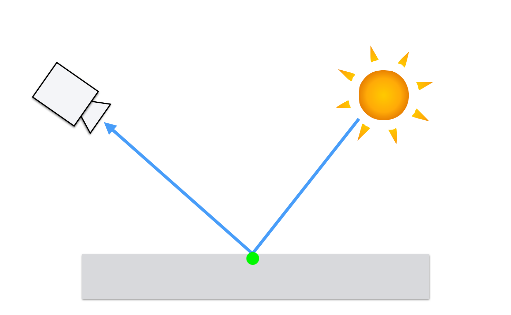]

---

## Local Illumination

Hence, the final color (the light reaching the viewer) of a surface point depends on the properties of the light sources as well as the reflective characteristics of the surface itself.

.center[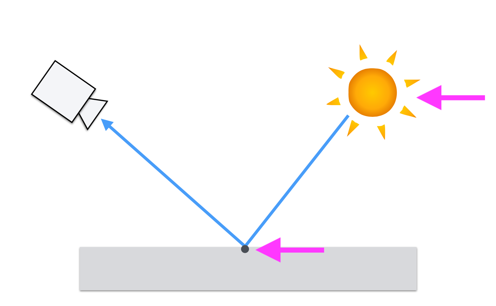]

---

## Local Illumination

.left-even[]

.right-even[
    
<br/>
> This computation can be interpreted as a geometric problem.
]

---
.header[Local Illumination]

## View and Light Vectors

--

We interpret the light transport as the radiance traveling along rays, where

--

* **L** points to the direction the light is coming from,
* **V** points to the observer and is the direction the light is reflected towards.

.center[]


---
.header[Local Illumination]

## View and Light Vectors

.center[]


**Make sure that ||**L**|| = ||**V**|| = 1 as these are directions!**


---
.header[Local Illumination]

## Insight 1

### Now we know how to describe the scene: with vectors!

---
.header[Local Illumination]

## Multiple Lights?

--

.center[  [[Scratchapixel]](https://www.scratchapixel.com/lessons/3d-basic-rendering/introduction-to-shading/shading-multiple-lights)]

???

.task[TASK:] What do we see here?

---
.header[Local Illumination]

## Multiple Lights

.center[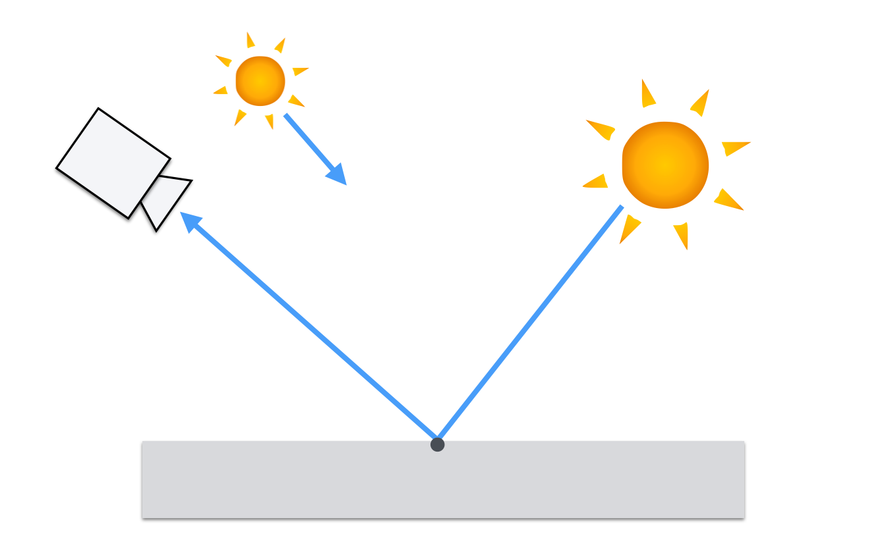]

The color that we calculate for a point on a surface is the combination of contributions from ***all*** the light sources that illuminate the surface. 

--

Hence, we need to iterate over all lights and collect their values.

???

In most render engines, we can get the intensity and/or color of each light separately. 


---
.header[Local Illumination]

## Multiple Lights


.center[ [[Scratchapixel]](https://www.scratchapixel.com/lessons/3d-basic-rendering/introduction-to-shading/shading-multiple-lights)]

The contribution of each light adds up linearly. This means that the contribution of each light just needs to be **summed up**.

---
.header[Local Illumination]

## Insight 2

### We have to iterate over lights and sum up their contributions!


---
.header[Local Illumination]

## What Are we Summing Up?


???
.task[COMMENT:]  

* The computation of the different light intensities, e.g. for a spot light this is given by a formul

---
.header[Local Illumination]

## Lighting

The standard types of light sources supported by all 3D graphics systems come in four varieties: 

* ambient, 
* directional / distant, 
* point, 
* and spot.

???

.task[TASK:] Describe each one.

---
.header[Local Illumination]

## Lighting

In Houdini:

.center[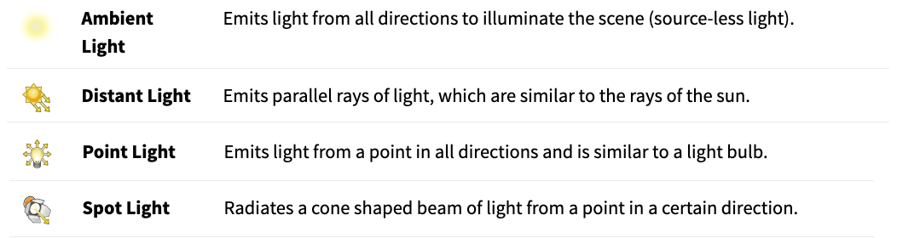[[Houdini Reference]](http://www.sidefx.com/docs/houdini/render/lights.html#lights)]

---
.header[Local Illumination]

## Lighting

In p5:

.center[  [[p5 Reference]](https://p5js.org/reference/#group-Lights,%20Camera)]  

---
.header[Local Illumination]

## Lighting


For the p5 example we work with (for the sake of simplicity):

* a constant color for the ambient light, and
* a direction vector and a constant color for each directional light.

--

> In a 3D context you usually just use the lights and customize the shading.

---
.header[Local Illumination]

## Insight 3

### Now we have numeric properties for the incoming light!

---
.header[Local Illumination]

## On a Side Note: Color

Also, for the p5 example, we are working with the RGB color system and the intensity of reflected light at a point on a surface is calculated for red, green, and blue wavelengths simultaneously.

--

Hence, whenever we talk about intensity or color, we mean a rgb-vector.

???

.task[TASK:] Workshop stop is possible here.

---
template:inverse

### Local Illumination

# Materials

---
.header[Local Illumination]

## Materials

Instead of...

.center[[[Wikipedia]](https://en.wikipedia.org/wiki/File:BSDF05_800.png)]


---
.header[Local Illumination]

## Materials

...we simply compute how much incoming light is reflected at a surface point:

.center[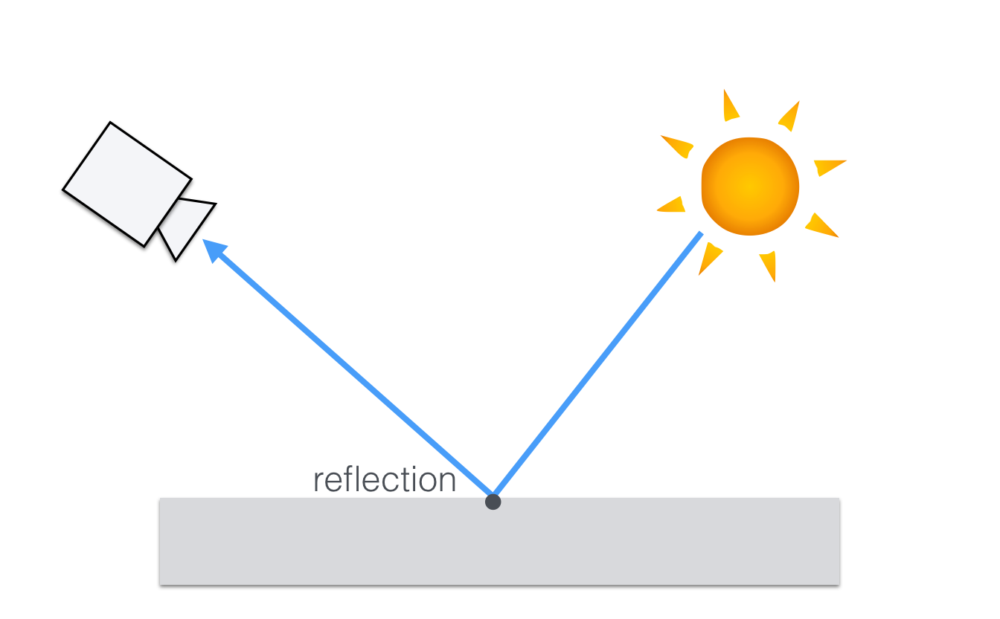]

--

1. The reflected light cannot be more than the received light.

--
2. There are different types of reflections.

???


How these different types of reflections are computed and combined is defined by various shading models.

First we have a look at the relevant refection types, then we implement them.


---
template: inverse

# Reflections

???

.task[TASK:] Which reflections do you know?

---
.header[Local Illumination]

## Reflections

--

.center[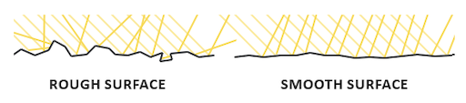]

???

Be based on the microfacet surface model: this theory describes how at a microscopic level, all surfaces have a certain degree of roughness which will scatter light rays in a more or less chaotic way, depending on this roughness degree. 

--

.center[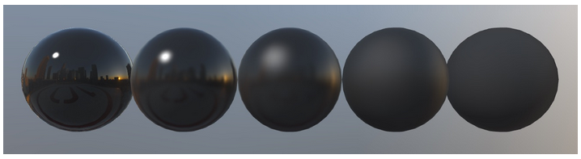  ]  

[[avilapa]](https://avilapa.github.io/post/custom-engine-pbr/)

---
.header[Local Illumination]


## Diffuse Reflection

???

.task[TASK:] Is what?

--

A diffuse surface is one which scatters the incident light on a point on the surface equally in random directions.

--

.center[]

--

This is also called a *Lambertian* reflection, and the appearance of the Lambertian reflection does not depend on the position of the observer.

---
.header[Local Illumination]

## Specular Reflection

???

.task[TASK:] Is what?

--

For a *shiny* or *glossy* reflection there is a preferred angle of reflection, meaning more of the incident light is reflected in a certain angle than in other angles.

--

.center[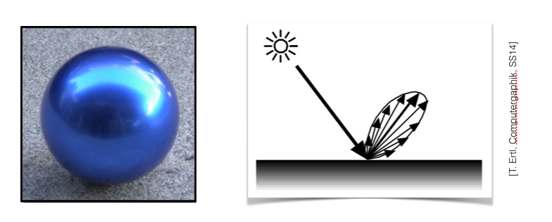]

---
.header[Local Illumination]


## Full Specular Reflection

--

For a full specular reflection all light is reflected in the same angle as the incoming angle.  

This is a *mirror reflection*.

--

.center[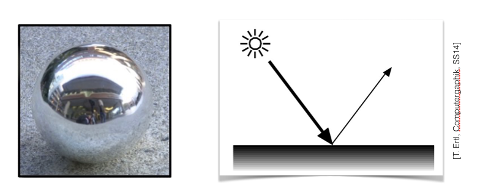]

---

.center[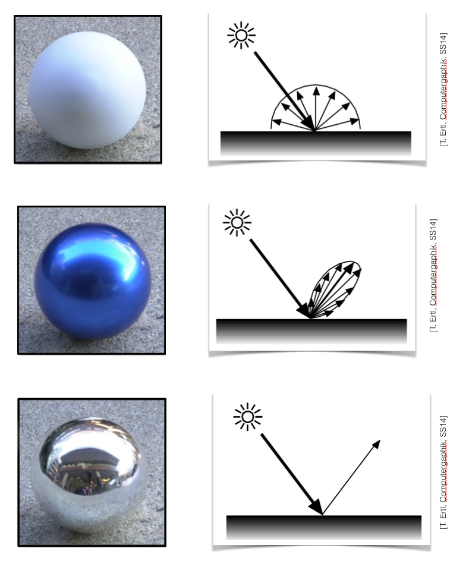]

---
.header[Local Illumination]

## Measured Reflections

---

### Measured Diffuse Surface Reflection

.center[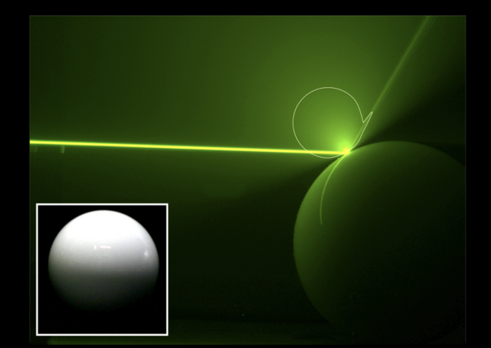  [[Hullin et al. 2008]]()]

---

### Measured Glossy Surface Reflection

.center[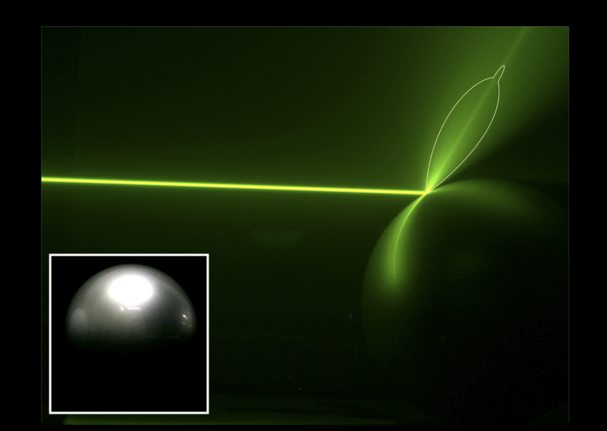  [[Hullin et al. 2008]]()]

---

### Measured Layered (Diffuse / Glossy) Surface Reflection

.center[  [[Hullin et al. 2008]]()]

---
template:inverse

### Reflections

## Computation

---
.header[Reflections | Computation]

## Diffuse Reflection

The Diffuse Reflection looks the same under all observation directions. 

.center[]

--

It only depends on the light direction.

???

.task[TASK:] Which influence does the light direction have?


---
.header[Reflections | Computation]

## Diffuse Reflection - Light Direction

.center[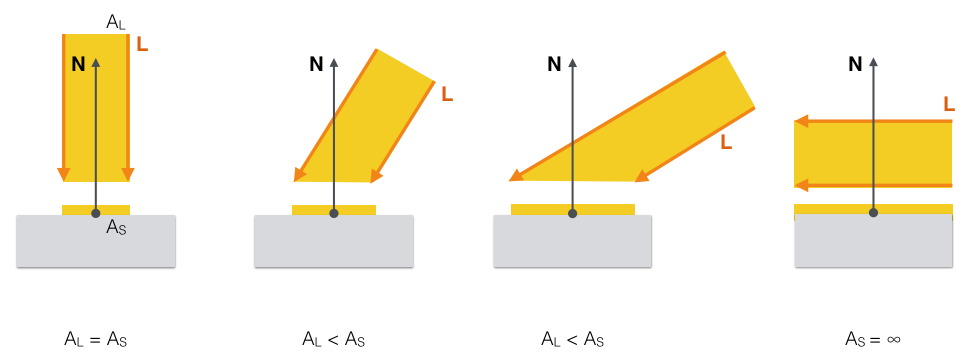]

???

.task[TASK:] What do we see?

--

As the angle between the normal vector and the light direction increases, the surface area illuminated by the beam of light (which stays the same) increases...

???

.task[TASK:] What does this imply?

A beam of light having a cross-sectional area A illuminates the same area A on a surface only if the surface is perpendicular to the direction in which the light is traveling.

--

... and the intensity of the light per unit surface area **decreases**.

???

-> law of conservation of energy?!

---
.header[Reflections | Computation]

## Diffuse Reflection - Light Direction

.center[]

---
.header[Reflections | Computation]

## Diffuse Reflection - Light Direction

Depending on \\(θ\\), we want to multiply the light intensity with a factor.

.center[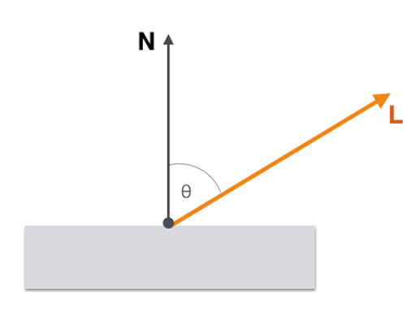]

---
.header[Reflections | Computation]

## Diffuse Reflection - Light Direction

.center[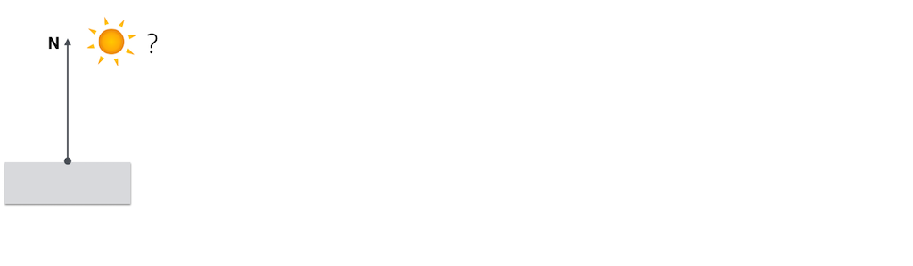]

---
.header[Reflections | Computation]


## Diffuse Reflection - Light Direction

.center[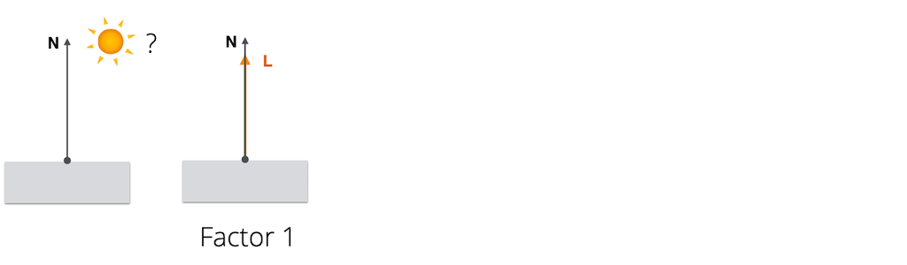]

---
.header[Reflections | Computation]

## Diffuse Reflection - Light Direction

.center[]

---
.header[Reflections | Computation]

## Diffuse Reflection - Light Direction

.center[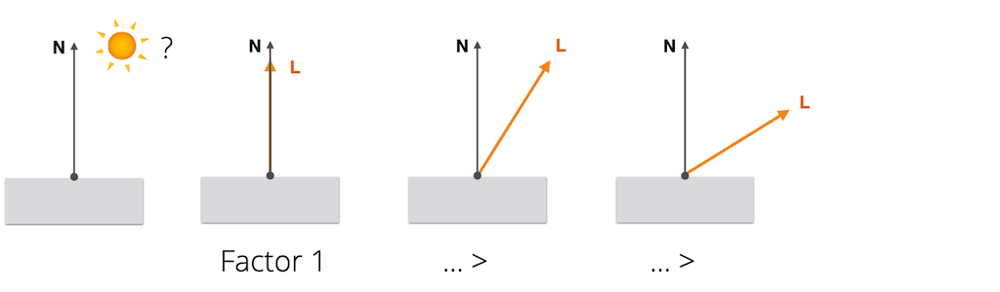]

---
.header[Reflections | Computation]

## Diffuse Reflection - Light Direction

.center[]

???

.task[ASK:]  

* How to model this behavior?

--

Cosinus to the rescue!

---
.header[Reflections | Computation]

## Lambert's Cosine Law


.center[  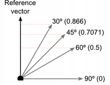[[Unity Manual]](https://docs.unity3d.com/Manual/UnderstandingVectorArithmetic.html)]


--

Thus, we need to decrease in the intensity of the light (per unit surface area) by a factor of \\({cosθ}\\). 


---
.header[Reflections | Computation]

## Lambert's Cosine Law

.center[]

The value of \\({cosθ}\\) is given by the dot product between the normal vector **N** and the unit direction to the light source **L**. 

\\({cosθ}\\) = **L** ∙ **N**

???

Geometrically, the dot product of the magnitudes of two vectors is the cosine of the angle between them.

---
.header[Reflections | Computation]

## Diffuse Reflection

.center[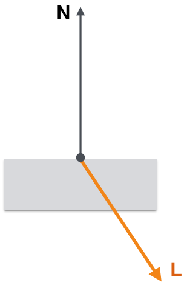]

???

.task[ASK:]  

* What do we want to happen in this case?
* The value should be zero!

---
.header[Reflections | Computation]

## Diffuse Reflection

Lucky us!

.center[  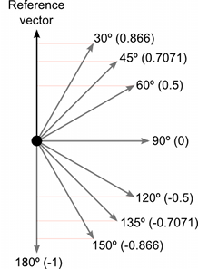[[Unity Manual]](https://docs.unity3d.com/Manual/UnderstandingVectorArithmetic.html)]


???

* We clamp negative values to zero.

---
.header[Reflections | Computation]

## Diffuse Reflection

Lucky us!

.center[  [[Unity Manual]](https://docs.unity3d.com/Manual/UnderstandingVectorArithmetic.html)]

A negative dot product means that the surface is facing away from the light source and should not be illuminated at all. 

---
.header[Reflections | Computation]

## Diffuse Reflection

Thus, we clamp the dot product to zero in our illumination calculations. 

max(**L** ∙ **N**, 0)

--

This is the Lambertian Reflection.

---
.header[Reflections | Computation]

## Diffuse Reflection

Now, we can compute the diffuse reflection with:


```js
light_diffuse * max(L ∙ N, 0);
```

*Reminder:* `light_diffuse` is a rgb color in our context.

???

.task[TASK:] Show lambert in scene.

???

Or, if we have ambient light in the scene


```js
light_ambient + light_diffuse * max(L ∙ N, 0);
```

???

.task[TASK:]  

* Include shininess?

---
.header[Reflections | Computation]

## Specular Reflection

--

.center[]

---
.header[Reflections | Computation]

## Specular Reflection

Surfaces tend to reflect light strongly along the **reflection of the incident direction** across the surface normal.  

--

This results in the appearance of a shiny highlight on the surface, called a specularity. 

--

.center[  
[[Hullin et al. 2008]]()]

---
.header[Reflections | Computation]

## Specular Reflection

Hence, unlike the diffuse reflection, the specular reflection depends on the position of the viewer! 

.center[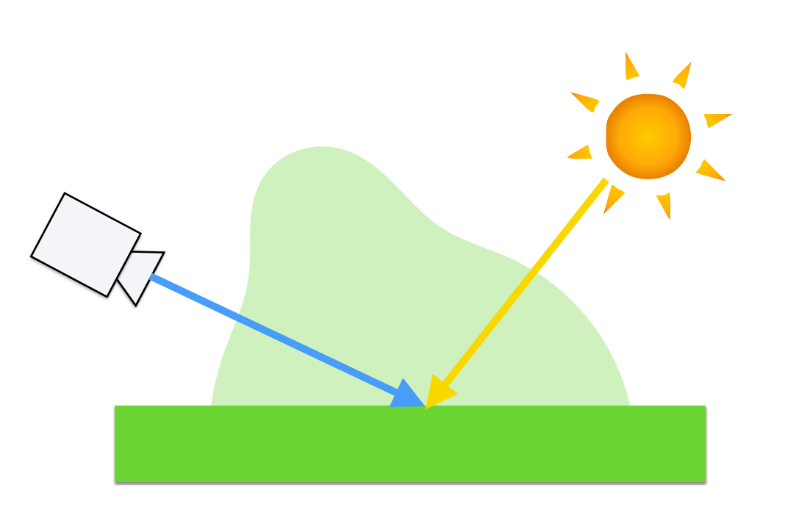 ]

---
.header[Reflections | Computation]

## Specular Reflection

Hence, unlike the diffuse reflection, the specular reflection depends on the position of the viewer! 

.center[ ]

The intensity of the specular reflection is strongly related to the reflection vector R.

---
.header[Reflections | Computation]

## Reflection Vector

???

Hence, for specular reflection, we need the reflection vector.

--

.center[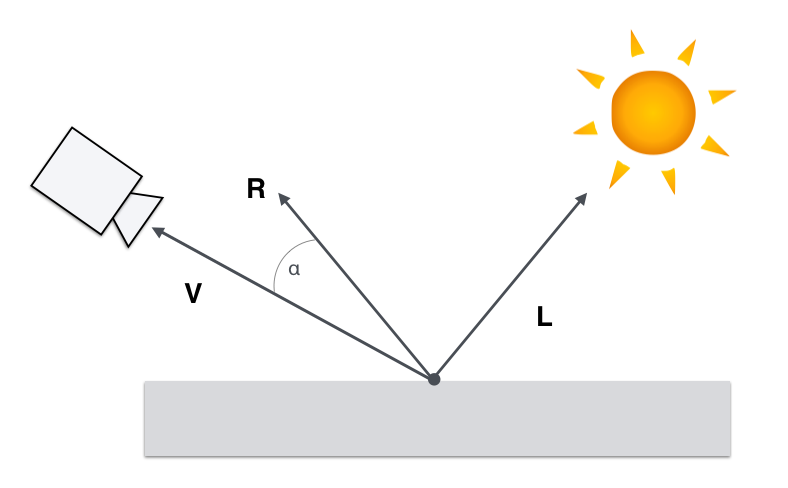]
--

Most 3D package offer functions such as `reflect(L, N);` in GLSL.

???

NOTE: Add formula?

---
.header[Reflections | Computation]

## Specular Reflection

.center[]

--

Based on the given geometry, how can we model specular reflection now?


---
.header[Reflections | Computation]

## Specular Reflection

.center[]

A model that recreates believable (but having almost no real physical basis) specular highlights uses again the **cos** function for modulation.

---
.header[Reflections | Computation]

## Specular Reflection

.center[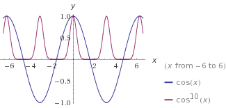]  

.footnote[[[cglearn](https://cglearn.eu/images/seminar/light/cosinePower.gif)]]

---
.header[Reflections | Computation]

## Specular Reflection


.center[]

--

\\[{cos^{n}\alpha} = max(0, R \cdot V)^{n}\\]

--

With n as a *shininess* exponent.

???

The expression (N ⋅ L > 0) is a boolean expression that evaluates to 1 if true and 0 otherwise. This prevents specular highlights from showing up at points on a surface that face away from the light source. 

---
.header[Reflections | Computation | Specular Reflection]

## Shininess Exponent

\\[{cos^{n}\alpha} = max(0, R \cdot V)^{n}\\]

The specular or shininess exponent $n$ controls the sharpness of the specular highlight. 

--

.center[]

--

* A small value of n produces a dull highlight that fades out over a relatively large distance

--
* A large value of n produces a sharp highlight that fades out quickly as the vectors V and R diverge.  

---
.header[Reflections | Computation | Specular Reflection]

## Specular Reflection

Now, we can compute the specular reflection with:

--

```glsl
light_specular * max(0, R ∙ V)^n;
```

---
template:inverse

### And now what?


???
.task[COMMENT:]  

* We need to put together the different formulas to a material models

---
template:inverse

# Shading Models


---
## Shading Models

What we just learned are the parts of one of the most famous and excessively used shading models, namely the ***Phong* shading model**.

--

The Phong model looks as follows:

\\( I_{Phong} = I_A + I_D + I_S \\)

--

.center[]

---
.header[Shading Models]

## Phong Model

\\( I_{Phong} = I_A + I_D + I_S \\)

--

With the reflection components modelled as


\\(I_{Ambient} = k_a \\)

--

\\(I_{Diffuse} = k_d  max(N \cdot L, 0)\\)

--

\\(I_{Specular} = k_s max(R \cdot V, 0)^n\\)

---
.header[Shading Models]

## Phong Model

.center[]


---
.header[Shading Models]

## Phong Model

We can now define how much of an incoming light intensity is reflected on a surface point for a certain view vector.

--

For an incoming light I


\\(I_{Phong} = k_a + k_d \cdot max(N \cdot L, 0) \cdot I_d  + k_s \cdot max(R \cdot V, 0)^n \cdot I_s \\)

This is also called a **BRDF**, or better in this case the **Phong BRDF**.

