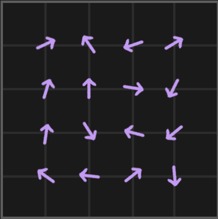
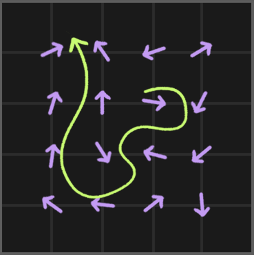
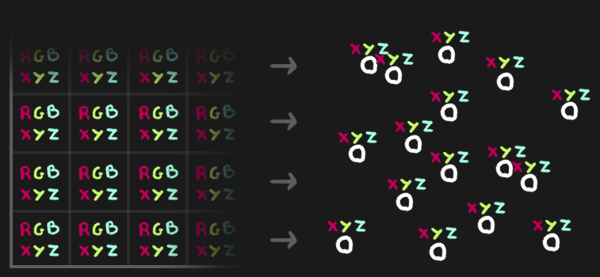
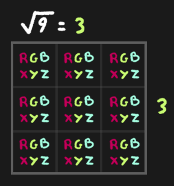
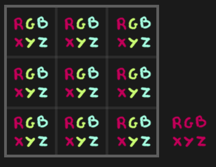
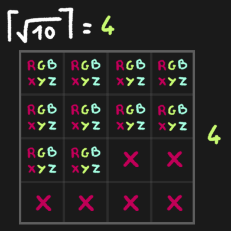
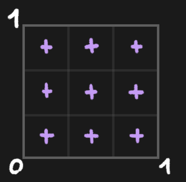
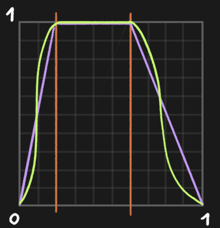

# GPGPU Particle Animation


Tutorial is based on Brunos excellent tutorial three.js journey, specifically on [Lesson 41 - GPGPU Flow Field Particles](https://threejs-journey.com/lessons/gpgpu-flow-field-particles-shaders).

* [GPGPU Particle Animation](#gpgpu-particle-animation)
    * [Scene](#scene)
    * [Theory](#theory)
        * [Flow Fields](#flow-fields)
        * [Persistent Data](#persistent-data)
        * [Frame Buffer Object](#frame-buffer-object)
            * [FBO Texture Size](#fbo-texture-size)
            * [FBO Texture Representations](#fbo-texture-representations)
            * [FBO Rendering](#fbo-rendering)
            * [FBO Implementation](#fbo-implementation)
        * [GPGPU](#gpgpu)
        * [GPUComputationRenderer](#gpucomputationrenderer)
            * [Variable](#variable)
            * [Rendering](#rendering)
        * [Setup](#setup)
    * [Tutorial](#tutorial)
        * [Geometry](#geometry)
        * [GPUComputationRenderer](#gpucomputationrenderer-1)
        * [The Particles Variable](#the-particles-variable)
        * [Debug](#debug)
        * [Updating and Piping Particle Data](#updating-and-piping-particle-data)
        * [GPGPU Particles Positions](#gpgpu-particles-positions)
        * [Flow Field Simulation](#flow-field-simulation)
        * [Life of a Particle](#life-of-a-particle)
            * [Reset](#reset)
        * [Control the Chaos](#control-the-chaos)
        * [Life Size](#life-size)
        * [Particle Coloring](#particle-coloring)
    * [Next Steps](#next-steps)
    * [References](#references)


## Scene

We start with a sphere made out of particles using a ShaderMaterial. The size of the particles is already handled in the vertex shader with perspective and we can control it using the uSize gui element. Particles set to be shaped as discs in the fragment shader.

Then it is our goal to make the particles seem to move influenced by various streams pushing them around. This effect is based on two core techniques:

1. GPGPU for memory
2. Flow field for the animation

[[1]](https://threejs-journey.com/lessons/gpgpu-flow-field-particles-shaders)

## Theory

### Flow Fields

A flow field is a mathematical representation of a vector field that describes the motion of a fluid (such as air, water, or gas) at every point in space. Each point in the field has a vector associated with it, indicating the velocity (direction and magnitude) of the fluid at that specific location.  

  

Now imagine throwing a particle on a flow field. For each frame, we would calculate the stream direction for the particle and make it move accordingly, resulting in the particle moving around:  

  

Unfortunately, a flow field takes up a considerable amount of computing power. As a result, doing the calculation for each frame for thousands and thousands of particles using just the CPU is hardly possible. Hence, we use a more efficient GPU setup for computing the flow field simulation in parallel for all vertices.
  
[[1]](https://threejs-journey.com/lessons/gpgpu-flow-field-particles-shaders)

### Persistent Data

In a flow field, the trajectory of the particle is unpredictable and keeps on evolving over time. Hence, we need to know where a particle was in the last frame, to compute the next. We need data to *persist*.

Unfortunately, the vertex and fragment shader programs, we have used so far are *stateless*, meaning they have no memory and one shader pipeline execution know nothing about the past, the future or its neighbors.

For have a kind of memory within our shader pipeline, we can use a GPGPU shader program. The GPGPU shader program supports us to process and save data using the GPU, utilizing a Frame Buffer Object (FBO).

  
[[1]](https://threejs-journey.com/lessons/gpgpu-flow-field-particles-shaders)


### Frame Buffer Object 

A Frame Buffer Object is an OpenGL construct that allows rendering operations to be directed to textures or renderbuffers instead of directly to the screen. It provides a way to perform off-screen rendering, saving and passing data between frames.


[[wiki]](https://en.wikipedia.org/wiki/Framebuffer_object)

In Three.js we create FBOs as render target using the [WebGLRenderTarget](https://threejs.org/docs/#api/en/renderers/WebGLRenderTarget) constructor. From Three.js [documentation](https://threejs.org/docs/#api/en/renderers/WebGLRenderTarget): 
> A render target is a buffer where the video card draws pixels for a scene that is being rendered in the background. It is used in different effects, such as applying postprocessing to a rendered image before displaying it on the screen.
  
For now, you can imagine such a FBO, which is also called renderbuffer, as a texture that is not applied within the scene, e.g., for coloring, but is purely used to save and hand data around.

We write to the renderbuffer in the following scenario in a additional glsl shader program. In that additional, general purpose shader, we compute the particle simulation in parallel, making it performant. 

Specifically, for the data handling for simulating the particles of a flow field, one pixel of the FBO texture saves the `x, y, z` coordinates of one particle in its `r, g, b` channel. Hence, the size of the texture needs to be at least as big as the number of particles we have.

  

The images shows such a render target texture, with each pixel containing in its `r, g, b` channel the `x, y, z` coordinates of one particle.
  
The render target texture also has an alpha channel, which can be used for something else, e.g., the size of the particle.


[[1]](https://threejs-journey.com/lessons/gpgpu-flow-field-particles-shaders)

#### FBO Texture Size

Each pixel of the FBO corresponds to one particle. E. g., if we have 9 particles, we need 9 pixels on the FBOs. Since FBOs are pretty much like 2D texture, they are rectangular. In order to make calculations easier (and potentially more performant), FBOs are usually squares.

The with and height of a FOB is given by the square root of the number of particles. 

For 9 particles, the square root of 9 is 3 and we need a 3 by 3 FBO:  

  

But what about 10 particles?  

  

The square root of 10 equals 3.1622. We round it up to 4 so that each particle fits:

  

We get some left-over pixels, but it’s not much of an issue.

[[1]](https://threejs-journey.com/lessons/gpgpu-flow-field-particles-shaders)


#### FBO Texture Representations

A [WebGLRenderTarget](https://threejs.org/docs/#api/en/renderers/WebGLRenderTarget) texture is a 1D arrays for rgba data due to efficiency. Hence it is a 1D array saving 4D data. We have to map our 2D (e.g., UVs), 3D data (e.g., a xyz position) and 4D data (e.g., a xyz position and particle size) to 1D or the other way around.

Mapping 3D mesh data (x, y, z) to 4D (r, g, b, a) in a 1D array:

```js
// PSEUDO CODE


// Size of the "Texture-Memory" 
textureParticles.size = Math.ceil(Math.sqrt(numberOfParticles));

for(let i = 0; i < numberOfParticles; i++){

    const i3 = i * 3;
    const i4 = i * 4;


    // The textureParticles r channel
    // The x position of mesh point i
    textureParticles.image.data[i4 + 0] = 
                                    baseGeometry.mesh.attributes.position.array[i3 + 0];
    
    // The textureParticles g channel
    // The y position of mesh point i
    textureParticles.image.data[i4 + 1] = 
                                    baseGeometry.mesh.attributes.position.array[i3 + 1];
    
    // The textureParticles b channel
    // The z position of mesh point i
    textureParticles.image.data[i4 + 2] = 
                                    baseGeometry.mesh.attributes.position.array[i3 + 2];

    // The textureParticles alpha channel
    // A random value for, e.g., the size
    textureParticles.image.data[i4 + 3] = Math.random();

}
```

Alternatively, we might want to map from a 2D array to 1D arrays with 1D, 2D and 3D data:

```js
// PSEUDO CODE


for (let y = 0; y < texture.size; y++) {
    for (let x = 0; x < gpgpu.size; x++) {

        // Coordinates for 1D, 2D and 3D arrays
        const i = (y * gpgpu.size) + x; // Size array
        const i2 = i * 2;               // UV array
        const i3 = i * 3;               // RGB array

        // 1D: A random size for each particle
        sizesArray[i] = Math.random();

        // 2D: The 2D UV coordinates of the "memory-texture"
        // for each particle
        particlesUvArray[i2 + 0] = uvX;
        particlesUvArray[i2 + 1] = uvY;

        // 3D: A 3D color for each particle
        particlesColorArray[i3 + 0] = r;
        particlesColorArray[i3 + 1] = g;
        particlesColorArray[i3 + 2] = b;

    }
}
```

#### FBO Rendering

Technically, it is not possible to read and write the same FBO, which is why we need to have two of them. 
  
Instead of reading and writing to one FBOs continuously, the are two FBOs, switching the active framebuffer with each render call. 
  
While framebuffer 1 is active and "rendered" (e.g., as prost-processing effect literally displayed), we compute the next simulation step and write that data into one framebuffer 2. In the next render call, framebuffer 2 become active and is "rendered", while we write into framebuffer 1. And so on.

  

[[1]](https://threejs-journey.com/lessons/gpgpu-flow-field-particles-shaders)


#### FBO Implementation

Thankfully, in Three.js we can use a given class to handle the core framebuffer functionality of integrating new shaders as framebuffer into the pipeline, namely reading and writing to them and continuously switching rendering.

### GPGPU

For the above setup to create a memory for the GPU, we are using the [`GPUComputationRenderer`](https://github.com/mrdoob/three.js/blob/8286a475fd8ee00ef07d1049db9bb1965960057b/examples/jsm/misc/GPUComputationRenderer.js) class.

GPUComputationRenderer will do most of the heavy lifting such as creating the scene, handling the ping-pong buffers, setting the color format properly, rendering, etc.

As of now, the class is not officially documented. Fortunately, the code itself is well commented: [`GPUComputationRenderer.js`](https://github.com/mrdoob/three.js/blob/8286a475fd8ee00ef07d1049db9bb1965960057b/examples/jsm/misc/GPUComputationRenderer.js). The comments in that file function as documentation fairly well.

Also, there are some [three.js examples](https://threejs.org/examples/?q=gpgpu#webgl_gpgpu_birds) using the class.


[[1]](https://threejs-journey.com/lessons/gpgpu-flow-field-particles-shaders)

### GPUComputationRenderer

#### Variable

The "memory-textures" the GPUComputationRenderer calls variables. These variables are RGBA float textures that hold 4 floats for each compute element (texel).

Each variable has a fragment shader that defines the computation made to obtain the variable in question. You can use as many variables you need, and make dependencies so you can use textures of other variables in the shader (the sampler uniforms are added automatically). 

[[2]](https://github.com/mrdoob/three.js/blob/8286a475fd8ee00ef07d1049db9bb1965960057b/examples/jsm/misc/GPUComputationRenderer.js)

#### Rendering

The renderer has two render targets per variable and switches them back and for per render call. Textures from the current frame are used as inputs to render the textures of the next frame.

The render targets of the variables can be used as input textures for your visualization shaders, in the sense of "accessing the memory".

### Setup

A complete basic setup of the GPUComputationRenderer includes the following steps (we will later do them step by step, here just as an overview):


```js
//scene.js

import textureParticlesShader from './shaders/gpgpu/textureParticles.glsl';

//...

//// Geometry
const baseGeometry = {};
baseGeometry.mesh = new THREE.SphereGeometry(1, 128, 128);
baseGeometry.count = baseGeometry.mesh.attributes.position.count;


//// GPGPU Compute
// https://github.com/mrdoob/three.js/blob/8286a475fd8ee00ef07d1049db9bb1965960057b/examples/jsm/misc/GPUComputationRenderer.js

// Setup
const gpgpu = {};

// Size of the "Texture-Memory"
gpgpu.size = Math.ceil(Math.sqrt(baseGeometry.count));

// Create GPGPU Computation Renderer
gpgpu.computation = new GPUComputationRenderer(gpgpu.size, gpgpu.size, renderer);


// Create the "Texture-Memory"
const textureParticles = gpgpu.computation.createTexture();


// Writing into the rgba channels of the textureParticles texture
// The required access is textureParticles.image.data and
// that is a 1D array.
for(let i = 0; i < baseGeometry.count; i++){

    const i3 = i * 3;
    const i4 = i * 4;

    // The textureParticles r channel
    // The x position of mesh point i
    textureParticles.image.data[i4 + 0] = 
                                    baseGeometry.mesh.attributes.position.array[i3 + 0];
    
    // The textureParticles g channel
    // The y position of mesh point i
    textureParticles.image.data[i4 + 1] = 
                                    baseGeometry.mesh.attributes.position.array[i3 + 1];
    
    // The textureParticles b channel
    // The z position of mesh point i
    textureParticles.image.data[i4 + 2] = 
                                    baseGeometry.mesh.attributes.position.array[i3 + 2];

    // The textureParticles b channel
    textureParticles.image.data[i4 + 3] = Math.random();

}


// Add the Texture Variables to the GPGPU Computation Renderer
// This will be a uniform sampler2D in the shader
gpgpu.particlesVariable = gpgpu.computation.addVariable('uTextureParticles', textureParticlesShader, textureParticles);
// Add variable dependencies
// Which shader needs to know from which other shader?
// Most often a variable will need itself as dependency
gpgpu.computation.setVariableDependencies(gpgpu.particlesVariable, [ gpgpu.particlesVariable ]);


//// Uniforms 
// Adding custom uniforms for textureParticlesShader
// in the syntax needed from three.js ShaderMaterial
gpgpu.particlesVariable.material.uniforms.uTime = new THREE.Uniform(0);
gpgpu.particlesVariable.material.uniforms.uBase = new THREE.Uniform(textureParticles);
gpgpu.particlesVariable.material.uniforms.uDeltaTime = new THREE.Uniform(0);
gpgpu.particlesVariable.material.uniforms.uFlowFieldInfluence = new THREE.Uniform(0.5);
gpgpu.particlesVariable.material.uniforms.uFlowFieldStrength = new THREE.Uniform(2);
gpgpu.particlesVariable.material.uniforms.uFlowFieldFrequency = new THREE.Uniform(0.5);


///// Init
// Initialize the gpgpu computation
// and check for completeness
const error = gpgpu.computation.init();
if ( error !== null ) {
    console.error( error );
}

//...


const renderScene = () => {

    // Computing the texture processing
    gpgpu.computation.compute();

    // Updating texture to the swapped texture 
    // that is now being rendered, which
    // the gpu renderer output returns
    particles.material.uniforms.uParticleUvsTexture.value = gpgpu.computation.getCurrentRenderTarget(gpgpu.particlesVariable).texture;


    // Render
    renderer.render(scene, camera);

    // Call renderScene() again on the next frame
    window.requestAnimationFrame(renderScene);
}

renderScene();
```


[[1]](https://threejs-journey.com/lessons/gpgpu-flow-field-particles-shaders)

[[2]](https://github.com/mrdoob/three.js/blob/8286a475fd8ee00ef07d1049db9bb1965960057b/examples/jsm/misc/GPUComputationRenderer.js)

## Tutorial

Again, the tutorial is based on [[1] Bruno Simon. 2024. three.js journey - 41 - GPGPU Flow Field Particles.](https://threejs-journey.com/lessons/gpgpu-flow-field-particles-shaders). I do not add there reference again one more time, assume, all in its core is based on the tutorial with some re-naming, re-structuring and minor adjustments from me.

### Geometry

We start with getting the number of vertices from the used sphere mesh as that is also the size of the framebuffer to create.

We have:

```js
//scene.js

//// GEOMETRY
const baseGeometry = {};
baseGeometry.mesh = new THREE.SphereGeometry(1, 128, 128);
```

Add to that:
```
baseGeometry.count = baseGeometry.mesh.attributes.position.count;
```

In the `//// PARTICLES` section, replace the the `particles.geometry` with the `baseGeometry.mesh` on the Points:

```js
//scene.js

//// PARTICLES

const particles = {};

//...

TODO:
// Points

// REPLACE: particles.points = new THREE.Points(baseGeometry.mesh, particles.material);

// WITH
particles.points = new THREE.Points(particles.geometry, particles.material);
scene.add(particles.points);
```

### GPUComputationRenderer 

Now, we can setup the Frame Buffer Object with the GPUComputationRenderer class. Import it from `three/addons/misc/GPUComputationRenderer.js`:

```js
//scene.js

import { GPUComputationRenderer } from 'three/addons/misc/GPUComputationRenderer.js'
```

In the `//// GPGPU COMPUTE` section, create a a gpgpu object, which holds the needed data:

```js
//scene.js

//// GPGPU COMPUTE
const gpgpu = {}
```

Computing the size of the framebuffer:

```js
//scene.js

//// GPGPU COMPUTE
// Setup
const gpgpu = {};

// Size of the framebuffer
gpgpu.size = Math.ceil(Math.sqrt(baseGeometry.count));

// Create GPGPU Computation Renderer
gpgpu.computation = new GPUComputationRenderer(gpgpu.size, gpgpu.size, renderer);
```

To that GPUComputationRenderer, eventually we need to send the base particles as a texture. It’s the base texture that will be used for the first render and then updated again and again.

We create one texture object (meaning one framebuffer) using the createTexture() method:

```js
//scene.js

// Base particles
// Create the "Texture-Memory" framebuffer
const textureParticles = gpgpu.computation.createTexture();
```

It’s a [DataTexture](https://threejs.org/docs/index.html?q=DataTexture#api/en/textures/DataTexture), which is similar to other Three.js textures but the pixels data is set up as an array which we can access in `textureParticles.image.data`.  
  
Have a look at the data with `console.log(textureParticles.image.data);`.

We get a bunch of `0`. Each set of 4 values corresponds to one particle because each set of 4 values are the `r`, `g`, `b` and a channels of one pixel.

Let’s keep the baseParticlesTexture like this for now, and later, we are going to put the particles positions in there instead of those `0`.


### The Particles Variable

In the GPUComputationRenderer calls each framebuffer is called a “variable”. In our case, we have only one variable and it’s the particles.

To create a variable, we connect the texture (`textureParticles`) that we created earlier to the GPUComputationRenderer object. In addition, we need to send a GLSL shader program that updates the texture.

Create a new file `textureParticles.glsl` in `shaders/gpgpu` and add the following code to the new file:

```glsl
// textureParticles.glsl

void main()
{
    gl_FragColor = vec4(1.0, 0.0, 0.0, 1.0);
}
```
Yes, this means that, currently, all the particles are at the 1.0, 0.0, 0.0 coordinates.

Back to the `scene.js` - import the shader as gpgpuParticlesShader:

```js
//scene.js

import textureParticlesShader from './shaders/gpgpu/textureParticles.glsl';
```

Now, we have all data to create a GPUComputationRenderer variable:

```js
//scene.js

//// GPGPU COMPUTE

...

// Add the Texture Variables to the GPGPU Computation Renderer
// This will be a uniform sampler2D in the shader
gpgpu.particlesVariable = gpgpu.computation.addVariable('uTextureParticles', textureParticlesShader, textureParticles);
```

`uTextureParticles` is the name we choose for the framebuffer texture. This means that, in the shader program `./shaders/gpgpu/textureParticles.glsl`, we can access the texture as `uTextureParticles`.

With the line above, we create a “variable” using the `addVariable()` method, send 'uTextureParticles' as the first parameter, the `textureParticlesShader` shader program as the second parameter and the framebuffer texture `textureParticles` as the third parameter. 

Furthermore, we have the option to set dependencied between various framebuffers, which is especially needed, if we have multiple buffers. In this case, we only have one, `particlesVariable`, but we need to create a self-reference:

```js
// Add variable dependencies
// Which shader needs to know from which other shader?
// Most often a variable will need itself as dependency
gpgpu.computation.setVariableDependencies(gpgpu.particlesVariable, [ gpgpu.particlesVariable ]);
```
The first parameter is the variable (gpgpu.particlesVariable in our case) and the second parameter is an array containing the dependencies (the same gpgpu.particlesVariable).

For the actual rendering, we need to initialize and loop the gpgpu object:

```js
//scene.js

//// GPGPU COMPUTE

//...

///// Init
// Initialize the gpgpu computation
// and check for completeness
const error = gpgpu.computation.init();
if ( error !== null ) {
    console.error( error );
}
```

In the render loop function `renderScene`:

```js
//scene.js

const renderScene = () => {

    //...

    // Computing the texture processing
    gpgpu.computation.compute();

    //...
}

renderScene();
```

### Debug

Before trying to use the output of GPUComputationRenderer on the particles, we are going to test what’s in there.

In the end, what we want from GPUComputationRenderer is a texture containing the particles coordinates. We are going to create a plane and apply the GPUComputationRenderer output texture to it, just to see what we get.

Back to the GPU Compute section: create a debug plane using PlaneGeometry and MeshBasicMaterial, move it sideways and add it to the scene:

```js
//scene.js

//// Optional for debugging
// Displaying the computed texture
// on a plane mesh
gpgpu.debug = new THREE.Mesh(
    new THREE.PlaneGeometry(3, 3),
    // Assigning the "texture-memory" as texture map
    // Accessing: gpgpu.computation.getCurrentRenderTarget( ).texture 
    // The current texture variable: gpgpu.particlesVariable
    new THREE.MeshBasicMaterial({ map: gpgpu.computation.getCurrentRenderTarget(gpgpu.particlesVariable).texture })
);
gpgpu.debug.visible = true; // Set to false to hide
gpgpu.debug.position.x = 5;
scene.add(gpgpu.debug);
```

In the above code, we access the framebuffer texture with `gpgpu.computation.getCurrentRenderTarget(gpgpu.particlesVariable).texture` and use that as color texture for the Plane.

However, we get a fully red plane because our shader program `textureParticles.glsl` only outputs red. For now this is the desired behavior, our setup works so far!

### Updating and Piping Particle Data

Instead of that uniform red, we want to have our particles as pixels. We already sent `textureParticles` to the shader when creating the particles variable, but it’s currently filled with a bunch of 0. Let’s populate it.

We want to configure each particle's coordinates (x, y and z) as the r, g and b channels and already save a randome value for the size of the particles.

Right after creating the textureParticles, use a for(…) to loop from 0 to baseGeometry.count:

```js
//scene.js


// Create the "Texture-Memory" framebuffer
const textureParticles = gpgpu.computation.createTexture();


// Writing into the rgba channels of the textureParticles texture
// The required access is textureParticles.image.data and
// that is a 1D array.
for(let i = 0; i < baseGeometry.count; i++){

    const i3 = i * 3;
    const i4 = i * 4;

    // The textureParticles r channel
    // The x position of mesh point i
    textureParticles.image.data[i4 + 0] = 
                                    baseGeometry.mesh.attributes.position.array[i3 + 0];
    
    // The textureParticles g channel
    // The y position of mesh point i
    textureParticles.image.data[i4 + 1] = 
                                    baseGeometry.mesh.attributes.position.array[i3 + 1];
    
    // The textureParticles b channel
    // The z position of mesh point i
    textureParticles.image.data[i4 + 2] = 
                                    baseGeometry.mesh.attributes.position.array[i3 + 2];

    // The textureParticles b channel
    textureParticles.image.data[i4 + 3] = Math.random();
}
```
The above data, we want to access now on the shader program `textureParticles.glsl`


We named the texture frame buffer `uTextureParticles` and the GPUComputationRenderer automatically injectes the texture as a sampler2D uTextureParticles.

Let's access the data (rgba / xyz) from that `uTextureParticles` in `textureParticles.glsl`:

```glsl
// textureParticles.glsl

void main() {

    vec2 uv = gl_FragCoord.xy / resolution.xy;
    vec4 particle = texture(uTextureParticles, uv);


    gl_FragColor = particle;
```

Each square of the plane corresponds to one pixel of the uTextureParticles texture which, itself, corresponds to the coordinates of each particle.

And the cool part is that the data is persisting, meaning that if we update particle, we will get the updated version in the next frame and we can keep on updating it.

As a test try the following:

```glsl
// textureParticles.glsl

void main() {

    vec2 uv = gl_FragCoord.xy / resolution.xy;
    vec4 particle = texture(uTextureParticles, uv);
    particle.y += 0.01;

    gl_FragColor = particle;
```
The pixels become more green. Since green corresponds to the y coordinate, it means that the particles would go up.

Note that rgba and xyzw are interchangeable. You can use one or the other and have the same effect. But since we consider the pixels as particles, it makes sense to use xyz.

After a few seconds, the pixels stop changing and you might think that the particles will also stop moving, but the value actually keeps on getting higher. It’s just that the color channels are visually confined to the range between 0 to 1.


### GPGPU Particles Positions

Our setup, even though basic, is ready and we now want to use that texture to position the particles.

Currently, the particles are using the baseGeometry.mesh as the geometry when instantiating the Points, but we want to use the GPGPU texture instead.

Let’s start from an empty geometry. In the Particles section, create a BufferGeometry, save it as particles.geometry and send it to the Points:

```js
//scene.js

//// PARTICLES
// ...

// A BufferGeometry object is more efficient
// to pass all this data to the GPU.
particles.geometry = new THREE.BufferGeometry();

// Setting the number of vertices to render
// with 0 as start
particles.geometry.setDrawRange(0, baseGeometry.count);

// Points
particles.points = new THREE.Points(particles.geometry, particles.material)
scene.add(particles.points)

//...

// Points
// Adding the template to the scene
// One point per mesh vertex
// particles.points = new THREE.Points(baseGeometry.mesh, particles.material);
particles.points = new THREE.Points(particles.geometry, particles.material);
scene.add(particles.points);
```

We dont' compute any animation yet, so there are currently thousands of particles at the center of the scene and we are going to use the GPGPU to move them.

In the ShaderMaterial, send a new `uParticleUvsTexture` uniform using the Uniform class and keep it empty for now:

```js
//scene.js

// The known ShaderMaterial setup
// piping data into and applying
// vertex and fragment shader
particles.material = new THREE.ShaderMaterial({

    //...
    uniforms:
    {
        uParticleUvsTexture: new THREE.Uniform() // Set in the render loop
    }
})
```

In the `renderScene` function, update the uParticleUvsTexture uniform using the same technique we used previously to access the FBO from the GPGPU with the getCurrentRenderTarget() method and don’t forget that it’s the texture property we want:

```js
//scene.js


const renderScene = () => {

    ...

    // Computing the texture processing
    gpgpu.computation.compute();

    // Updating texture to the swapped texture 
    // that is now being rendered, which
    // the gpu renderer output returns
    particles.material.uniforms.uParticleUvsTexture.value = gpgpu.computation.getCurrentRenderTarget(gpgpu.particlesVariable).texture;

    ...
}
```

We need to send the framebuffer texture on each frame because GPUComputationRenderer is using multiple FBOs for the ping-pong buffers, and we need the current one that has been used when computing this frame.

In the vertex shader of the particles, we want to pick the texture from the uParticleUvsTexture like we did before. But we cannot do it using gl_FragCoord.xy since those are screen coordinates.
  
Instead, we are going to send the UV coordinates ourselves as an attribute.
  
In the Geometry part of the Particles, before creating the BufferGeometry, create a particlesUvArray array using a Float32Array of length baseGeometry.count * 2. The second array is 1D for the sizes of the particles.

```js
//scene.js

//// PARTICLES
// The following prepares all data needed
// for doing the particle simulation in the
// gpgpu shader

const particles = {};

// Data Computation
const particlesUvArray = new Float32Array(baseGeometry.count * 2);
const sizesArray = new Float32Array(baseGeometry.count);
```

We now want to fill the particlesUvArray with UV coordinates corresponding to the pixels in the uParticleUvsTexture.

To understand the following part, here are the coordinates we would need if we had 9 particles (3 by 3):
  
  

The purple crosses are at the center of each cell. To get there, we compute the following:

```js
//scene.js

//// PARTICLES

//...

// Data Computation
const particlesUvArray = new Float32Array(baseGeometry.count * 2);
const sizesArray = new Float32Array(baseGeometry.count);

for (let y = 0; y < gpgpu.size; y++) {
    for (let x = 0; x < gpgpu.size; x++) {

        // Coordinates for 1D, 2D and 3D arrays
        const i = (y * gpgpu.size) + x; // Size array
        const i2 = i * 2;               // UV array

        // The UV coordinates of the "memory-texture"
        // for each particle
        const uvX = (x + 0.5) / gpgpu.size;
        const uvY = (y + 0.5) / gpgpu.size;

        particlesUvArray[i2 + 0] = uvX;
        particlesUvArray[i2 + 1] = uvY;

        // A random size for each particle
        sizesArray[i] = Math.random();
    }
}
```
While we are at, we already save a random value later used for the particle sizes.

We can now send the above array data as attributes to the shader programs.

After:

```js
//scene.js

// A BufferGeometry object is more efficient
// to pass all this data to the GPU.
particles.geometry = new THREE.BufferGeometry();

// Setting the number of vertices to render
// with 0 as start
particles.geometry.setDrawRange(0, baseGeometry.count);
```

Add:
```js
// Adding attributes to the geometry
// This is more efficient than the attributes property
// because an internal hashmap of .attributes is maintained 
// to speed up iterating over attributes. 
particles.geometry.setAttribute('aParticlesUv', new THREE.BufferAttribute(particlesUvArray, 2));
particles.geometry.setAttribute('aSize', new THREE.BufferAttribute(sizesArray, 1));
```


In `particles.vert`, retrieve the `uParticleUvsTexture` uniform as a sampler2D and the `aParticlesUv` attribute as vec2:

```glsl
// particles.vert


uniform sampler2D uParticleUvsTexture;
attribute vec2 aParticlesUv;
```

We can now pick the color from uParticleUvsTexture using texture() at the aParticlesUv coordinates:

```glsl
// particles.vert
void main()
{
    // Accessing the passed in texture with the
    // UVs that are computed in the scene
    vec4 particle = texture(uParticleUvsTexture, aParticlesUv);
    
    // ...
}
```

Next, use it for the modelPosition instead of position by swizzling the xyz since we only want the position:

```glsl
// particles.vert

void main()
{
    vec4 particle = texture(uParticlesTexture, aParticlesUv);

    // Final position
    vec4 modelPosition = modelMatrix * vec4(particle.xyz, 1.0);
    // ...
}
```


Nothing happening... it is time to flow!

### Flow Field Simulation

A flow field corresponds to streams in space, represented by 3D directional vectors. For any 3D point, we calculate a direction and we use that direction to move the particle. Where the particle goes, depends on the direction of the flow flied at that point. To make those directions feel natural and vary smoothly, we are going to use the [Simplex Noise](https://en.wikipedia.org/wiki/Simplex_noise) we know from PGS.

And since the Simplex Noise allows more than 3 dimensions, we are using a 4D Simplex Noise for making the Simplex Noise-streams vary in time too.

The 4D Simplex Noise is already available in the `src/shaders/includes/simplexNoise4d.glsl` and has been taken from Patricio Gonzalez Vivo repo: https://gist.github.com/patriciogonzalezvivo/670c22f3966e662d2f83

As homework, understand the Simplex Noise glsl code 🤓 (well, I don't...).

In gpgpu/textureParticles.glsl, import the noise file:

```glsl
// textureParticles.glsl

#include ../includes/simplexNoise4d.glsl
```

```glsl
// textureParticles.glsl

void main() {

    
    vec2 uv = gl_FragCoord.xy / resolution.xy;
    vec4 particle = texture(uTextureParticles, uv);
    

    // Flow Animation
    vec3 flowField = vec3(
        simplexNoise4d(vec4(particle.xyz + 0.0, 0.0)),
        simplexNoise4d(vec4(particle.xyz + 1.0, 0.0)),
        simplexNoise4d(vec4(particle.xyz + 2.0, 0.0))
    );
    flowField = normalize(flowField);
    particle.xyz += flowField * 0.01;

    gl_FragColor = particle;
}
```

And now we get something looking like a flow field, but after a while, the particles get stuck in loops.

It’s because the flow field stays the same in time and particles end up following the same path. We want to make the Simplex Noise vary in time. This is exactly what the fourth value of the vec4 can be used for. But since we want it to vary with the time, we need to send that time to the shader.

We want to add a uTime uniform, but be careful, as we want to set it on the GPGPU variable handling the particles, not the final particles ShaderMaterial.

To do that, you can access the GPGPU ShaderMaterial handling the particles using gpgpu.particlesVariable.material and it works like any ShaderMaterial, meaning that it has a uniforms property.

To the save some effort, we are creating all uniforms that we are going to use later in this tutorial:

```js
// scene.js

//// GPGPU COMPUTE

//...

//// Uniforms 
// Adding custom uniforms for textureParticlesShader
// in the same syntax as needed for three.js's ShaderMaterial
gpgpu.particlesVariable.material.uniforms.uTime = new THREE.Uniform(0);

// For later
gpgpu.particlesVariable.material.uniforms.uBase = new THREE.Uniform(textureParticles);
gpgpu.particlesVariable.material.uniforms.uDeltaTime = new THREE.Uniform(0);
gpgpu.particlesVariable.material.uniforms.uFlowFieldInfluence = new THREE.Uniform(0.5);
gpgpu.particlesVariable.material.uniforms.uFlowFieldStrength = new THREE.Uniform(2);
gpgpu.particlesVariable.material.uniforms.uFlowFieldFrequency = new THREE.Uniform(0.5);
```

The time uniform we need to update in `renderScene` before the `gpgpu.computation.compute();` call:


```js
//scene.js

const renderScene = () => {

    //...

    // GPGPU Updates
    // Updating the uniforms
    gpgpu.particlesVariable.material.uniforms.uTime.value = elapsedTime;
    gpgpu.particlesVariable.material.uniforms.uDeltaTime.value = deltaTime;

    // Computing the texture processing
    gpgpu.computation.compute();

    //...
}
```

Let's import all those uniforms:

```glsl
// textureParticles.glsl

uniform float uTime;
uniform float uDeltaTime;
uniform sampler2D uBase;
uniform float uFlowFieldInfluence;
uniform float uFlowFieldStrength;
uniform float uFlowFieldFrequency;
```

And use uTime as fourth parameter for the noise:

```glsl
// textureParticles.glsl

//...
void main() {

    
    vec2 uv = gl_FragCoord.xy / resolution.xy;
    vec4 particle = texture(uTextureParticles, uv);
    
    float time = uTime * 0.2;
   
    // Flow Animation
    vec3 flowField = vec3(
            simplexNoise4d(vec4(particle.xyz, time)),
            simplexNoise4d(vec4(particle.xyz + 1.0, time)),
            simplexNoise4d(vec4(particle.xyz + 2.0, time))
    );
    flowField = normalize(flowField);
    particle.xyz += flowField * 0.01;

    gl_FragColor = particle;
}
```

### Life of a Particle

We’ve just created beautiful and perpetual chaos, but after a few seconds, we lose the shape of the sphere.

We want the particles to live their life and, after a moment, get back to their initial position and start moving around again; they kind of should be re-born. Each particle will have its own life span, meaning that we need this data to persist. For that, we are going to use the particle's alpha channel, which is currently not used.

For each particle, its life starts with an `a` to `0.0`, it increases with each frame and, when reaching 1, it resets itself to the initial position and is back to 0.0, ready to start again.

```glsl
// textureParticles.glsl

//...
void main() {

    
    //...

    // The dying
    particle.a += 0.01;

    gl_FragColor = particle;
}
```
Now we are going to use a condition to establish whether or not the particle is dead, which is when particle.a reaches 1.0 or above.

If it’s dead, for now, we’ll just reset the a to 0.0 ; otherwise, we apply the flow field and the dying value:

```glsl
// textureParticles.glsl

//...

void main() {

    
    //...


    // Death
    if(particle.a >= 1.0){

        particle.a = 0.;
    }
    // Life
    else{

        // Flow Simulation
        vec3 flowField = vec3(
            simplexNoise4d(vec4(particle.xyz, time)),
            simplexNoise4d(vec4(particle.xyz + 1.0, time)),
            simplexNoise4d(vec4(particle.xyz + 2.0, time))
        );
        flowField = normalize(flowField);
        particle.xyz += flowField * 0.01;

         // The dying
        particle.a += 0.01;
    }

    gl_FragColor = particle;
}
```

Make sure to keep the gl_FragColor update outside of the if and else statements.

#### Reset

We now want to reset the position, but we don’t have access to the initial position. Even though in the first frame uTextureParticles contains the initial positions, it gets updated after each compute().

To fix that, we are already sending as uniform `uBase` which is a texture that containing the initial positions. Now, we can simply use it:


```glsl
// textureParticles.glsl

//...


void main() {

    
    //...


    // Death
    if(particle.a >= 1.0){

        particle.a = fract(particle.a);
        particle.xyz = base.xyz;
    }
    // Life
    else{

        // Flow Simulation
        vec3 flowField = vec3(
            simplexNoise4d(vec4(particle.xyz, time)),
            simplexNoise4d(vec4(particle.xyz + 1.0, time)),
            simplexNoise4d(vec4(particle.xyz + 2.0, time))
        );
        flowField = normalize(flowField);
        particle.xyz += flowField * uDeltaTime * 0.5;

         // The dying
        particle.a += uDeltaTime * 0.3;
    }

    gl_FragColor = particle;
}
```
We are also adding the `fract()` for the a, for the case that a goes beyond 1.0. 

Additionally, to have no issues with different update rates of high-frequency monitors and with that faster deaths of the particles, we pipe in the `uDeltaTime` (set in `scene.js`) at all value incremente for more control over the rate of change based on the actual passed time.

It’s because we increment the life by 0.01 with each frame, regardless of the frame rate.

### Control the Chaos

Currently, we apply the flow field on all particles at all times. Although it looks nice, it’s not subtle, and we can’t see the sphere anymore.

We want to apply the flow field only on parts of the model, and we want it to vary organically.

We are going to use another Simplex Noise to control how strong the original Simplex Noise is 🤯.

In the else, right before the flowField, call a simplexNoise4d(), send it the base.xyz as the first three values, time + 1.0 as the fourth (so that it’s different from the other simplexNoise4d()) and save it as strength:

```glsl
// textureParticles.glsl

//...


void main()
{
    // ...

    // Life
    else
    {
        // Strength
        float strength = simplexNoise4d(vec4(base.xyz * 0.2, time + 1.0));
        strength = smoothstep(- 1.0, 1.0, strength);

        // ...
    }

    // ...
}
```

The Simplex Noise goes from -1.0 to +1.0 and we want something from 0.0 to 1.0. Also, we smooth the value with a smoothstep.

Then we use strength when applying the flowField:

```glsl
// textureParticles.glsl

//...
    particle.xyz += flowField * uDeltaTime * strength * 0.5;

```

It’s working, but it’s barely noticeable. We want more control over the effect and for that compute an influence factor and while we are at, add the other uniforms that are sent over from the UI:

```glsl
// textureParticles.glsl

//...

void main() {

    // ...
    
    
    // Life
    else{

        //Strength
        float influence = (uFlowFieldInfluence - 0.5) * (-2.0);
        float strength = simplexNoise4d(vec4(base.xyz, time + 1.0));
        // strength = smoothstep(-1.0, 1.0, strength);
        strength = smoothstep(influence, 1.0, strength);

        // Flow Simulation
        vec3 flowField = vec3(
            simplexNoise4d(vec4(particle.xyz * uFlowFieldFrequency, time)),
            simplexNoise4d(vec4(particle.xyz * uFlowFieldFrequency + 1.0, time)),
            simplexNoise4d(vec4(particle.xyz * uFlowFieldFrequency + 2.0, time))
        );
        flowField = normalize(flowField);
        particle.xyz += flowField * uDeltaTime * strength * uFlowFieldStrength;

         // The dying
        particle.a += uDeltaTime * 0.3;
    }

    gl_FragColor = particle;
}
```

### Life Size

When dying, particles immediately pop back to their original position. We want to control their size so that they grow up slowly and smoothly, stay big for a moment, and start to shrink down before dying:
  
  
  
For that we go into `particles.vert`, as there we are already handling the size attunation based on the camera position.

```glsl
// particles.vert


void main()
{
    // Accessing the passed in texture with the
    // UVs that are computed in the scene
    vec4 particle = texture(uParticleUvsTexture, aParticlesUv);
    //...

    // Randomization of sizes
    // Looping between size
    float sizeIn = smoothstep(0.0, 0.1, particle.a);
    float sizeOut = 1.0 - smoothstep(0.5, 1.0, particle.a);
    float size = min(sizeIn, sizeOut);

    // Point size attenuation (size depends
    // on distance to camera)
    gl_PointSize = size * aSize * uSize * uResolution.y;
    gl_PointSize *= (1.0 / - viewPosition.z);

    // Varyings
    vColor = aColor;
    // vColor = vec3(1., 1.0, 0.);
}
```


### Particle Coloring

Well, the coloring is really no polished yet. Here, you could try to merge in all the glorious stuff, we learned in the previous sessions.

As of now the coloring has three parts:

1. Converting the point space to discs as shape for the particles
2. An interpolation of two colors in screen space from the origin (the center of the screen) to the window borders.
3. A colored rim for each particle

Starting with the disc in the fragment shader `particles.frag`

```glsl
// particles.frag


void main()
{
    // Point space, meaning within 
    // the "billboard" of the point
    float distanceToCenter = length(gl_PointCoord - 0.5);
    // Only draw what is inside the circle
    if(distanceToCenter > 0.5) {
        discard;
    }


    vec3 color = vec3(1.);

    gl_FragColor = vec4(color, 1.0);

    #include <tonemapping_fragment>
    #include <colorspace_fragment>
}

```

`gl_PointCoord` is in point space, meaning on the little billboard of the size set in `particles.vert`. With the above code we disregard all fragements outside of a disc around the orgin, which is in the center.

Next up is the global color:

```glsl
// particles.frag
uniform vec2 uResolution;

void main()
{
        // Point space, meaning within 
    // the "billboard" of the point
    float distanceToCenter = length(gl_PointCoord - 0.5);
    // Only draw what is inside the circle
    if(distanceToCenter > 0.5) {
        discard;
    }
    vec3 color = vec3(1.);

    // Global Color Transition in Screen Space
    vec2 p = (2.0 * gl_FragCoord.xy - uResolution.xy) / uResolution.y;
    float d = distance(p, vec2(0,0));

    // vec3 colorCenter = vec3(1.0, 0.0, 0.98);
    // vec3 colorBorder = vec3(0.2353, 0.0, 1.0);
    vec3 colorCenter = vec3(1.0, 0.651, 0.0);
    vec3 colorBorder = vec3(0.0549, 0.0, 0.2392);
    color = mix(colorCenter, colorBorder, (d * 2.2));

    
    gl_FragColor = vec4(color, 1.0);
}
```

For that we are using the size of the screen, which we are sending from `scene.js` as uniform. With that we normalize the fragment coordinate with `vec2 p = (2.0 * gl_FragCoord.xy - uResolution.xy) / uResolution.y;` to be between -1..1 with the origin in the middle. With the normalized fragment coordinate we compute the distance to the origin and based on the distance mix between two colors.

Lastly we add rim. Why? Well why not... 😎

```glsl
// particles.frag
uniform vec2 uResolution;


void main()
{
    // Point space, meaning within 
    // the "billboard" of the point
    float distanceToCenter = length(gl_PointCoord - 0.5);
    // Only draw what is inside the circle
    if(distanceToCenter > 0.5) {
        discard;
    }
    vec3 color = vec3(1.);

    // Global Color Transition in Screen Space
    vec2 p = (2.0 * gl_FragCoord.xy - uResolution.xy) / uResolution.y;
    float d = distance(p, vec2(0,0));

    // vec3 colorCenter = vec3(1.0, 0.0, 0.98);
    // vec3 colorBorder = vec3(0.2353, 0.0, 1.0);
    vec3 colorCenter = vec3(1.0, 0.651, 0.0);
    vec3 colorBorder = vec3(0.0549, 0.0, 0.2392);
    color = mix(colorCenter, colorBorder, (d * 2.2));

    // Rim Mask
    float rimMask = distance(gl_PointCoord, vec2(0.5));
    rimMask *= 2.0;
    rimMask = pow(rimMask, 5.);
    color = mix(color, vec3(0.6, 0.0, 0.6), rimMask);
    

    gl_FragColor = vec4(color, 1.0);

    #include <tonemapping_fragment>
    #include <colorspace_fragment>
}
```

Developing different coloring and maybe even some shading for the particles, with knowledge from the previous lessons, can now be your place to shine ⭐️!

## Next Steps

* Add UI controls for picking the colors, used in the fragement shader.
* Use a sophisticated .glb model. The base code for that is still as comments still in the scene file, but need some re-tweaking.
* Change the shape of the particles
* Control simulation parameter with the cursor, e.g. clicking increases the inflience and/or strength of the simulation.


## References

[[1] Bruno Simon. 2024. three.js journey - 41 - GPGPU Flow Field Particles.](https://threejs-journey.com/lessons/gpgpu-flow-field-particles-shaders)
[[2] mrdoob. 2023. GitHub: three.js/examples/jsm/misc/GPUComputationRenderer.js.](https://github.com/mrdoob/three.js/blob/8286a475fd8ee00ef07d1049db9bb1965960057b/examples/jsm/misc/GPUComputationRenderer.js)