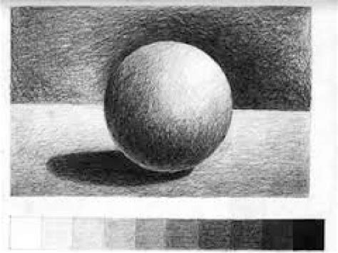

# Workshop Materials & Shading

Prof. Dr. Lena Gieseke  
l.gieseke@filmuniversitaet.de  
Film University Babelsberg *KONRAD WOLF*
  
   
---

## Topics

* Intro to Shading
* Local Illumination
* Local Shading Model Implementation
* Material Properties
* Global Illumination
* Non Photorealistic Rendering (NPR)
* NPR Model Implementation
* Complex Model Implementation
  
Please note that topics are still subject to change during the workshop!

## Learning Objectives

With this course, you will

* Understand what shading is
* Grasp core theoretical concepts of shading and lighting
* Understand material properties
* Be able to implement basic materials within Three.js
* Be able to go from there to explore advanced and creative material options

## Setup

This workshop is part of the `Creative Technologies II` course and counts for 1 SWS and 1 ECTS. You can get more ECTS with additional project work. There is no grade for the workshop.

---

🤩